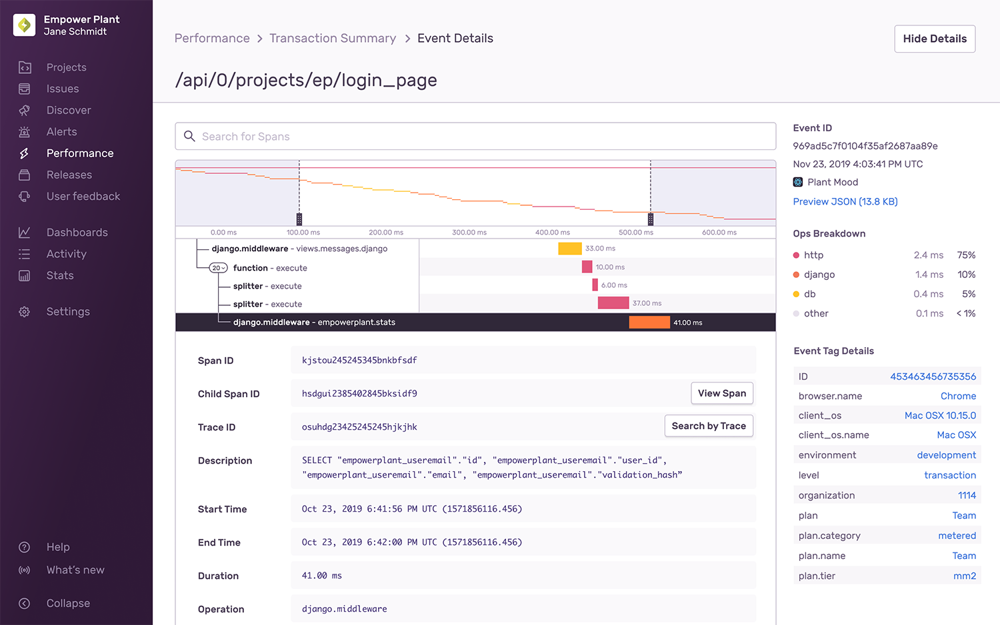
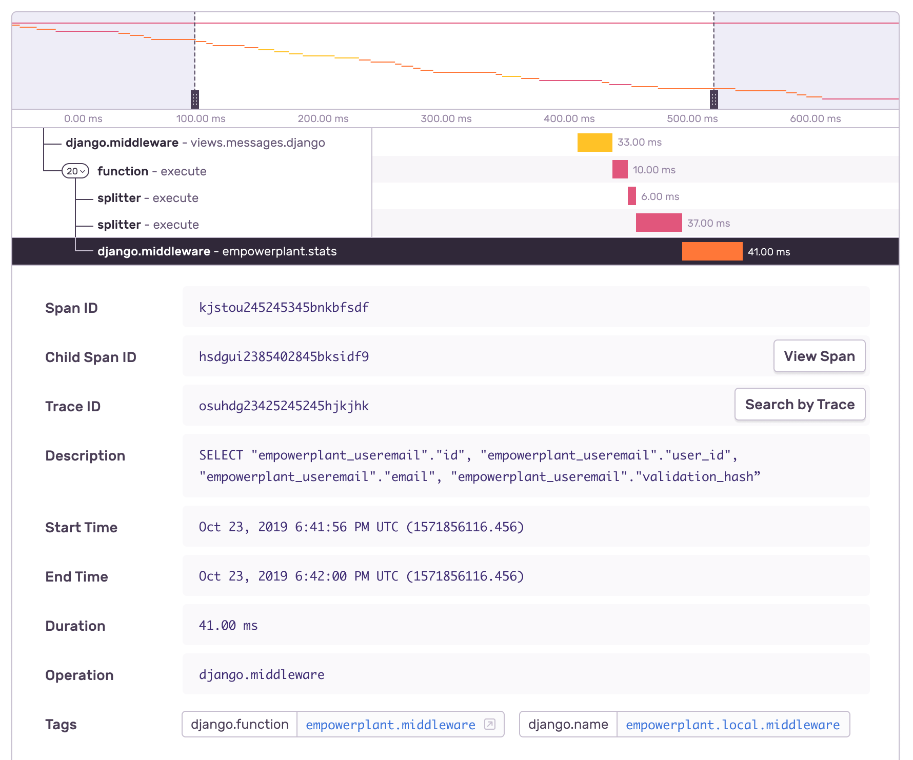

From [Performance](/performance-monitoring/performance/index) and [Discover](/performance-monitoring/discover-queries/index), you can drill all the way down into a span for a single transaction and traverse multiple directions. This will accelerate your ability to debug slow HTTP requests, database queries, identify associated errors, and root out other bottlenecks.



Information about this specific event is located in the sidebar, listing out the Event ID, date and time of occurrence, project, and downloadable JSON package. More can be found under Event Tag Details. You'll also get a breakdown of operations, which will correspond to the waterfall span view as a legend.

<Alert>
Currently, only root transactions are searchable. Any span data that inherits from its root are not.
</Alert>

## Span View

The span view is a split view where the left-hand side shows the transaction’s span tree, and the right-hand side represents each span as a colored rectangle. Within the tree view, Sentry identifies spans by their `op` and `description` values. If a span doesn’t have a description, Sentry uses the span’s id as a fallback. The first span listed is always the transaction’s root span, from which all other spans in the transaction descend.



To find these views, you can either go through the [Transaction Summary](/performance-monitoring/performance/transaction-summary) or [Query Builder](/performance-monitoring/discover-queries/query-builder/). Event IDs will be linked to open the corresponding Event Detail.

**With Transaction Summary**

Select the [Performance Homepage](/performance-monitoring/performance/index), then click the affected transaction to display the trace data.

**With Query Builder**

Scroll down to the "Trace Details" context panel in either the Issue Details or the Discover Event Details page, and click on the "View Summary" button. This will maintain the context of the current Sentry event.

_Note_: Users on the Team or Business plans can also view a list of transaction events by clicking on the "Transactions" pre-built query in [Discover](/performance-monitoring/discover-queries/index) or by performing a search with the `event.type:transaction` condition the Discover Query Builder view.

### Minimap

The minimap (top of the span view) reflects the entirety of the transaction broken into spans. You can either click and drag your cursor across the minimap to zoom in or adjust the window selection by dragging the handlebar (black dashed lines) in from the side. This will affect the range you see in the waterfall view.

### Waterfall

The waterfall view is a split view where the left reflects the transaction's span tree, and the right reflects each span as a horizontal bar (colors represent the operation). Within the tree, Sentry identifies spans by their `operation` and `description` values. If a span doesn't have a description, Sentry uses the span's ID as a fallback. The first span listed is always the transaction's root span, from which all other spans in the transaction descend.

### Span Details

Clicking on a span row expands the details of that span. From here, you can see all attached properties, such as tags and other field data. With the Trace ID, you'll be able to view all transactions within that given trace. Click "Search by Trace" to view that Discover list. Learn more about [distributed tracing](/performance-monitoring/distributed-tracing/) in our docs.

<Alert>
<markdown>

The trace view may be limited to one project at a time if you're on the [Team plan](https://sentry.io/pricing/). Further, project permissions may affect access to some of these transactions.

</markdown>
</Alert>

**Traversing Transactions**

Some spans within a transaction may be the parent of another transaction. Under these circumstances, some Span IDs will have a "View Child" or "View Children" button. These will potentially lead to another transaction or a list of transactions.

<Alert>
  <markdown>

    Traversing between parent and child transactions is only available on the [Business plan](https://sentry.io/pricing/). Further, project permissions may affect access to some of these transactions.

</markdown>
</Alert>

**Adding Query Information and Parameters to Spans**

Currently, every tag has a maximum character limit of 200 characters. Tags over the 200 character limit will become truncated, losing potentially important information. To retain this data, you can split data over several tags instead.

For example, a 200+ character tagged request:

`https://empowerplant.io/api/0/projects/ep/setup_form/?user_id=314159265358979323846264338327&tracking_id=EasyAsABC123OrSimpleAsDoReMi&product_name=PlantToHumanTranslator&product_id=161803398874989484820458683436563811772030917980576`

The 200+ character request above will become truncated to:

`https://empowerplant.io/api/0/projects/ep/setup_form/?user_id=314159265358979323846264338327&tracking_id=EasyAsABC123OrSimpleAsDoReMi&product_name=PlantToHumanTranslator&product_id=1618033988749894848`

Instead, using `span.set_tag` and `span.set_data` you could structure the details of this query as metadata. This could be done over `columns`, `table`, and `conditions`, in this case, resulting in three different calls:

```python
import sentry_sdk

#  ...

columns = ["first_column", "second_column", "third_columns", "fourth_column", "fifth_column", "sixth_colummn"]

table = "this_is_a_long_table_name"

conditions = "first_column=some_value AND second_column=some_other_value AND third_column=yet_another_value"

with sentry_sdk.start_span(op="db", transaction="query api") as span:
    span.set_tag("table", table)
    span.set_data("columns", columns)
    span.set_data("conditions", conditions)

    query = "SELECT {columns} FROM {table} WHERE {conditions}".format(
        columns=columns,
        table=table,
        conditions=conditions,
    )

    # ...
```

### Missing Instrumentation

Gaps between spans may be marked as "Missing Instrumentation." This means a duration in the transaction that isn't accounted for by any of the transaction's spans. It likely means that you need to manually instrument that part of your process. Go back to the [performance setup](/performance-monitoring/setup) for details.
