Manage your account details from the User Settings page, available in the dropdown menu under your organization’s name.

## Account Details

Sentry automatically saves all changes made in the Account Details section.

## Preferences

Unlike Account Details, the Preferences section doesn't automatically save all changes. Choose your changes in the provided dropdowns.

### Stack Trace Order

Choose the order of stack trace frames; the default is "let Sentry decide".

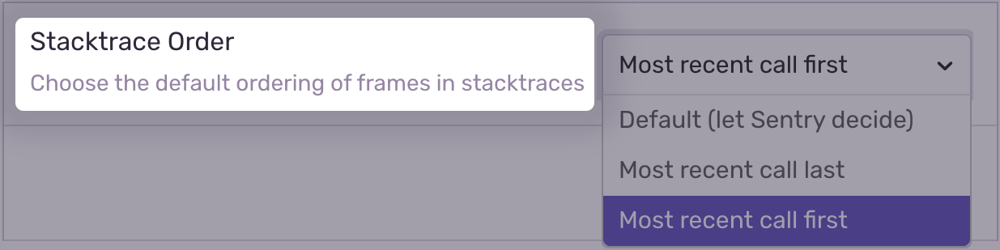

### Language

Use the dropdown to choose the default language.

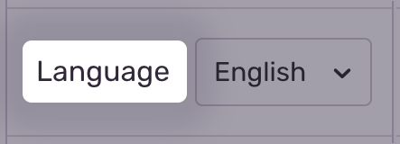

### Timezone

Choose the timezone to display on issue timestamps. For a 24-hour clock, slide the toggle.

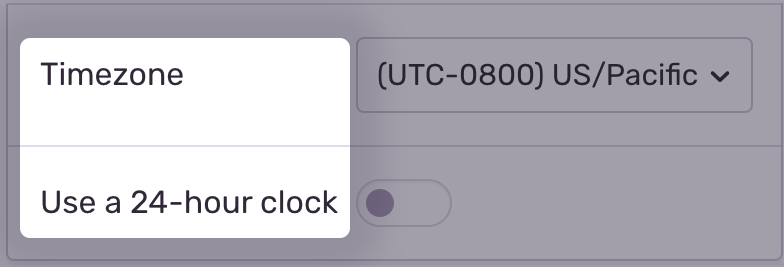

### Avatar

Choose between displaying your initials, an image, or a Gravatar next to your name. To save your selection, click "Save Avatar".

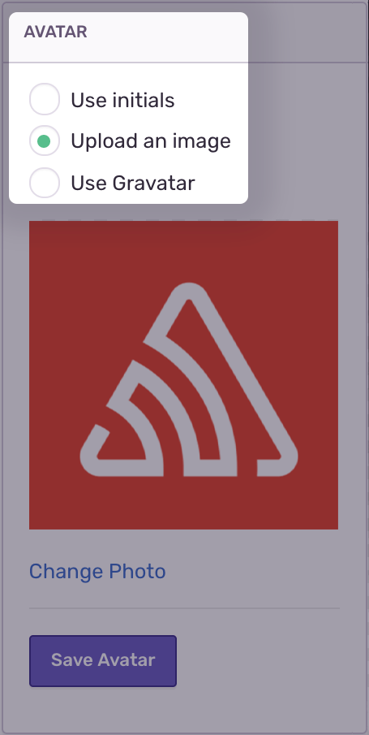

# Security

Security contains two sections: Settings and Session History.

## Settings

### Password

As a reminder, changing your password invalidates all logged in sessions. For more details about changing passwords, check with your information technology (IT) department.

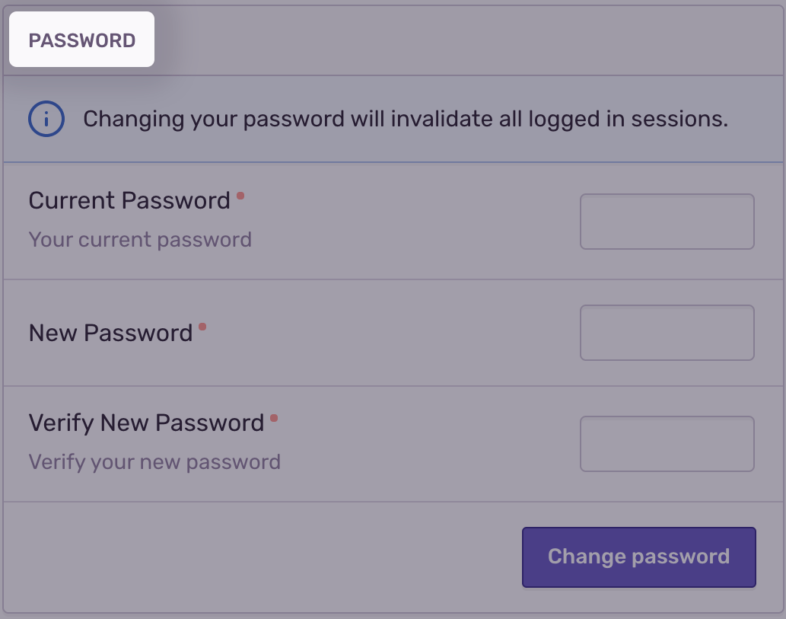

### Sessions

Sessions end with each sign out. Clicking "Sign out of all devices" will end your sessions with all Sentry devices.

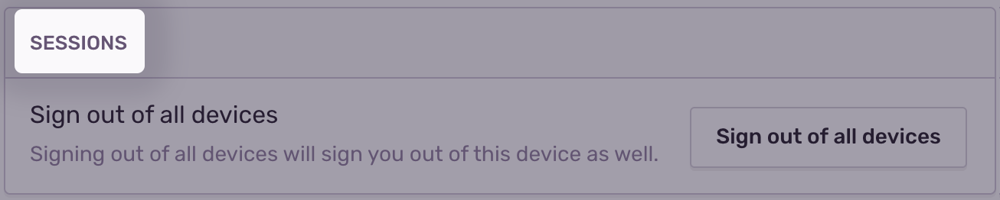

### Two-Factor Authentication

Keep your account information secure by enabling a two-factor authentication method. Choose between an Authenticator App, Text Message, or a Universal 2nd Factor (U2F) hardware device.

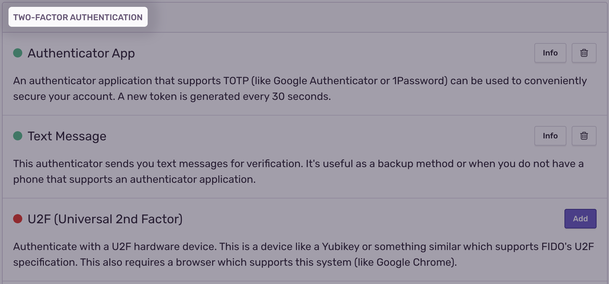

### Recover Codes

If you cannot receive two-factor authentication codes, such as when you lose your device, use recovery codes to access your account. Click the "View Codes" button to download, print, or copy your codes to a secure location.

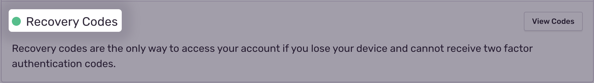

### Session History

Find a historical list of your sessions, including First Seen and Last Seen timestamps, under the Session History tab.

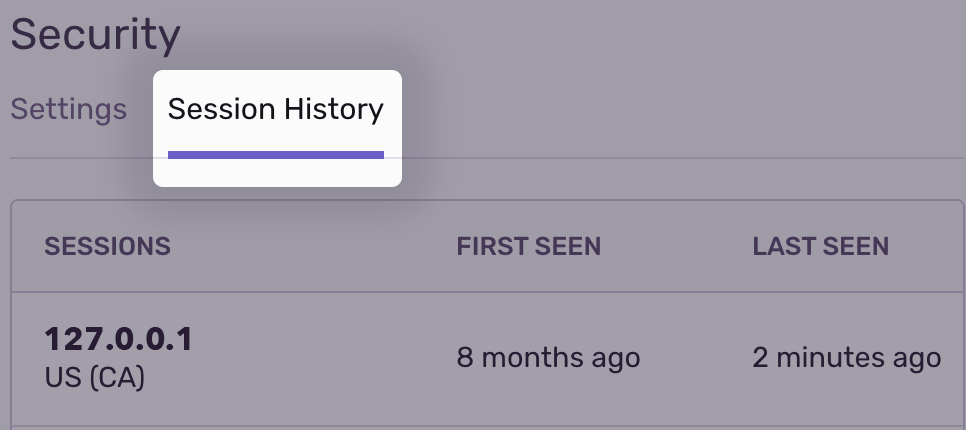

# Notifications

Sentry notifications are broadly categorized into alerts and non-alert notifications.

- Alerts can be sent to many supported [integrations](/workflow/integrations/#webhook-alerts).
- Non-alert notifications only go to email.

## Alerts & Notifications

Define Project Alerts in [Project] > Project Settings > Alerts. Slide the toggle under Send Me Alerts to receive team alerts. Fine-tune the alerts you receive per project with the dropdown selector.

Control workflow notifications (for example, in issue assignment, resolution status, and comments) by clicking a radio button under Send Me Workflow Notifications. Fine-tune workflow notifications per project with the dropdown selector.

For more details, see the [full documentation on Alerts & Notifications](/workflow/alerts-notifications/).

## Email Routing

Email notifications default to the email address used to set up your Sentry account. Route email notifications to an alternative email address and keep your project notifications organized. For example, infrastructure-related projects can route to an email dedicated to your team's infrastructure.

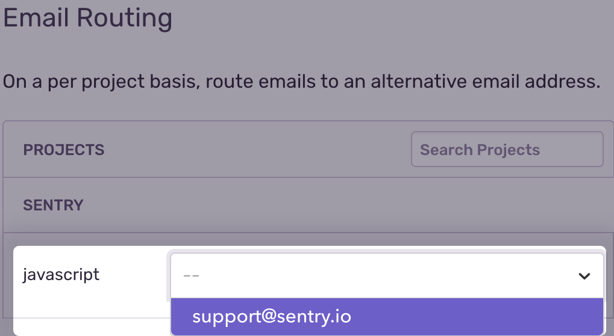

## Weekly Reports

Sentry generates reports per project and sends them once a week on Mondays. Fine-tune your reports per project with the dropdown selector.

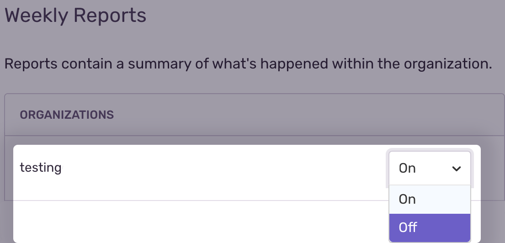

The following report sample shows details on Events Seen This Week, Events by Issue Type, Events by Project, and activity over time.

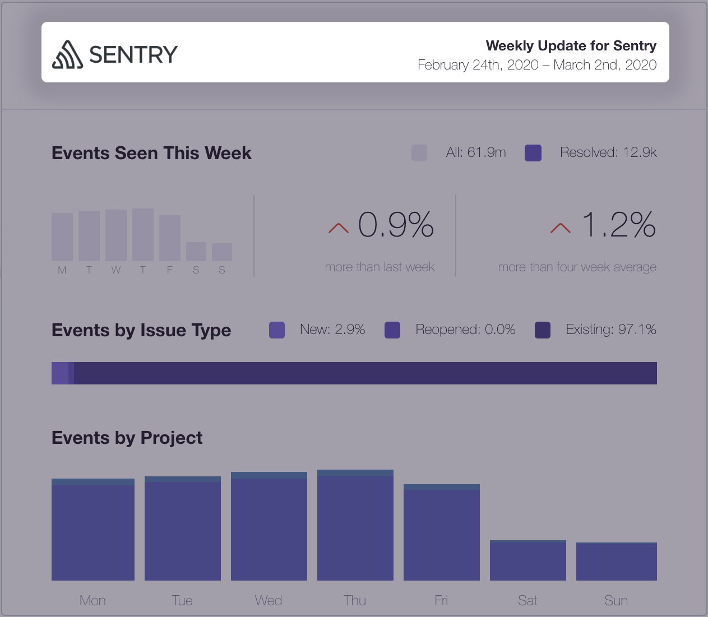

## Deploy Notifications

Choose a Deploy Notifications option to keep track of deployment details such as release version, environments, and commit reviews. Fine-tune options from the dropdown next to each organization.

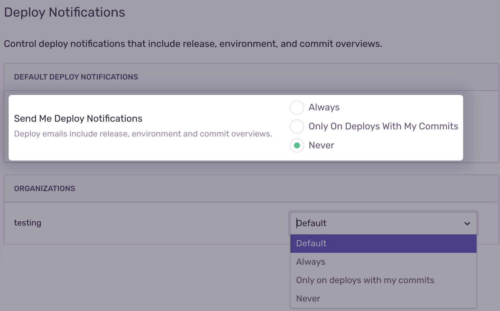

## My Activity

Updates regarding your user account actions, such as claiming unassigned issues, can be turned into an email notification in this section.

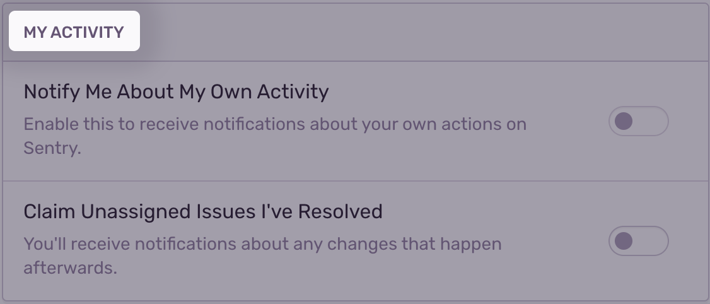

**Note:** You will find a shortcut to the Emails panel at the bottom of this section.

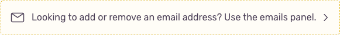

## Emails

The email address used to login to your Sentry account is by default your primary email address. Add an alternative email address under the Add Secondary Emails section.

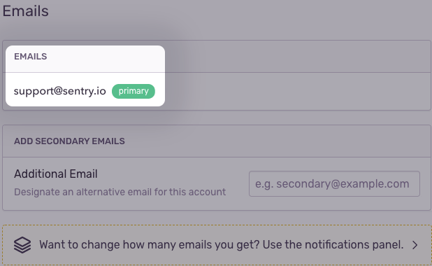

**Note:** You will find a shortcut to the Notifications panel at the bottom of this section.

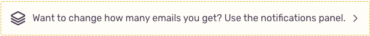

## Subscriptions

As part of our compliance with the EU’s General Data Protection Regulation (GDPR), you receive marketing campaign emails only after explicitly opting into any of the listed categories.

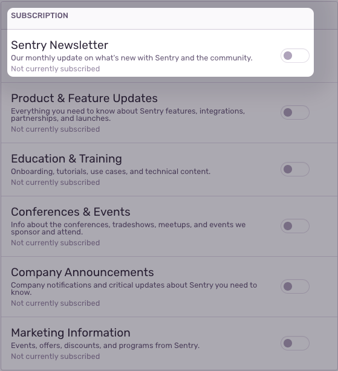

## Authorized Applications

Sentry lists all authorized third-party applications in this section and requires authentication tokens for authorization. Find tokens in the [*Auth Tokens*](https://sentry.io/api/) section.

## Identities

Sentry integrates with several identity providers, like Okta, OneLogin, Auth0, and Yubico. To disconnect any previously configured provider, click the "Disconnect" button.

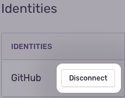

## Close Account

Closing your Sentry account automatically removes all data associated with your account. If your account is the sole owner of an organization, this organization will be deleted. Organizations with multiple owners will remain unchanged.

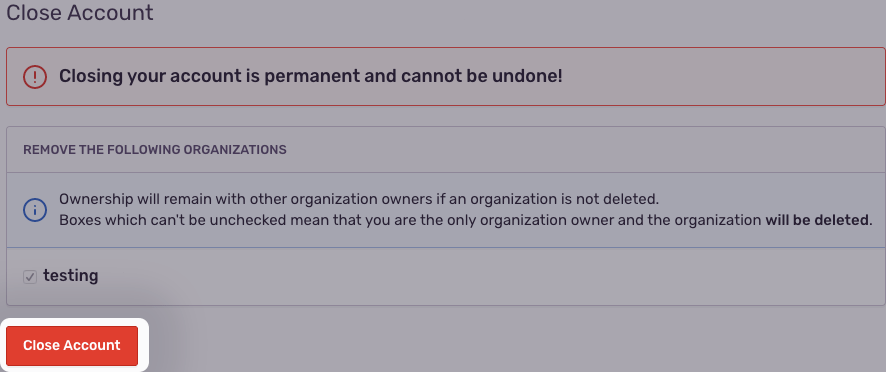

<Alert level="warning">
Deleting your account cannot be undone.
</Alert>

## API

### Applications

Integrating your application with Sentry allows you to send events to your Sentry instance automatically. To create an application, click the "Create New Application" button.

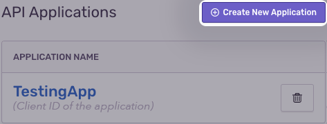

### Auth Tokens

Authentication tokens allow you to perform actions against the Sentry API on behalf of your account. To create one, click the "Create New Token" button.

[Create New Token button in the Auth Tokens section under User Settings](us-token.png)
