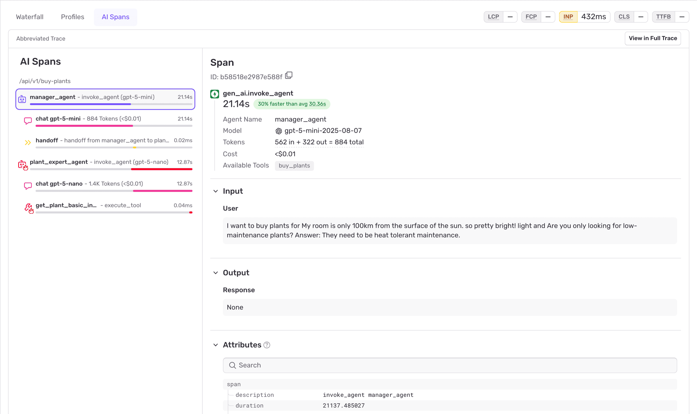

When you click on a trace, you'll be taken to the Trace Explorer with the **AI Spans** tab selected. This view shows an abbreviated trace focused on AI-related spans:

- **Agent Invocations**: Each agent execution and nested calls
- **LLM Generations**: Language model interactions with token breakdown
- **Tool Calls**: External API calls with inputs and outputs
- **Handoffs**: Agent-to-agent transitions and human handoffs
- **Critical Timing**: Duration metrics for each step
- **Errors**: Any failures that occurred

Click **"View in Full Trace"** for comprehensive debugging details.
