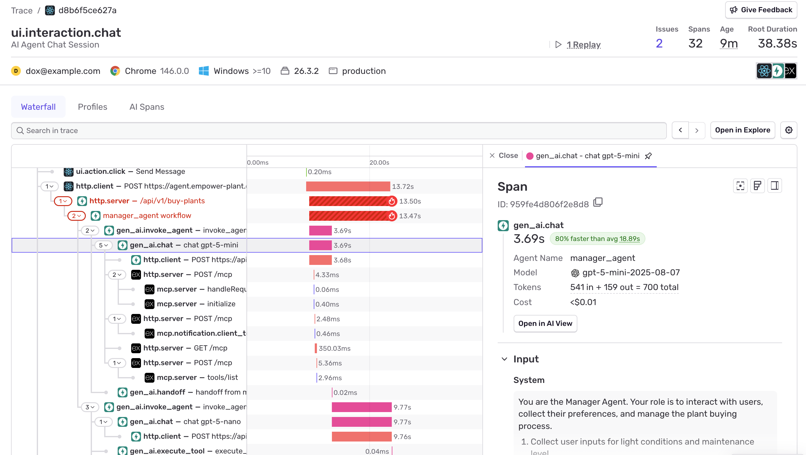

The full trace view shows the complete agent workflow with full context:

This detailed view reveals:

- **Complete Agent Flow**: Every step from initial request to final response
- **Tool Calls**: When and how the agent used external tools or APIs
- **Model Interactions**: All LLM calls with prompts and responses (if PII is enabled)
- **Timing Breakdown**: Duration of each step in the agent workflow
- **Error Context**: Detailed information about any failures or issues

When your AI agents are part of larger applications (like web servers or APIs), the trace view will include context from other Sentry integrations, giving you a complete picture of how your agents fit into your overall application architecture.
