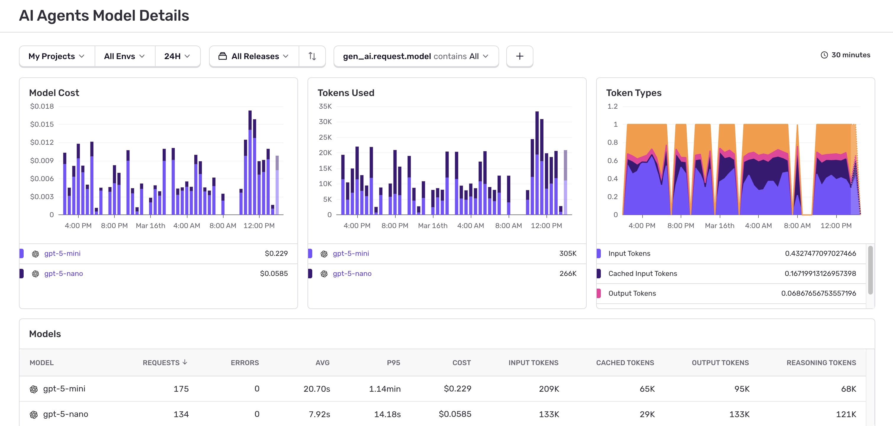

The Models dashboard displays Model Cost, Tokens Used, and Token Types widgets, as well as all used models with durations and token usage:

The Model Cost widget shows estimated costs based on token usage and model pricing. For details on how costs are calculated, where pricing data comes from, and what's not covered, see [Model Costs](/product/agents/costs/).
