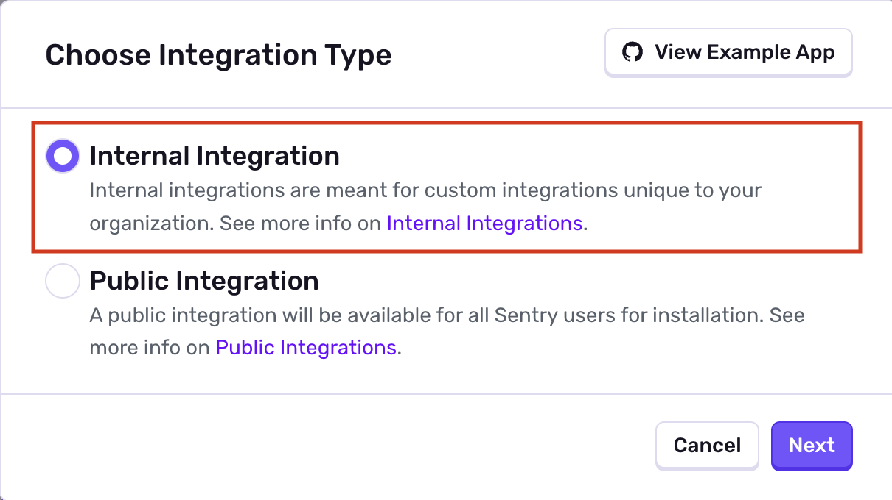
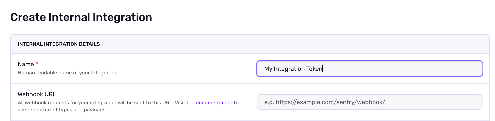
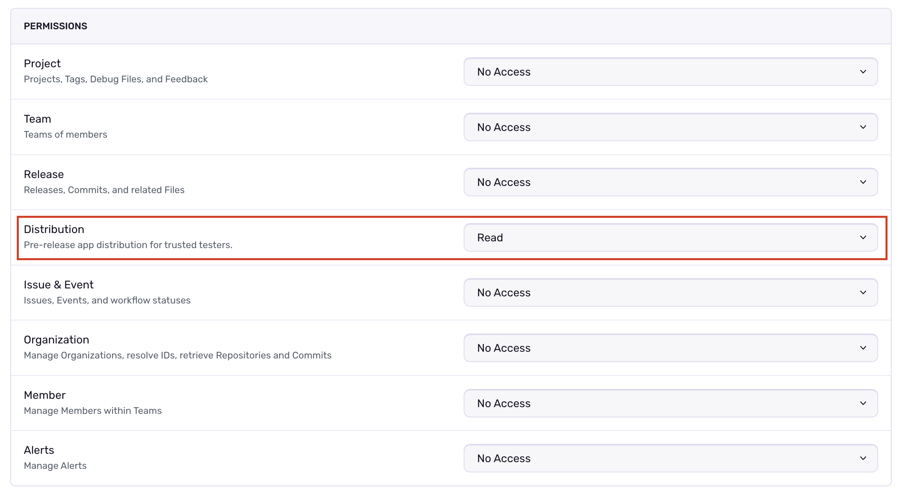
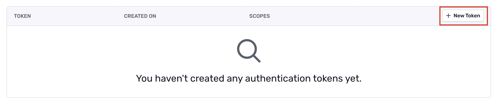

## Create an Integration Token

To use the Auto-Update SDK, you need to create an internal integration token with the appropriate permissions:

1. Navigate to **Settings > Custom Integrations** in your Sentry organization
2. Click **Create New Integration**
  

3. Select **Internal Integration** and click **Next**
  

4. Give your integration a name (e.g., "Build Distribution")
  
5. Under **Permissions**, select **Read** next to the **Distribution** scope.
  
6. Click **Save Changes**
7. Scroll down to the Tokens section and click **New Token**
   
8. Copy the generated token to your CI secrets as an environment `SENTRY_DISTRIBUTION_AUTH_TOKEN`

