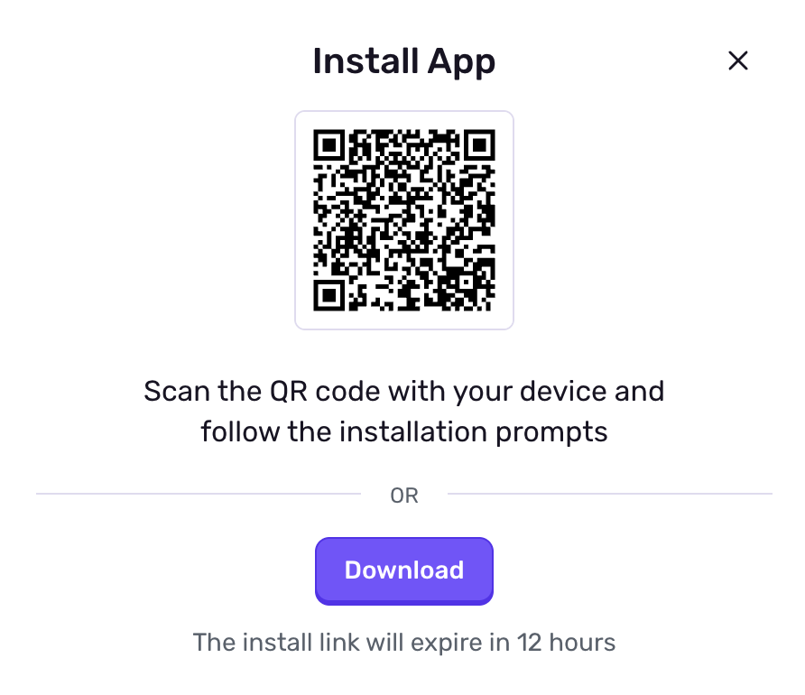

Once builds are uploaded to Sentry, your team members and beta testers can download them through the Sentry web interface.

1. Open the URL printed to the console after uploading the build
2. Click the **Install** button on the right side of the page

3. Either scan the QR code from a mobile device or click the **Download** button to download the build directly

