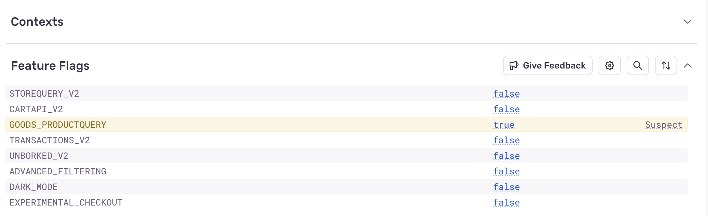

The `sentry_firebase_remote_config` integration provides [Firebase Remote Config](https://firebase.google.com/docs/remote-config/get-started?platform=flutter) support for Sentry, providing insight into feature flag evaluations.

## Behavior

- Adding the `SentryFirebaseRemoteConfig` integration will automatically track feature flag evaluations.
- Only boolean values are supported.

## Prerequisites

1. [Sentry SDK](/platforms/dart/#configure) version `9.0.0` or higher.
2. Firebase Remote Config is set up.

## Install

To use the `SentryFirebaseRemoteConfig` integration, add the `sentry_firebase_remote_config` dependency.

```yml {filename:pubspec.yaml}
dependencies:
  sentry: ^9.0.0
  sentry_firebase_remote_config: ^9.0.0
```

## Configure

Add the `SentryFirebaseRemoteConfig` integration to the Sentry SDK initialization.

```dart
await SentryFlutter.init(
  (options) {
    options.addIntegration(
      SentryFirebaseRemoteConfigIntegration(
        firebaseRemoteConfig: firebaseRemoteConfig,
      ),
    );
  },
);
```

### Remote Config Update

The integration will automatically call `await remoteConfig.activate();` when the config is updated.
If you don't want this behavior, you can set `activateOnConfigUpdated` to `false`.

```dart
SentryFirebaseRemoteConfigIntegration(
  firebaseRemoteConfig: firebaseRemoteConfig,
  activateOnConfigUpdated: false,
),
```

## Verify & View

### 1. Update Firebase Remote Config Value

Update a boolean [Firebase Remote Config](https://firebase.google.com/docs/remote-config/get-started?platform=flutter) value to true. Keep in mind that values will be evaluated as bool if their string values are `true`, `false`, `1`, or `0`. So numerical values of `1` or `0` will be evaluated as `true` or `false` boolean values respectively.

### 2. View the Recorded Feature Flag Evaluation on Sentry.io

To view the recorded feature flag evaluation, log into [sentry.io](https://sentry.io) and open your project.

Flag evaluations will appear in the "Feature Flag" section of Issue Details page as a table, with "suspect" flag predictions highlighted in yellow.

