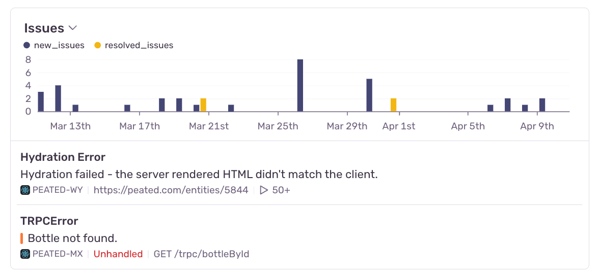

<Include name="feature-available-for-user-group-early-adopter.mdx" />

If you have [sessions or releases](/product/releases/setup/) enabled on Sentry, you can take full advantage of the Session Health tab on Insights. The Session Health tab contains a variety of data visualizations to help you learn insights about how your sessions are performing. [Learn more about how sessions are defined](/product/releases/health/#sessions).

The charts help you understand trends for crashes and sessions on a per-project level, and the customized chart views and toggleable legends allow you to drill down into the metrics you care about most.

## Prerequisites

You must have [sessions or releases](/product/releases/setup/) enabled in order to view these insights. Session Health on Insights is available only for the Frontend and Mobile modules.

## Charts

The overall chart view can be customized, so that you can display the visualizations you care about most. Simply click the toggle near the chart title to see other charts that can be displayed.

The chart view will be saved into local storage, so when you come back to the page, the chart view you customized before will still be displayed.

For the Frontend module, the following charts are available:

- Unhealthy Sessions
- Session Health
- Session Counts
- User Health
- User Counts
- [Issues](/product/issues/)

Most of these charts, with the exception of the Issues chart, are based on session-backed data.

The Session Health, Session Counts, User Health, and User Counts charts aim to break down trends in how your sessions are performing status-wise. The status options are healthy, crashed, errored, or abnormal. [Learn more about session statuses](/product/releases/health/#session-status).

The Unhealthy Sessions chart combines the total rate of errored, crashed, and abnormal sessions into one line.

The Issues chart is the only chart that does not rely on session-backed data. Instead, it shows the number of new and resolved issues for that project over time. It also gives a preview of the two most recently seen issues for that project. The chart header, when hovered, contains a link to view all issues for that project.

Click on any option in the graph legend to hide it. In some charts, including the Session Health chart, the healthy series is hidden by default to allow you to automatically see the errored, abnormal, and crashed series in better scale.
