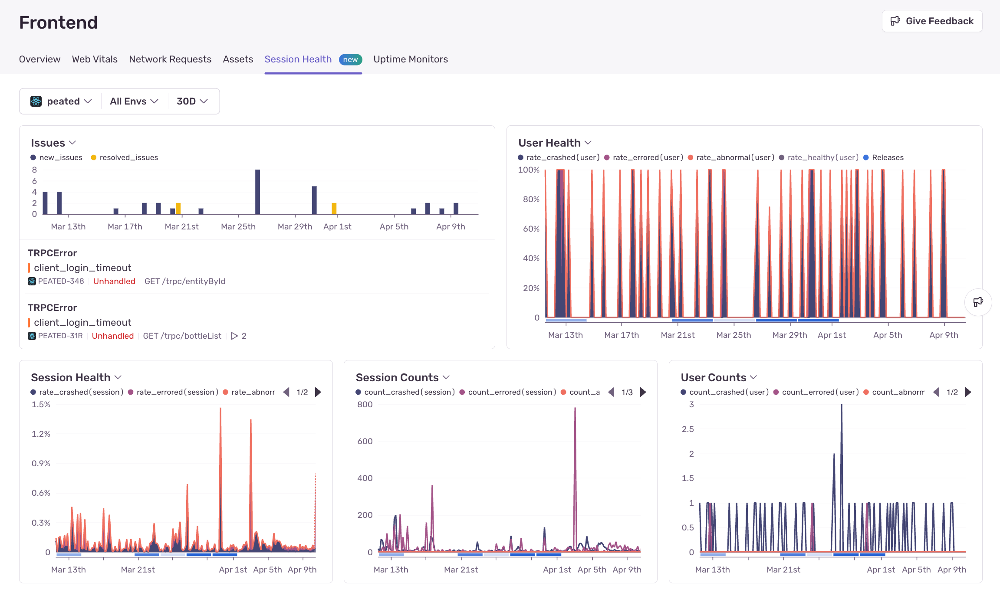
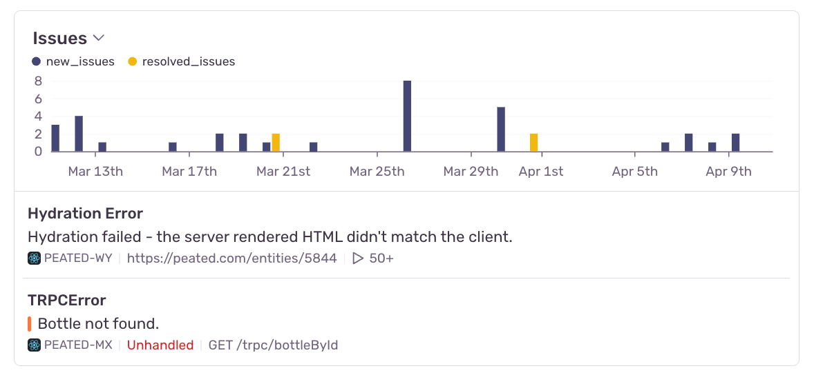
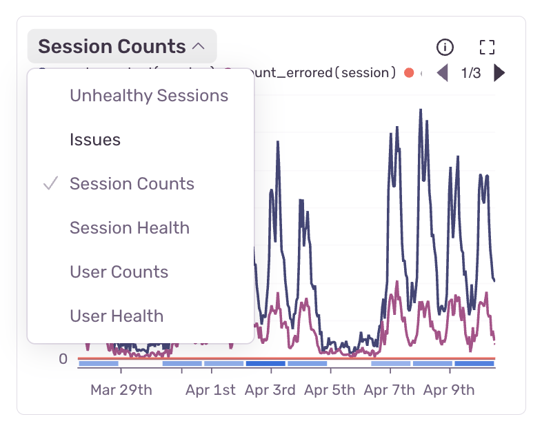

## Charts

For the Frontend module, the following charts are available:

- Unhealthy Sessions
- Session Health
- Session Counts
- User Health
- User Counts
- [Issues](/product/issues/)

Most of these charts, with the exception of the Issues chart, are based on sessions-backed data.

The Session Health, Session Counts, User Health, and User Counts charts aim to break down trends in how your sessions are performing status-wise. The status options are healthy, crashed, errored, or abnormal. For frontend sessions, the "errored" status refers to handled errors, and "crashed" refers to unhandled errors. Note that these are mutually exclusive groups. [Learn more about session statuses](/product/releases/health/#session-status).

The Unhealthy Sessions chart combines the total rate of errored, crashed, and abnormal sessions into one line.

The Issues chart shows the number of new and resolved issues for the selected projects over time. It also gives a preview of the two most recently seen issues for the selected projects. The chart header, when hovered, has a button to view all issues for the selected projects.

Click on any series option in the graph legend to hide it. In some charts, including the Session Health chart, the healthy series is hidden by default to allow you to automatically see the errored, abnormal, and crashed series at a better scale.

The overall chart view can be customized, so that you can display the visualizations and metrics you care about most. Simply click the toggle near the chart title to see other charts that can be displayed.

The chart view will be saved into your browser's local storage, so when you come back to the page, the chart view you selected before will still be displayed.
