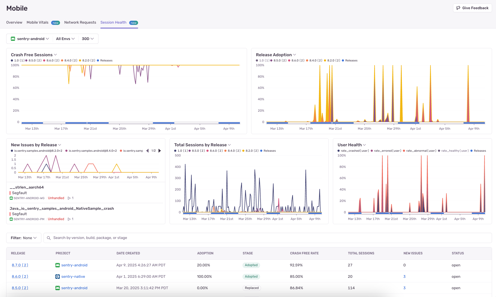
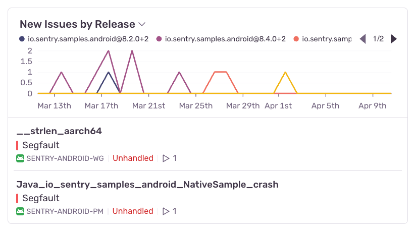
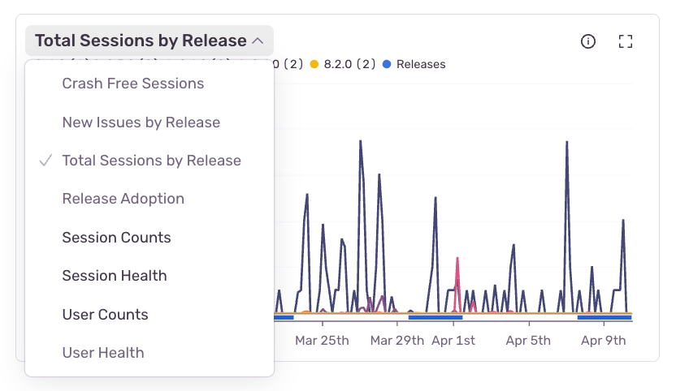
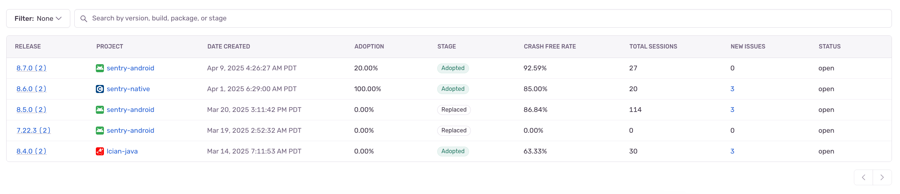

## Charts

For the Mobile module, the following charts are available:

- [Crash Free Sessions](/product/releases/health/#crash-free-sessionsusers)
- [Total Sessions by Release](/product/releases/health/#session)
- Release Adoption
- Session Health
- Session Counts
- User Health
- User Counts
- [New Issues by Release](/product/issues/)

Most of these charts, with the exception of the New Issues by Release chart, are based on sessions-backed data.

The Session Health, Session Counts, User Health, and User Counts charts aim to break down trends in how your sessions are performing status-wise. The status options are healthy, crashed, errored, or abnormal. [Learn more about session statuses](/product/releases/health/#session-status).

The Crash Free Sessions chart extracts out a single status — "crashed" — to highlight the crash free rate of the 5 most adopted releases in the selected projects. In this case, we define "adoption" as the percent of sessions occurring in that release, out of the total number of sessions in the selected projects. We chose to highlight crash free rate, since this is typically the most useful and relevant error-related status for mobile developers.

The Total Sessions by Release and Release Adoption charts are two ways of visualizing the same data — how many sessions occur in each release. The most recent 5 releases are shown. Total Sessions by Releases is count-based, and Release Adoption is percentage-based (the percent of session counts coming from that release). Release adoption across all 5 releases will add to 100%.

The New Issues by Release shows the number of new issues per release over time. The most recent 5 releases are shown, and there is an additional series labeled `other` that comprises all other releases. (This series is turned off in the legend by default.) It also gives a preview of the two most recently seen issues for the selected projects. The chart header, when hovered, has a button to view all issues for the selected projects.

Click on any series option in the graph legend to hide it. In some charts, including the Session Health chart, the healthy series is hidden by default to allow you to automatically see the errored, abnormal, and crashed series at a better scale.

The overall chart view can be customized, so that you can display the visualizations and metrics you care about most. Simply click the toggle near the chart title to see other charts that can be displayed.

The chart view will be saved into your browser's local storage, so when you come back to the page, the chart view you selected before will still be displayed.

## Releases Table

The Mobile Session Health tab also includes a table of releases for the selected projects.

The table contains key information about each release, including:

- [Adoption stage](/product/releases/health/#adoption-stages)
- [Crash free rate](/product/releases/health/#crash-free-sessionsusers)
- [Total session count](/product/releases/health/#sessions)
- [Number of new issues](/product/issues/)
- Release status (open or archived)
- Adoption rate

The search bar and filter dropdown above the table allow you to filter and search this table. The syntax and options here are similar to those used on the [Releases page](/product/releases/). Note that filtering by adoption stage requires exactly 1 environment to be chosen in the global page filters. [Learn more about searching and filtering releases](/product/releases/usage/sorting-filtering/).
