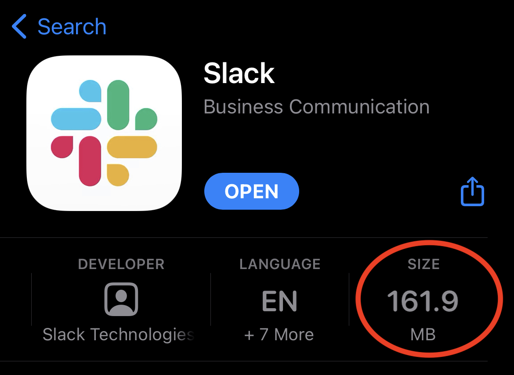
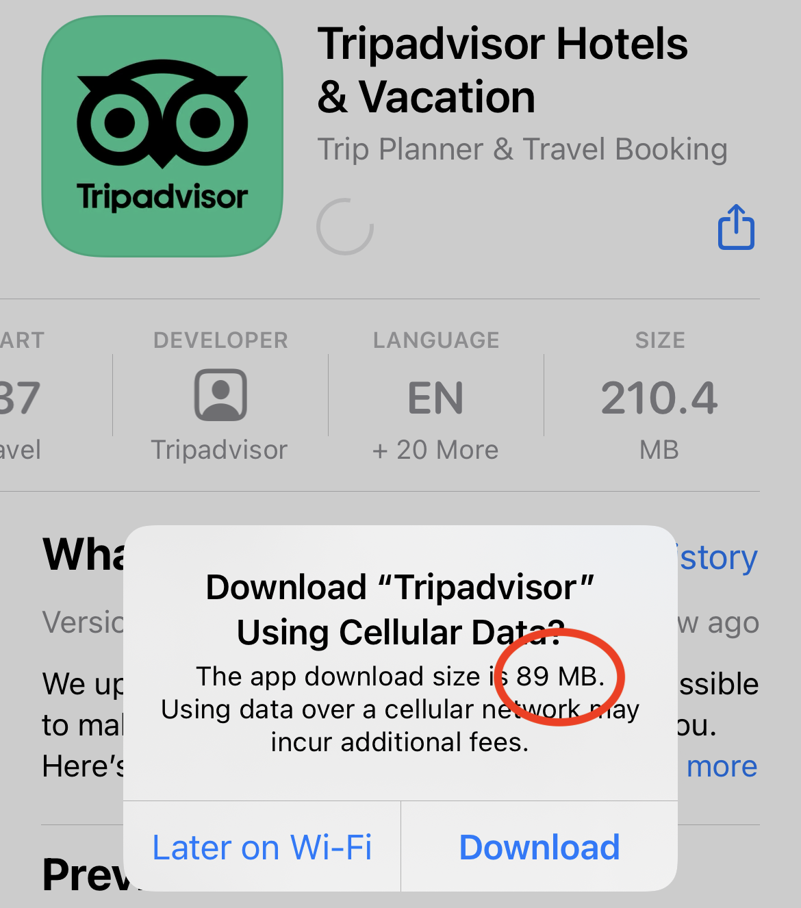
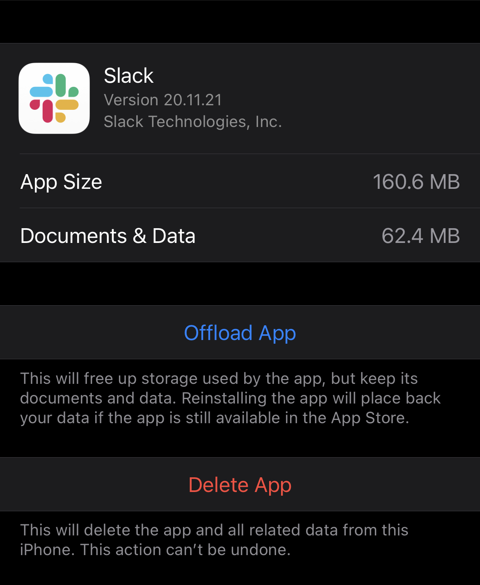

Sentry's iOS app size metric tracks the unencrypted install size of your app on the latest iPhone hardware running the latest iOS version. Since install size is what users see before downloading your app and before deciding if an app should be deleted, it's the most important metric to track and reduce on iOS.

Apps are compressed before they are downloaded, so the actual number of bytes transferred will be lower than the amount of storage taken up by an installed app. Users can see both these numbers, but install size is more prominently displayed.

The install size is what you see when viewing the details for an app on the App Store:

By default, download size will only be displayed if an app is over the Apple determined limit of 200 MB and the user is not on Wi-Fi. Hidden in the iOS Settings app, users can configure the App Store to always warn them of the download size of an app before starting the download, still only when not connected to Wi-Fi.

Users can also review the app's install size in the Settings app.

It's important to reduce install size, because this is what many users see when deciding if an app should be downloaded or what apps to delete.

**Regarding App Clips**: By default, Sentry measures the uploaded XCArchive as-is, including content that App Thinning might remove. If the archive includes App Clips, the reported archive total includes their size so you can monitor changes to them. Physical devices don't download App Clips with the app, so Sentry's install and download sizes can be larger than the sizes shown in TestFlight or the App Store.
