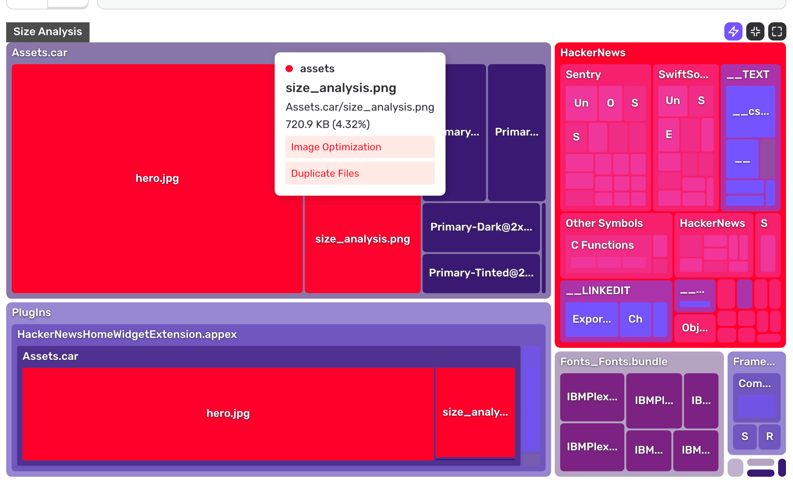

In addition to seeing the full list of insights, you can toggle insight highlighting directly on the treemap.

Nodes in red have at least one insight. Hover over a node to see which insights apply to it.

