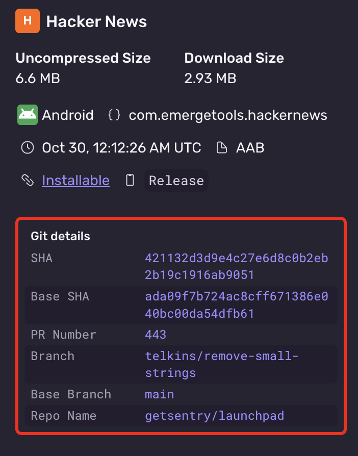

1. Install the [sentry-cli](/cli/) (version `{{@inject apps.version('sentry-cli') }}`)

   <Alert>
   We recommend using the latest version for the best possible experience, but at a minimum version `2.58.2` is required.
   </Alert>

2. Authenticate the Sentry CLI by [following these steps](https://docs.sentry.io/cli/configuration/#to-authenticate-manually)

3. Build your app to create an AAB (preferred) or APK

4. Invoke the following CLI command to trigger the upload:

   ```bash
   sentry-cli build upload app.aab \
     --org your-org \
     --project your-project \
     --build-configuration Release
   ```

5. After an upload has successfully processed, confirm the metadata is correct in the Sentry UI

   
