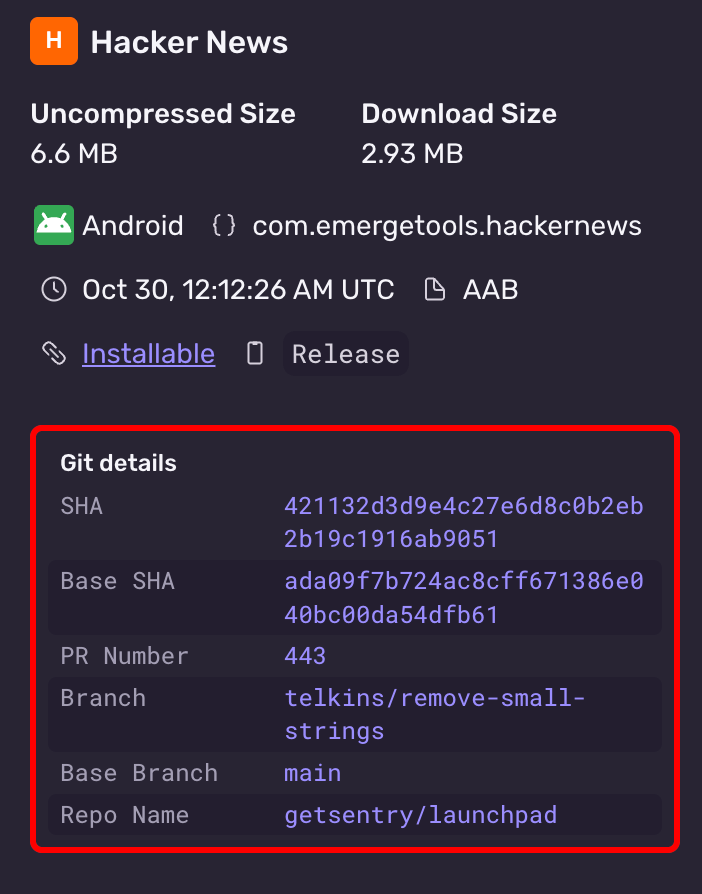

The Fastlane plugin can be used to upload AAB or APK builds to Sentry. On GitHub Actions, Fastlane will automatically detect your [build's metadata](#upload-metadata) and include it in the upload. In other Continuous Integration (CI) environments, you may need to manually set metadata values.

<Alert>
Uploading AAB and APK files requires Sentry Fastlane plugin version `2.0.0-rc.3` or later.
</Alert>

1. Configure the [Sentry Fastlane plugin](https://github.com/getsentry/sentry-fastlane-plugin) (version `{{@inject packages.version('sentry.cocoa.fastlane') }}`):

   ```ruby
   bundle exec fastlane add_plugin fastlane-plugin-sentry
   ```

2. Set up `SENTRY_AUTH_TOKEN` in your environment (you can generate a token [here](https://sentry.sentry.io/settings/auth-tokens/))

3. In `FastFile`, add a call to `sentry_upload_build` after your build step.

   **Uploading an AAB (preferred):**

   When using the `gradle` action with `bundle` task, the AAB path is automatically detected from `SharedValues::GRADLE_AAB_OUTPUT_PATH`.

   ```ruby {filename:Fastfile}
   lane :upload_to_sentry do
     gradle(
       task: 'bundle',
       build_type: 'Release'
     )
     sentry_upload_build(
       org_slug: 'your-org',
       project_slug: 'your-project',
       build_configuration: 'Release'
     )
   end
   ```

   You can also explicitly specify `aab_path`:

   ```ruby {filename:Fastfile}
   lane :upload_to_sentry do
     gradle(
       task: 'bundle',
       build_type: 'Release'
     )
     sentry_upload_build(
       org_slug: 'your-org',
       project_slug: 'your-project',
       aab_path: 'app/build/outputs/bundle/release/app-release.aab',
       build_configuration: 'Release'
     )
   end
   ```

   **Uploading an APK:**

   When using the `gradle` action with `assemble` task, the APK path is automatically detected from `SharedValues::GRADLE_APK_OUTPUT_PATH`.

    ```ruby {filename:Fastfile}
   lane :upload_to_sentry do
     gradle(
       task: 'assemble',
       build_type: 'Release'
     )
     sentry_upload_build(
       org_slug: 'your-org',
       project_slug: 'your-project',
       build_configuration: 'Release'
     )
   end
   ```

   You can also explicitly specify `apk_path`:

   ```ruby {filename:Fastfile}
   lane :upload_to_sentry do
     gradle(
       task: 'assemble',
       build_type: 'Release'
     )
     sentry_upload_build(
       org_slug: 'your-org',
       project_slug: 'your-project',
       apk_path: 'app/build/outputs/apk/release/app-release.apk',
       build_configuration: 'Release'
     )
   end
   ```

4. After an upload has successfully processed, confirm the metadata is correct in the Sentry UI

   

The Fastlane plugin automatically detects the following build metadata. If needed, the metadata values can be overridden by passing parameters to `sentry_upload_build`:

```ruby {filename:Fastfile}
sentry_upload_build(
  org_slug: 'your-org',
  project_slug: 'your-project',
  aab_path: 'path/to/app.aab', # or apk_path: 'path/to/app.apk'
  build_configuration: 'Release',
  # Optional metadata overrides:
  head_sha: 'abc123',
  base_sha: 'def456',
  vcs_provider: 'github',
  head_repo_name: 'organization/repository',
  base_repo_name: 'organization/repository',
  head_ref: 'feature-branch',
  base_ref: 'main',
  pr_number: '42'
)
```

See the [Fastlane repo](https://github.com/getsentry/sentry-fastlane-plugin) for more information.
