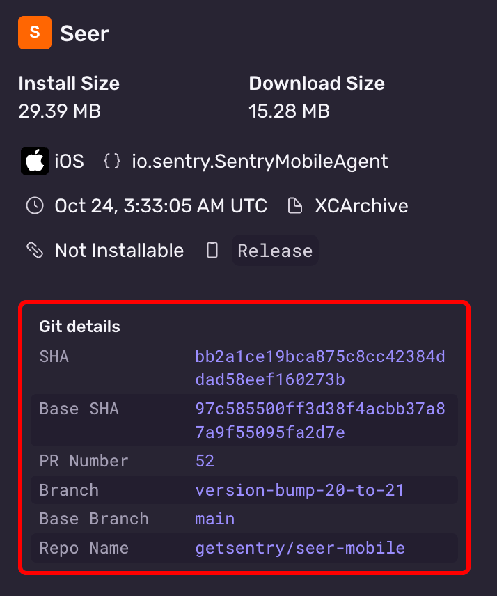

The Fastlane plugin can be used to upload XCArchive or IPA builds to Sentry. On GitHub Actions, Fastlane will automatically detect your [build's metadata](#upload-metadata) and include it in the upload. In other Continuous Integration (CI) environments, you may need to manually set metadata values.

<Alert>
Uploading IPA files requires Sentry Fastlane plugin version `2.0.0-rc.3` or later. XCArchive uploads are supported in earlier versions.
</Alert>

1. Configure the [Sentry Fastlane plugin](/platforms/apple/guides/ios/dsym/#sentry-fastlane-plugin) (version `{{@inject packages.version('sentry.cocoa.fastlane') }}`):

   ```ruby
   bundle exec fastlane add_plugin fastlane-plugin-sentry
   ```

2. Set up `SENTRY_AUTH_TOKEN` in your environment (you can generate a token [here](https://sentry.sentry.io/settings/auth-tokens/))

3. In `FastFile`, add a call to `sentry_upload_build` after your build step.

   **Uploading an XCArchive (preferred):**

   When using `build_ios_app`, the XCArchive path is automatically detected from `SharedValues::XCODEBUILD_ARCHIVE`:

   ```ruby {filename:Fastfile}
   lane :upload_to_sentry do
     build_ios_app(
       scheme: 'YourScheme',
       configuration: 'Release'
     )
     sentry_upload_build(
       org_slug: 'your-org',
       project_slug: 'your-project',
       build_configuration: 'Release'
     )
   end
   ```

   You can also explicitly specify the `xcarchive_path`:

   ```ruby {filename:Fastfile}
   lane :upload_to_sentry do
     sentry_upload_build(
       org_slug: 'your-org',
       project_slug: 'your-project',
       xcarchive_path: 'path/to/YourApp.xcarchive',
       build_configuration: 'Release'
     )
   end
   ```

   **Uploading an IPA:**

   When using `build_ios_app`, the IPA path is automatically detected from `SharedValues::IPA_OUTPUT_PATH`. To upload an IPA instead of the XCArchive, explicitly specify `ipa_path`:

   ```ruby {filename:Fastfile}
   lane :upload_to_sentry do
     build_ios_app(
       scheme: 'YourScheme',
       configuration: 'Release'
     )
     sentry_upload_build(
       org_slug: 'your-org',
       project_slug: 'your-project',
       ipa_path: 'path/to/YourApp.ipa',
       build_configuration: 'Release'
     )
   end
   ```

4. After an upload has successfully processed, confirm the metadata is correct in the Sentry UI

   

The Fastlane plugin automatically detects all build metadata. If needed, the metadata values can be overridden by passing parameters to `sentry_upload_build`:

```ruby {filename:Fastfile}
sentry_upload_build(
  org_slug: 'your-org',
  project_slug: 'your-project',
  xcarchive_path: 'path/to/YourApp.xcarchive', # or ipa_path: 'path/to/YourApp.ipa'
  build_configuration: 'Release',
  # Optional metadata overrides:
  head_sha: 'abc123',
  base_sha: 'def456',
  vcs_provider: 'github',
  head_repo_name: 'organization/repository',
  base_repo_name: 'organization/repository',
  head_ref: 'feature-branch',
  base_ref: 'main',
  pr_number: '42'
)
```

See the [Fastlane repo](https://github.com/getsentry/sentry-fastlane-plugin) for more information.
