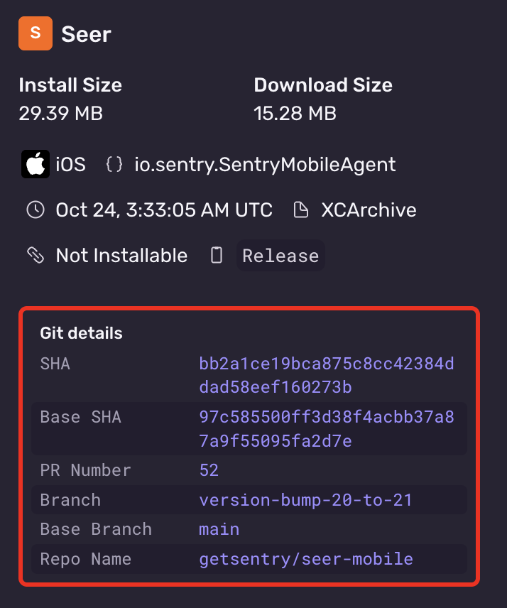

The Fastlane plugin can be used to upload XCArchive or IPA builds to Sentry. On GitHub Actions, Fastlane will automatically detect your [build's metadata](#upload-metadata) and include it in the upload. In other Continuous Integration (CI) environments, you may need to manually set metadata values.

1. Configure the [Sentry Fastlane plugin](/platforms/apple/guides/ios/dsym/#sentry-fastlane-plugin) (version `{{@inject packages.version('sentry.cocoa.fastlane') }}`):

   ```ruby
   bundle exec fastlane add_plugin fastlane-plugin-sentry
   ```

2. Set up `SENTRY_AUTH_TOKEN` in your environment (you can generate a token [here](https://sentry.sentry.io/settings/auth-tokens/))

3. In `FastFile`, add a call to `sentry_upload_build` after your build step:

   ```ruby {filename:Fastfile}
   lane :upload_to_sentry do
      build_ios_app(
        scheme: 'YourScheme',
        configuration: 'Release',
      )
      sentry_upload_build(
        org_slug: 'your-org',
        project_slug: 'your-project',
        build_configuration: 'Release' # Adjust to your configuration
      )
   end
   ```

4. After an upload has successfully processed, confirm the metadata is correct in the Sentry UI

   

The Fastlane plugin automatically detects all build metadata. If needed, the metadata values can be overridden by passing parameters to `sentry_upload_build`:

```ruby {filename:Fastfile}
lane :upload_to_sentry do
  build_ios_app(
    scheme: 'YourScheme',
    configuration: 'Release',
  )
  sentry_upload_build(
    org_slug: 'your-org',
    project_slug: 'your-project',
    build_configuration: 'Release',
    # Optional metadata overrides:
    head_sha: 'abc123',
    base_sha: 'def456',
    vcs_provider: 'github',
    head_repo_name: 'organization/repository',
    base_repo_name: 'organization/repository',
    head_ref: 'feature-branch',
    base_ref: 'main',
    pr_number: '42'
  )
end
```

See the [Fastlane repo](https://github.com/getsentry/sentry-fastlane-plugin) for more information.
