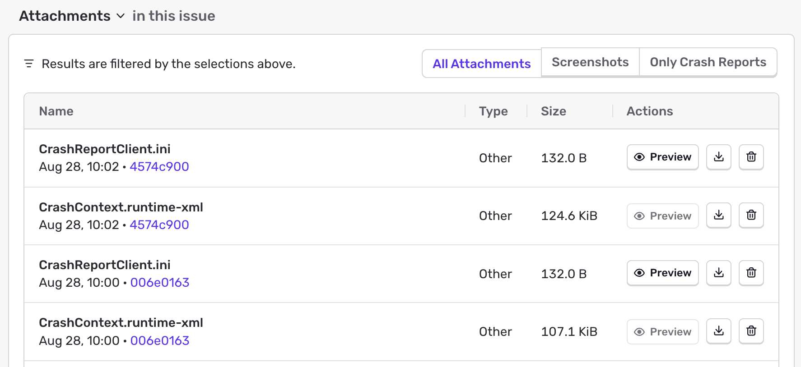
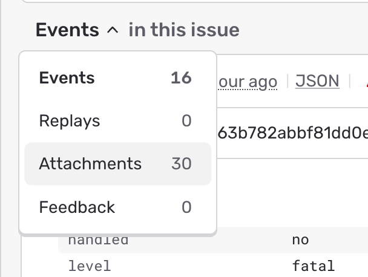

## Viewing Attachments

Attachments display on the bottom of the **Issue Details** page for the event that is shown.

Alternately, attachments also appear in the _Attachments_ view on the **Issue Details** page, where you can view the _Type_ of attachment, as well as associated events. Click the Event ID to open the **Issue Details** of that specific event.

To access the _Attachments_ view, click on "Events" to open the views menu:

## Maximum Attachment Size

The scale is bytes and the default is `20 MiB`. Please also check the
[maximum attachment size of Relay](/product/relay/options/)
to make sure your attachments don't get discarded there.
