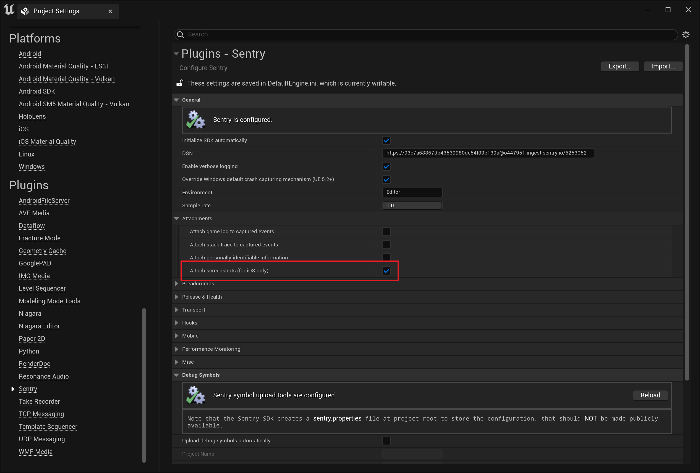

Using the editor menu in **Project Settings > Plugins > Sentry**:



Or, like so, if you're [configuring things programmatically](/platforms/unreal/configuration/options/):

```cpp
USentrySettings* Settings = FSentryModule::Get().GetSettings();
Settings->AttachScreenshot = true;
```

<Alert>

On Android, screenshot attachments are only supported for ensure and assertion events.

</Alert>

## Screenshot Capture Mechanism

Since the Unreal Engine SDK consists of multiple SDKs, the specific mechanism with which a screenshot is captured will vary depending on where the error originated.

- On Windows/Linux, errors from within your game will be captured using the Unreal Engine API. This means that screenshots will only contain what's visible within your game. Any overlays on top of your game won't be visible.
- On Mac/iOS, screenshots will be captured using platform APIs. If you're using a native plugin to display an overlay and an error occurs, the SDK will try to capture a screenshot that contains the overlay.

### Out-of-Process Screenshot Capturing (Experimental)

On Windows, the default screenshot capture runs in-process using the Unreal Engine rendering pipeline. This means it depends on the Slate renderer being functional at the time of the crash, which may not always be the case.

As an alternative, you can enable **out-of-process screenshot capturing**, which delegates crash screenshot capture to the native SDK. Instead of relying on Unreal's rendering pipeline, this uses OS-level APIs (GDI+) from a separate process (the crashpad handler or native crash daemon), making it significantly more reliable during crashes.

To enable it, turn on the **Enable out-of-process screenshot capturing** option in **Project Settings > Plugins > Sentry > Attachments**, or set it programmatically:

```cpp
USentrySettings* Settings = FSentryModule::Get().GetSettings();
Settings->EnableOutOfProcessScreenshots = true;
```

<Alert>

This option requires `AttachScreenshot` to be enabled.

</Alert>

**Differences from the default mechanism:**

- Screenshots are captured from a separate process, so they work even when the game's rendering pipeline is broken at the time of the crash.
- The crashpad backend can capture screenshots for fast-fail crashes that bypass structured exception handling (SEH).
- Because the screenshot is captured using OS-level screen capture, it shows the game window as it appears on screen rather than the rendered frame buffer. If the game window is minimized or fully occluded by other windows, the screenshot may be empty or incomplete.
- This only affects crash screenshots. Non-fatal events (ensures, assertions) continue using the default Unreal Engine-based capture regardless of this setting.

<Alert>

**Screenshots may contain PII.** For example, if your game has a registration form and an error occurs while the form is being displayed.

</Alert>
