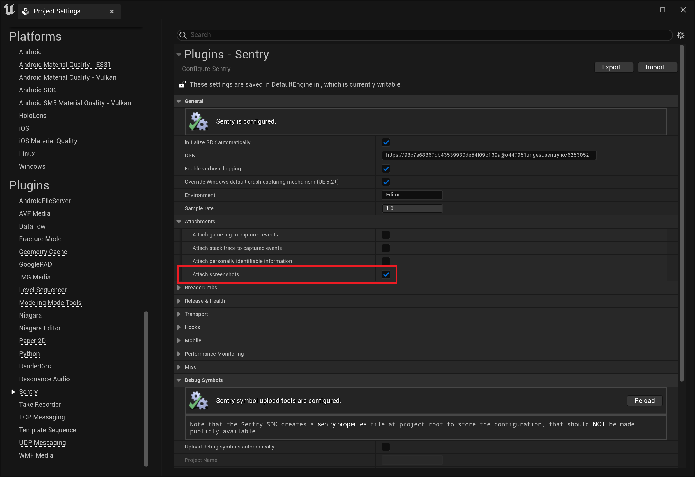

Using the editor menu in **Project Settings > Plugins > Sentry**:



Or, like so, if you're [configuring things programatically](/platforms/unreal/configuration/options/):

```cpp
USentrySettings* Settings = FSentryModule::Get().GetSettings();
Settings->AttachScreenshot = true;
```

<Alert>

Currently, this feature is supported for Windows and Linux only.

</Alert>

## Screenshot Capture Mechanism

Since the Unreal Engine SDK consists of multiple SDKs, the specific mechanism with which a screenshot is captured will vary depending on where the error originated.

- On Windows/Linux, errors from within your game will be captured using the Unreal Engine API. This means that screenshots will only contain what's visible within your game. Any overlays on top of your game won't be visible.
- On Apple/Android, screenshots will be captured using platform APIs. If you're using a native plugin to display an overlay and an error occurs, the SDK will try to capture a screenshot that contains the overlay.

<Alert>

**Screenshots may contain PII.** For example, if your game has a registration form and an error occurs while the form is being displayed.

</Alert>
