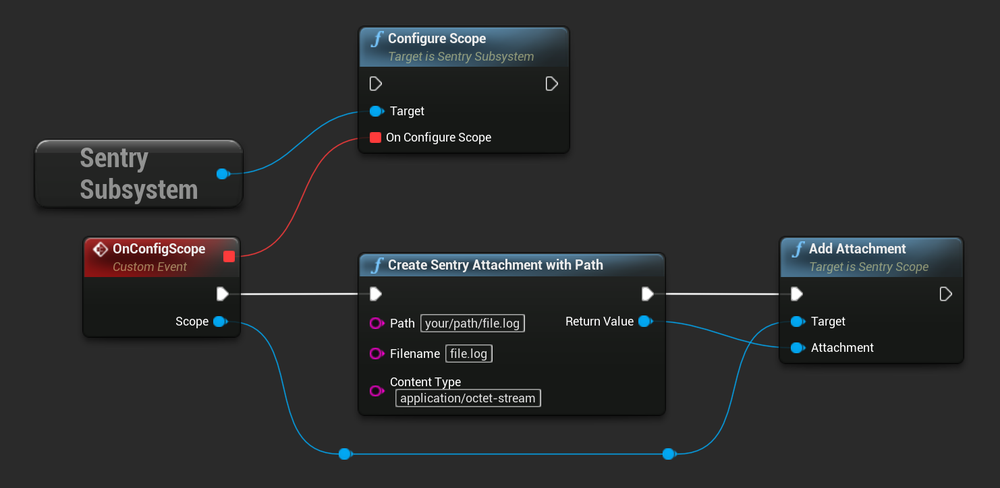

```cpp
USentrySubsystem* SentrySubsystem = GEngine->GetEngineSubsystem<USentrySubsystem>();

USentryAttachment* Attachment = NewObject<USentryAttachment>();
Attachment->InitializeWithPath("your/path/file.log", "file.log");

SentrySubsystem->AddAttachment(Attachment);
```

The same result can be achieved by calling the corresponding function in blueprint:


