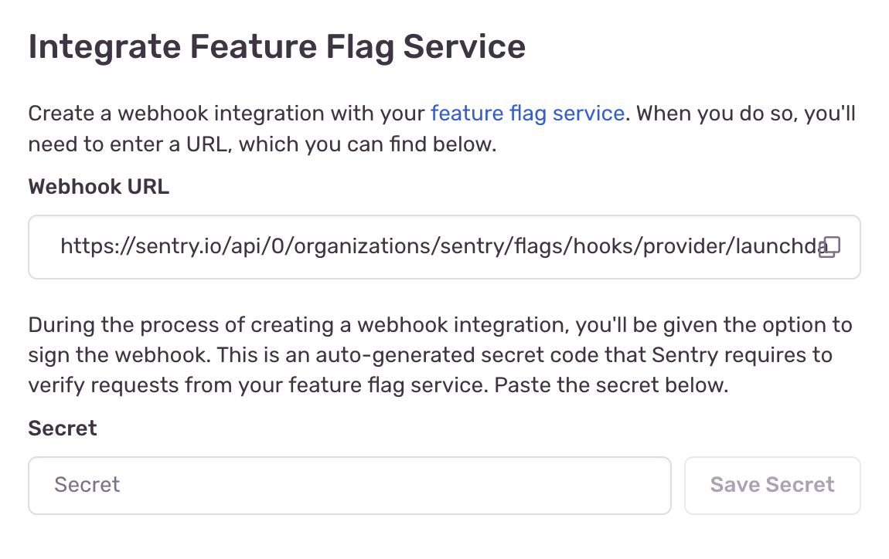

<PlatformContent includePath="feature-flags/change-tracking-cta" />

Under the "Integrate Feature Flag Service" heading a Sentry webhook URL has been provided. Additionally, a link to LaunchDarkly's webhook registration interface has been provided. Paste the Sentry webhook URL into the input box labeled "URL" within the LaunchDarkly webhook registration UI.

Next a signing secret must be created. Check the box that says "Sign this webhook". This will reveal an input element which contains your signing secret. Copy and paste this signing secret into the input box labeled "Secret" on the Sentry fly out. Click "Save Secret" in the Sentry UI, click "Save Settings" in the LaunchDarkly UI, and you're done. Sentry will now accept and authenticate all inbound hooks to your organization's feature flag webhook endpoint.
