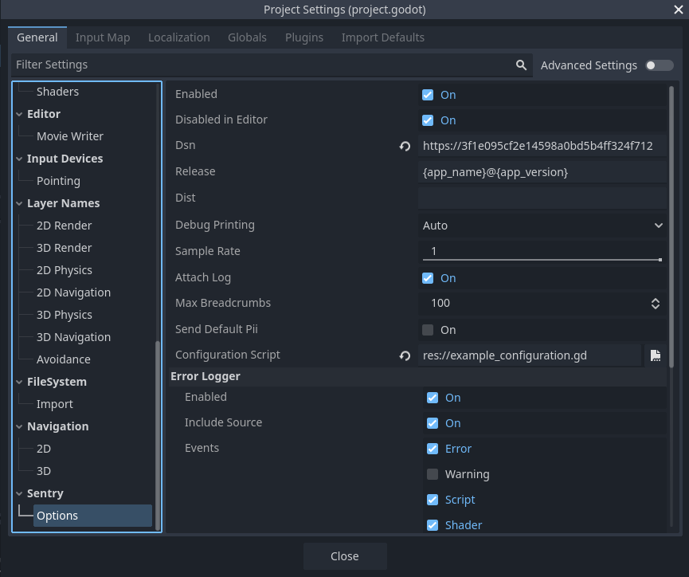

The minimum configuration required is the [DSN](/product/sentry-basics/dsn-explainer/) to your project.

Sentry can be configured via Project Settings or [in GDScript](/platforms/godot/configuration/options/). To access project settings in Godot Engine, navigate to `Project` > `Project Settings...`, then scroll down the sections list on the left until you find the Sentry section.

Your configuration is saved in the `project.godot` file along with other project settings.
