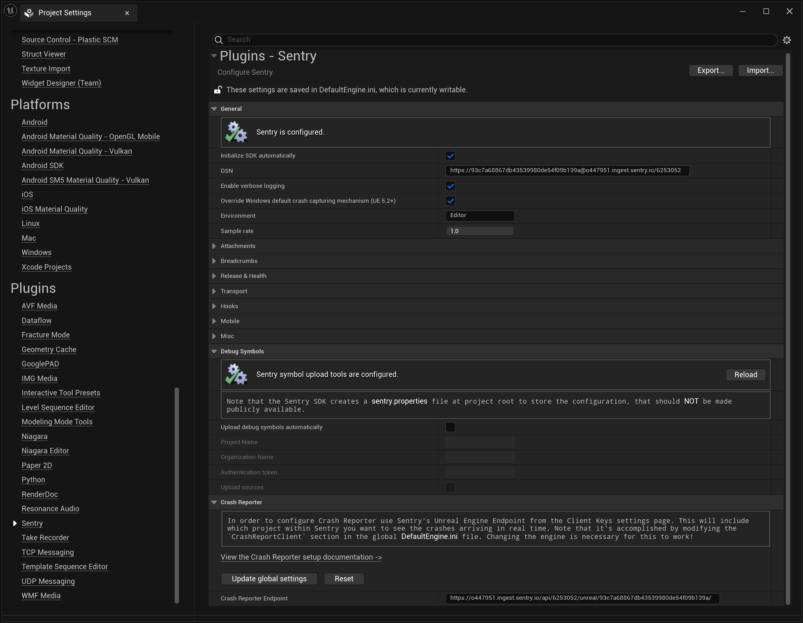

The minimum configuration required is the [DSN](/product/sentry-basics/dsn-explainer/) of your project:


```json {tabTitle: Public DSN}
{
  "public-dsn": "___PUBLIC_DSN___"
}
```

<Alert>

If you are logged in, you can also go to your project settings and copy its DSN directly from there.

</Alert>

Sentry can be configured using the Sentry configuration window.
The window can be accessed by going to editor's menu: **Project Settings > Plugins > Sentry**.



By default, the SDK is automatically initialized on application startup. Alternatively, the `Initialize SDK automatically` option can be disabled and in this case, explicit SDK initialization is required.

To override SDK settings at runtime, use the `InitializeWithSettings` method of the `SentrySubsystem` class.
