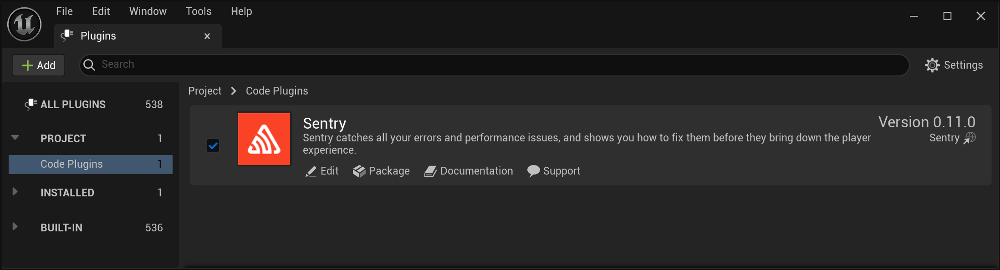

The Unreal Engine (UE) SDK is officially supported for the three latest UE versions. However, it is likely to be compatible with older engine versions as well depending on the specific features and functionality that you need.

To install the SDK, download the most up-to-date sources from the [Releases page](https://github.com/getsentry/sentry-unreal/releases) and add them to your project's `Plugins` directory. On the next project launch, UE will prompt you to build the Sentry and SentryEditor modules.

<Note>

Currently, this method is available only for C++ UE projects. Blueprint projects can be converted to a C++ one by adding an empty class using the editor.

</Note>

<Note>

The [Releases page](https://github.com/getsentry/sentry-unreal/releases) provides two plugin packages: `github` and `marketplace`. The key difference between the two is the crash capturing backend, which is used under the hood on Windows.

We recommend using the `github` version which uses `Crashpad`, an out-of-proc handler that sends the crash report right away. The `marketplace` version relies on `Breakpad`, an in-proc handler which requires the UE application or game to be relaunched in order to send the crash reports to Sentry.

</Note>

Alternatively, the Sentry SDK can be downloaded via the [standard installation process](https://docs.unrealengine.com/5.2/en-US/working-with-plugins-in-unreal-engine/#installingpluginsfromtheunrealenginemarketplace) from its [UE Marketplace](https://www.unrealengine.com/marketplace/en-US/product/sentry-01) page within the Epic Games Launcher.

<Note>

This method is recommended only for Blueprint UE projects. If you already have a C++ UE project or don't mind converting an existing Blueprint UE project to a C++ one, consider downloading the plugin from GitHub instead.

</Note>

To make sure the Sentry plugin has been enabled after installation has been completed, go to the editor and navigate to the **Settings > Plugins > Code Plugins** menu and check for the installation.



To access the plugin API from within C++,
add `Sentry` support to the build script (`MyProject.build.cs`):

```csharp
PublicDependencyModuleNames.AddRange(new string[] { ..., "Sentry" });
```
