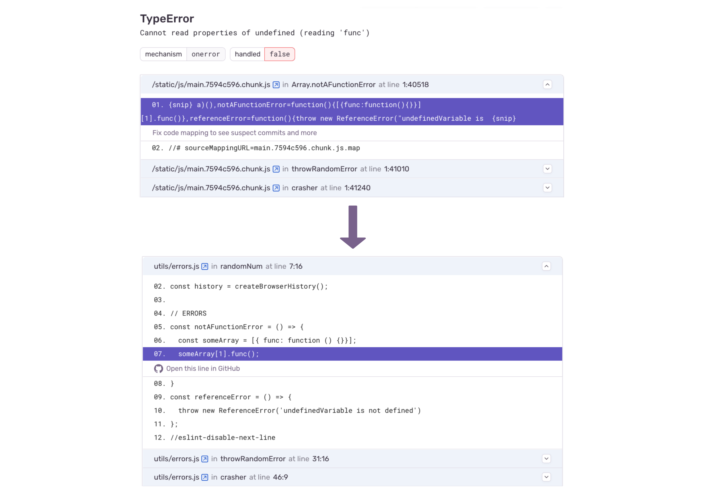

The Sentry Astro SDK will generate and upload source maps automatically during a production build, so that errors in Sentry contain readable stack traces.

The Astro SDK uses the [Sentry Vite Plugin](https://www.npmjs.com/package/@sentry/vite-plugin/) to upload source maps. See the <PlatformLink to="/manual-setup/#configure-source-maps-upload">Manual Configuration</PlatformLink> page and the Sentry [Vite plugin documentation](https://www.npmjs.com/package/@sentry/vite-plugin/#configuration) for more details.
