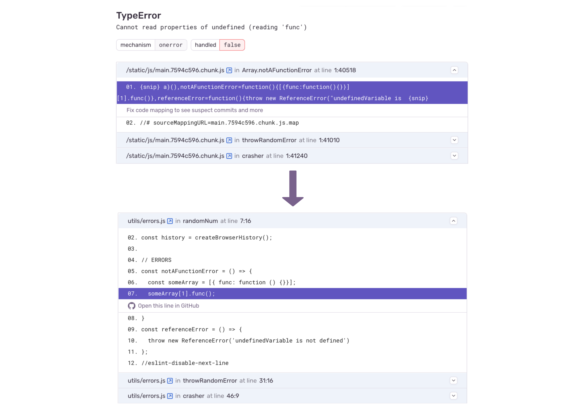

To enable readable stack traces in your Sentry errors, you need to upload your source maps to Sentry.

If you are using plain Cloudflare Workers, set `upload_source_maps = true` to your `wrangler.toml` file to enable source map generation.
