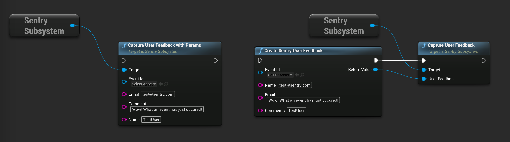

```cpp
USentrySubsystem* SentrySubsystem = GEngine->GetEngineSubsystem<USentrySubsystem>();

FString EventId = SentrySubsystem->CaptureMessage("Message with feedback");

USentryFeedback* UserFeedback = NewObject<USentryFeedback>();
User->Initialize("Feedback message");
User->SetName("Jon Doe");
User->SetContactEmail("test@sentry.io");
User->SetAssociatedEvent(EventId);

SentrySubsystem->CaptureFeedback(UserFeedback);

// OR

SentrySubsystem->CaptureFeedbackWithParams("Feedback message", "Jon Doe", "test@sentry.io", EventId);
```

The same result can be achieved by calling corresponding functions in blueprint:



<Alert>

The ability to capture user feedback is only supported on macOS, iOS, and Android.

</Alert>
