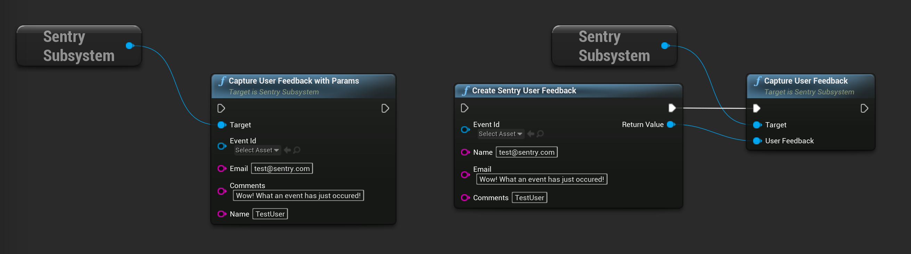

```cpp
USentrySubsystem* SentrySubsystem = GEngine->GetEngineSubsystem<USentrySubsystem>();

FString EventId = SentrySubsystem->CaptureMessage("Message with feedback");

USentryFeedback* UserFeedback = NewObject<USentryFeedback>();
UserFeedback->Initialize("Feedback message");
UserFeedback->SetName("Jon Doe");
UserFeedback->SetContactEmail("test@sentry.io");
UserFeedback->SetAssociatedEvent(EventId);

SentrySubsystem->CaptureFeedback(UserFeedback);

// OR

SentrySubsystem->CaptureFeedbackWithParams("Feedback message", "Jon Doe", "test@sentry.io", EventId);
```

The same result can be achieved by calling corresponding functions in blueprint:



Feedback can carry <PlatformLink to="/enriching-events/attachments/">attachments</PlatformLink>, such as screenshots or logs, and can be captured with a <PlatformLink to="/enriching-events/scopes/#local-scopes">local scope</PlatformLink> to add data to a single feedback without affecting other events:

```cpp
USentryAttachment* Attachment = NewObject<USentryAttachment>();
Attachment->InitializeWithPath("your/path/screenshot.png", "screenshot.png", "image/png");

UserFeedback->AddAttachment(Attachment);

SentrySubsystem->CaptureFeedbackWithScope(UserFeedback, FConfigureScopeNativeDelegate::CreateLambda([](USentryScope* Scope)
{
    Scope->SetTag("feedback-source", "in-game-menu");
}));
```

<Alert>

On macOS and iOS, changes made to the local scope are ignored for user feedback.

</Alert>
