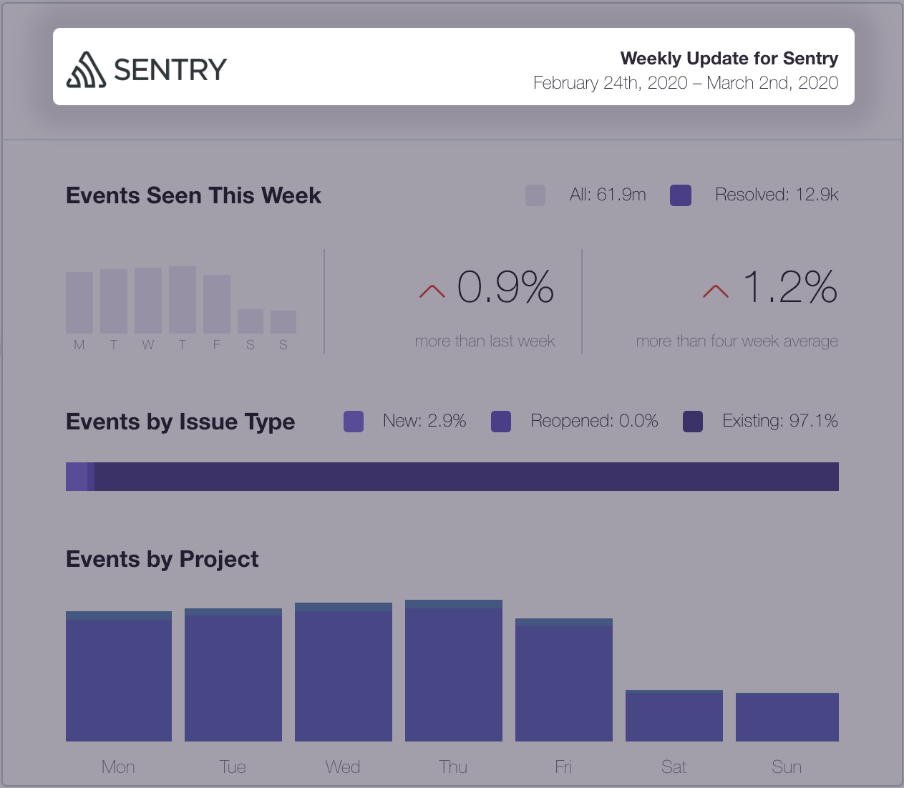

Manage your account by selecting **User Settings** from the dropdown available under your organization’s name. Here, you can set preferences for many basics of your Sentry account.

## Account Details

Use account details to set your preferred:

- **Stack Trace Order**: the default is `let Sentry decide`
- **Language**
- **Timezone**
- Whether to use a **24-hour clock**

You can also upload an Avatar to personalize your account. Choose among displaying your initials, an image, or a Gravatar next to your name.

## Security Settings

The **Security Settings** tab allows you to reset a password, sign out of all devices, and enable two-factor authentication. **Note:** Changing your password invalidates all logged in sessions.

If you cannot receive two-factor authentication codes, such as if you lose your device, use recovery codes to access your account. Click the **View Codes** button to download, print, or copy your codes to a secure location.

Clicking **Sign out of all devices** will end your sessions with any device logged in to Sentry using your account.

Click the **Session History** tab to find a historical list of your sessions, including First Seen and Last Seen timestamps.

## Notifications

Sentry notifications are broadly categorized into alerts and non-alert notifications.

- Alerts notify you about problems in your application and can be sent to many supported [integrations](/workflow/integrations/#webhook-alerts). You can set alerts on both errors and performance data.
- Non-alert are all other types of Sentry notifications such as workflow notifications, deploy notification, and quota & usage notifications. These are sent only email.

For more details, see our [full documentation on Alerts & Notifications](/workflow/alerts-notifications/).

Define your preference for **Alerts** and **Workflow Notifications**. Fine-tune the notifications per project using the dropdown selector.

**Email Routing** preference controls the emails sent for each project. These notifications default to the email address used to set up your Sentry account. Route email notifications to an alternative email address to organize your project notifications. For example, infrastructure-related projects can route to an email dedicated to your team's infrastructure.

Sentry generates reports **Weekly Reports** per project and sends these reports once a week on Mondays. Fine-tune your reports per project using the dropdown selector. The following report sample shows details on Events Seen This Week, Events by Issue Type, Events by Project, and activity over time.

Choose a **Deploy Notifications** option to track deployment details, such as release version, environments, and commit reviews. Fine-tune options from the dropdown next to each organization.

Enable email notification for updates regarding your user account actions, such as claiming unassigned issues in the section devoted to **My Activity**. **Note:** Find a shortcut to the Emails panel at the bottom of this section.

## Emails

The email address used to login to your Sentry account is by default your primary email address. Add an alternative email address in the **Add Secondary Emails** section. **Note:** Find a shortcut to the Notifications panel at the bottom of this section.

## Subscriptions

Opt in to receive information from Sentry, such as newsletters and product updates. As part of our compliance with the EU’s General Data Protection Regulation (GDPR), you receive marketing campaign emails **only** after explicitly opting into any of the listed categories.

## Authorized Applications

Sentry lists all authorized third-party applications in this section and requires authentication tokens for authorization. Find tokens in the [_Auth Tokens_](https://sentry.io/api/) section.

## Identities

Sentry integrates with several identity providers, such as Okta, OneLogin, Auth0, and Yubico. To disconnect any previously configured provider, click the **Disconnect** button.

## Close Account

Closing your Sentry account automatically removes all data associated with your account. If your account is the sole owner of an organization, this organization will be deleted. Organizations with multiple owners will remain unchanged.

<Alert level="warning">Warning: Deleting your account cannot be undone.</Alert>

## API

### Applications

Integrating your application with Sentry allows you to send events to your Sentry instance automatically. To create an application, click the **Create New Application** button.

### Auth Tokens

Authentication tokens allow you to perform actions against the Sentry API on behalf of your account. To create one, click the **Create New Token** button.
