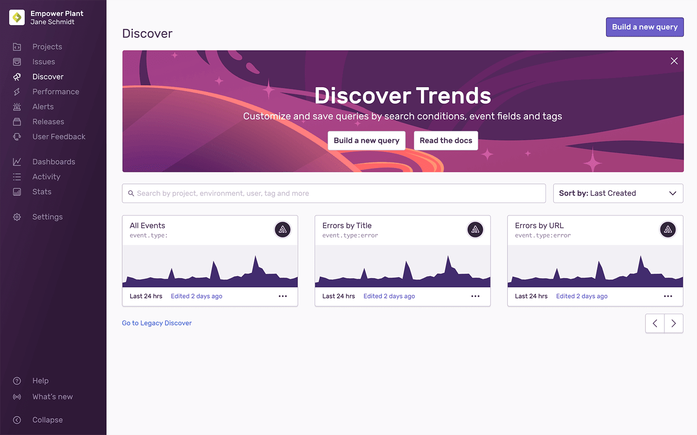
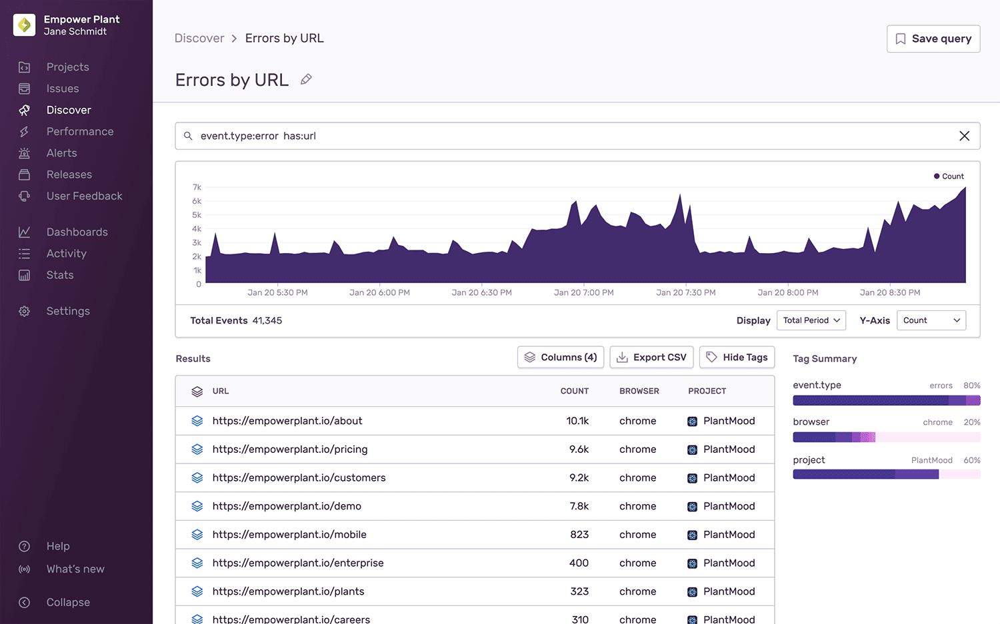
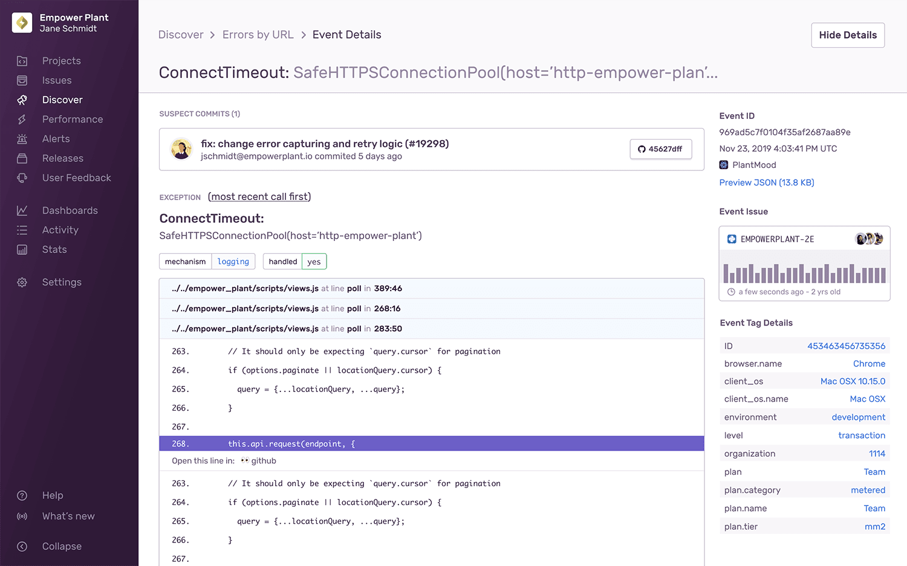

Discover provides visibility into your data across environments by building upon and enriching your error data. This feature will allow you to query and unlock deeper insights into the health of your entire system and answer critical business questions --- all in one place. Customers subscribed to the Team or Business plan can use Discover to view comprehensive information sent to Sentry.

The Discover Homepage offers views of all your saved and pre-built queries so you can quickly dive into areas that need immediate attention. For example, if a spike occurred in the past 24 hours for a query on errors, a user may investigate that first. Each query is saved as a card that displays a summarized view of the data.

- Display Name
- Search Conditions
- Creator
- Graph Snapshot
- Date Range
- Last Edited

## Pre-built Queries

Query cards with Sentry avatars are pre-built and cannot be removed.

- All Events: Users can see the raw error stream for any group of projects. This replaces the Events feature and gives users the ability to add additional columns and change groupings to achieve their desired breakdown.
- Errors by Title: Users can see their most frequently occurring errors by the total number of raw errors, as well as the total number of users affected.
- Errors by URL: Users can see the pages that generated the most errors and different types of issues. As a reminder, issues are a group of fingerprinted Events. For more details, see the [full documentation on fingerprinting](/data-management/event-grouping/).

## Saved Queries

Query cards with a user avatar indicate saved queries. The user who created a saved query will have their avatar display on the query card. Saved Queries are viewable by anyone in your organization, and **are not** scoped to the user's account.

**Build a New Query**

From the Discover Homepage, you can build a query in three ways.

- Click on "Build a new query"
- Click on the ellipsis of an existing saved query card to "Duplicate"
- Go into any existing query
  1. Click on "Save as..." in the top right
  2. Enter a display name
  3. Click "Save"

Apply new search conditions or table columns to modify the results of the query. Save the query and assign a custom display name. For the full details, see [documentation on the Query Builder](/performance-monitoring/discover-queries/query-builder/).

**Search for a Query**

Looking for a specific query? Use the search bar on the homepage to find the query name.

**Sort Queries**

The dropdown in the top right will allow you to sort by attributes.

- Recently Edited (Default)
- My Queries
- Query Name (A-Z)
- Date Created (Newest)
- Date Created (Oldest)
- Most Outdated

**Edit Queries**

If you need to edit any of these queries, go into the query, make the desired changes and a button will appear in the top right asking you to save/update the query. Keep in mind, edits to the query conditions **will not** be automatically saved.

To rename a saved query, click on the pencil icon by the header and enter the desired display name. Click "enter" or outside of the area to save the updated name.

**Share Queries**

Share your queries as often as you want. You can share URLs with other users who also have access to the same organization. As each part of the query is built, the results update, and the URL is updated so that in-progress searches can be shared in email, chat, etc.

**Delete Queries**

<Alert>
  Deleting a saved query is irreversible.
</Alert>

On the Discover Homepage, each saved query card has an ellipsis that will open a context menu. Delete the query from here. You can also delete the query within Query Results view by clicking the trash can in the upper right.

## Query Results

To view query results, click into any query card. You'll find a graph, table, and toggleable tag summary (or facet map). The search bar at the top enables you to see the search conditions entered. The table reflects the events with sortable columns.

If the first column shows an icon (as seen above), it means the events have been stacked. Click on the icon to view the full list of events. Each event will have an event ID you can click on for more details. For more about how to build a query, go to [the Query Builder](/performance-monitoring/discover-queries/query-builder/).

## Event Details

Navigate to the Event Details page from **Discover > [Saved Query] > Event Detail**. You'll find all the relevant details about a single event. For every event, you will see the ID, timestamp, and link to view the normalized JSON payload that Sentry received.

The Event Detail view varies depending on event type (error, transaction, csp). [Transaction event details](/performance-monitoring/performance/event-detail/) may have an entirely different view from error event details (as shown above). For example, errors may have a related issue shown in the sidebar. This gives you a quick glance at the event volume for that issue and lets you quickly navigate to the related issue. You may also find stack traces, breadcrumbs, and more in these views.
