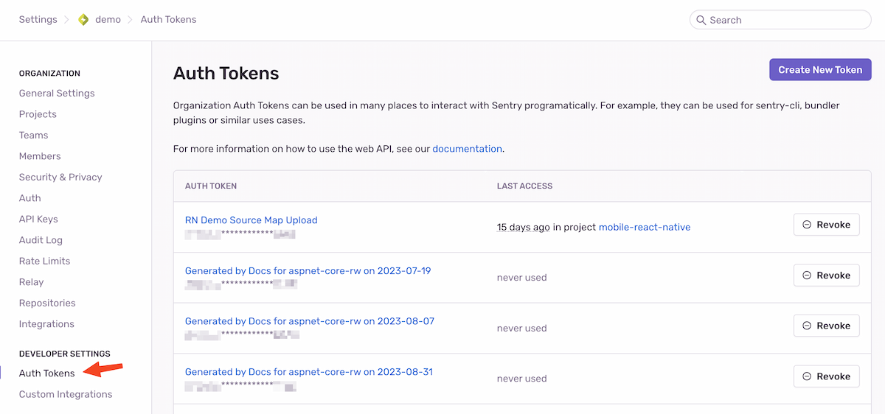
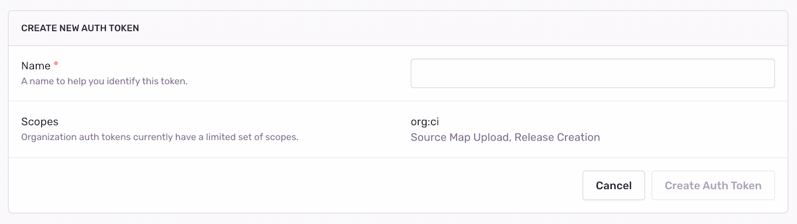
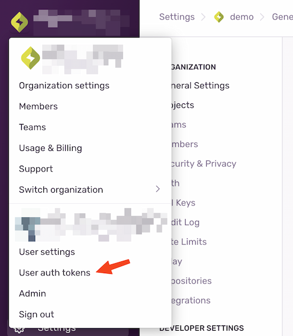
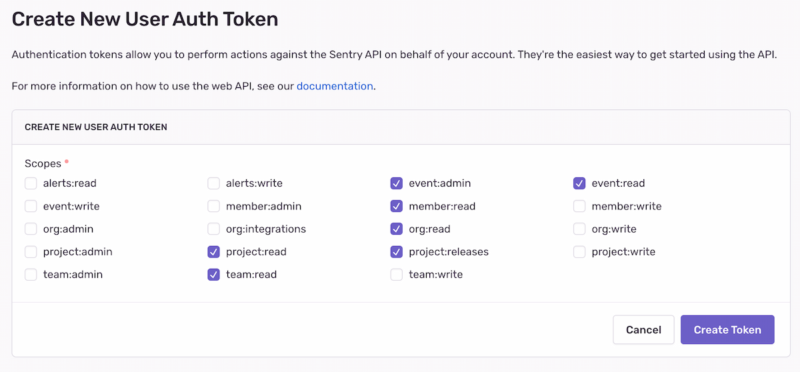
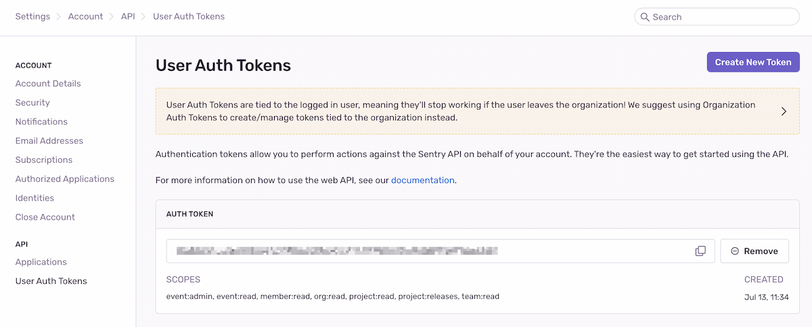

Auth tokens (short for _authentication tokens_) are a way to authenticate with Sentry. They are similar to passwords but are designed for programmatic interaction with Sentry. Some examples of what you would use auth tokens for include:

- Uploading Source Maps during your CI build
- Using [Sentry CLI](/product/cli/) to interact with Sentry
- Using the [Sentry API](/api/auth/)

Each auth token is created with a certain set of permissions and scopes which are mapped to the Sentry API's [Permissions & Scopes](/api/permissions/). Some types of auth tokens have set permissions that can't be edited, while others can be customized upon token creation and edited later.

We recommend using a separate auth token for each use case. For example, you would use a different auth token to upload source maps than the one you use with Sentry CLI. This has the benefit that if an auth token is compromised, you can revoke that auth token without impacting the rest of your workflow.

## Types of Auth Tokens

There are three key types of auth tokens in Sentry:

- [Organization Auth Tokens](#organization-auth-tokens):
  These tokens are bound to an organization, and have access to all projects within that organization. They have a limited set of permissions and are designed to be used in CI environments and with Sentry CLI.

- [User Auth Tokens](#user-auth-tokens):
  These tokens are bound to a user, and have access to all organizations and projects that user has access to.

- [Internal Integrations](#internal-integrations):
  These tokens are bound to an organization, and have access to all projects within that organization. They can be created with a custom set of permissions, and are designed to be used in cases where organization auth tokens don't have sufficient access rights.

### When Should I Use Which?

For most scenarios, we recommend using [Organization Auth Tokens](#organization-auth-tokens). They are designed to be used in CI environments and have a limited set of permissions. This means that if the place you stored the auth token is compromised, the attacker can only do limited damage.

Organization auth tokens permissions aren't customizable. They are set to allow most CI-related tasks, without any unnecessary permissions.

[User Auth Tokens](#user-auth-tokens) should be used to interact with the Sentry API on behalf of a user. For example, to fetch all issues for a user, you would use a User auth token. We don't recommend using User auth tokens for CI tasks because if the user who created the token is removed from the Organization, the token will stop working.

User auth token permissions are customizable and editable. 

[Internal Integrations](#internal-integrations) should be used when you need full API access (which the organization auth tokens cannot grant), and you want to interact with the Sentry API on behalf of an organization. For example, to programmatically create a new project, you would use an internal integration.

Permissions for auth tokens created as part of an internal integration are customizable and editable.

### Organization Auth Tokens

[Organization auth tokens](https://sentry.io/orgredirect/organizations/:orgslug/settings/auth-tokens/) can be created in [sentry.io](https://sentry.io) on the **Auth Tokens** page under  **Settings > Developer Settings > Auth Tokens**.

They can also be generated on certain pages of Sentry's docs if you're signed in, and by using the Sentry Wizard to configure uploading source maps.

Organization auth token names are generated for you unless you create the token through the Sentry UI. This name is only used for display purposes - it helps to identify an auth token in case you want to revoke it later. You can change the name for an organization auth token at [sentry.io](https://sentry.io) on the **Edit Auth Token** page under  **Settings > Developer Settings > Auth Tokens**.

For security reasons, organization auth tokens are only visible *once*, right after you create them. If you lose the auth token, you will have to create a new one. This means you can't see the full token on the overview page or on the token detail page, you can only see the last characters of the token to help identify it.

Any user can create organization auth tokens for any of their organizations. This allows any user (not only organization owners) to configure a Sentry SDK and set up CI processes by creating and using organization auth tokens. Since organization auth tokens have limited access, there is limited potential for abuse.

All owners of the organization will receive a security email when a new organization auth token is created and can revoke these tokens at any point. _Only_ organization owners & managers can revoke organization auth tokens .

### User Auth Tokens

[User Auth Tokens](https://sentry.io/settings/account/api/auth-tokens/) can be created in the Sentry UI in the Account dropdown in the top left, under **User Auth Tokens**:

User Auth Tokens can be created by any user, and are bound to that user. They have access to all Organizations and Projects that user has access to - their _maximum_ scope is all the scopes that the user has access to (for a given organization). This means that a User Auth Token created by a user cannot exceed the permissions of that user - see [Organization and User Management](/product/accounts/membership/) for more details on how permissions work in Sentry. When you create a new User Auth Token, you can select which [scopes](/api/permissions/) the token should have:

Note that in contrast to Organization Auth Tokens, you can still view User Auth Tokens after creating them. This is a legacy behavior that may change in the future. We still recommend to only use a given User Auth Token a single time, and to create a new token for each use case. Any user can always revoke any of their User Auth Tokens.

You should generally only need to use a User Auth Token when you want to interact with the Sentry API on behalf of a user. See [API > Authentication](/api/auth/) documentation for more information on how to do this.

## Internal Integrations

You should generally only need to use an Internal Integration when you want to interact with the Sentry API on behalf of an organization. See [API > Authentication](/api/auth/) documentation for more information on how to do this.

[Read more about Internal Integrations](/product/integrations/integration-platform/).
