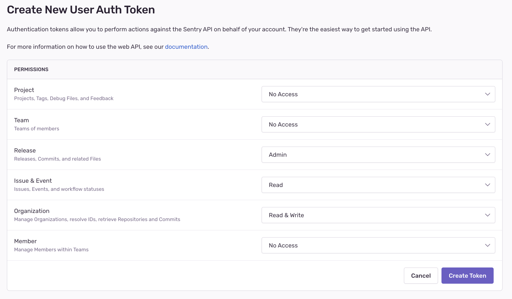

Sentry provides different ways to programatically interact with Sentry. You can use _Auth Tokens_ to authenticate with the Sentry API, but there are also other tooks that require Auth Tokens for authentication under the hood, like [Sentry CLI](/product/cli/) or tools for [source map uploads](/platforms/javascript/sourcemaps/uploading/).

## What Are Auth Tokens?

Auth Tokens (short for _Authentication Tokens_) are a way to authenticate with Sentry. They are similar to passwords, but are designed for programmatic interaction with Sentry. Some examples of what you would use Auth Tokens for include:

- Uploading Source Maps during your CI build
- Using [Sentry CLI](/product/cli/) to interact with Sentry
- Using the [Sentry API](/api/auth/)

Different kinds of Auth Tokens contain access rights for different things. Under the hood, all Auth Tokens are tied to [Permissions & Scopes](/api/permissions/), which define all the things the Auth Token grants access for.

Ideally, an Auth Token is only used once. This has the benefit that if the place you stored the Auth Token in is compromised, you can revoke this Auth Token without impacting any other place.

## What Types of Auth Tokens Are There in Sentry?

There are three key types of Auth Tokens in Sentry:

- [Organization Auth Tokens](#organization-auth-tokens):
  These tokens are bound to an Organization, and have access to all Projects within that Organization. They have a limited set of permissions, and are designed to be used in CI environments.

- [User Auth Tokens](#user-auth-tokens):
  These tokens are bound to a User, and have access to all Organizations and Projects that User has access to.

- [Internal Integrations](#internal-integrations):
  These tokens are bound to an Organization, and have access to all Projects within that Organization. They can be created with a custom set of permissions, and are designed to be used in cases where Organization Auth Tokens do not have sufficient access rights.

## When Should I Use Which?

For most scenarios, we recommend to use [Organization Auth Tokens](#organization-auth-tokens). They are designed to be used in CI environments, and have a limited set of permissions. This means that if the place you stored the Auth Token in is compromised, the attacker can only do limited damage.

They are also designed to be easily usable, they will work for all regular CI-related tasks out of the box.

[User Auth Tokens](#user-auth-tokens) should be used when interacting with the Sentry API on behalf of a user. For example, if you want to fetch all issues for a user, you would use a User Auth Token. You should avoid using User Auth Tokens for e.g. CI processes, as due to their User-bound nature, if the user that created the token is ever removed from the Organization, the token will stop working.

[Internal Integrations](#internal-integrations) should be used when you need full API access (which the Organization Auth Tokens cannot grant), and you want to interact with the Sentry API on behalf of an Organization. For example, if you want to create a new Project, you would use an Internal Integration.

## Organization Auth Tokens

[Organization Auth Tokens](https://sentry.io/orgredirect/organizations/:orgslug/settings/auth-tokens/) can be created in the Sentry UI under **Settings > Developer Settings > Auth Tokens**.

Each Auth Token has a user-defined name (which you can also update at a later point). This name is only used for display purposes, and does not have any impact on the Auth Token itself - it helps to identify an Auth Token e.g. in the case you want to revoke it later.

For security reasons, Organization Auth Tokens are only visible once right after you created them. If you lose the Auth Token, you will have to create a new one. Because of this, you cannot see the token either on the overview page or on the token detail page - you can only see the last characters of the token, as a help to identify a token.

Any user can create Organization Auth Tokens for any of their Organizations. Since Organization Auth Tokens are designed to have limited access, there is very limited abuse potential through them. Since any user (not only e.g. organization owners) may have to setup CI and similar processes, any user can create Organization Auth Tokens in order to keep the process as frictionless as possible.

All owners of the Organization will receive a security email when a new Organization Auth Token is created, and can revoke the token at any point. _Only_ Organization owners can revoke Organization Auth Tokens.

## User Auth Tokens

[User Auth Tokens](https://sentry.io/settings/account/api/auth-tokens/) can bre created in the Sentry UI in the Account dropdown in the top left, under **User Auth Tokens**:

User Auth Tokens can be created by any user, and are bound to that user. They have access to all Organizations and Projects that user has access to - their _maximum_ scope is all the scopes that the user has access to (for a given organization). This means that a User Auth Token created by a user cannot exceed the permissions of that user - see [Organization and User Management](./membership/) for more details on how permissions work in Sentry. When you create a new User Auth Token, you can select which [scopes](/api/permissions/) the token should have:

Note that in contrast to Organization Auth Tokens, you can still view User Auth Tokens after creating them. This is a legacy behavior that may change in the future. We still recommend to only use a given User Auth Token a single time, and to create a new token for each use case. Any user can always revoke any of their User Auth Tokens.

You should generally only need to use a User Auth Token when you want to interact with the Sentry API on behalf of a user. See [API > Authentication](/api/auth/) documentation for more information on how to do this.

## Internal Integrations

You should generally only need to use an Internal Integration when you want to interact with the Sentry API on behalf of an organization. See [API > Authentication](/api/auth/) documentation for more information on how to do this.

[Read more about Internal Integrations](/product/integrations/integration-platform/).
