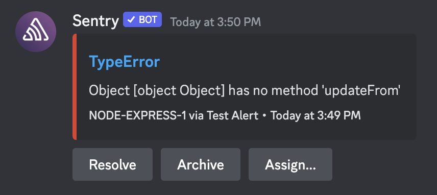

<Include name="feature-available-for-user-group-early-adopter.mdx" />

Get notified and manage issues right in Discord with Sentry's Discord integration.

## Install

<Note>

Sentry owner, manager, or admin permissions are required to install this integration.

</Note>

1. In [sentry.io](https://sentry.io), navigate to **Settings > Integrations > Discord**.

1. Click "Add Installation". A pop up window should open.

   

1. Log in to your Discord account. If you're already logged in, this login step will not be displayed.

1. Use the dropdown menu to select the Discord server you'd like to add Sentry to and click "Continue".

   <Note>
     You will need to have the "Manage Server" permission enabled for your
     Discord account in the server you're trying to add the bot to.
   </Note>

   

1. Finally, once the server is selected, click "Authorize". The integration will be created and the Sentry Discord bot will join the selected server.

Your Discord integration is now available to all projects in your Sentry organization.

In the next section, we'll walk through configuring Discord notifications.

## Configure

Currently our Discord integration supports issue alert rules, with metric alerts and personal notifications planned for future updates to the integration.

### Issue Alerts

Follow the steps below to create a new issue alert that sends Discord notifications.

1. In Sentry, go to **Alerts** and click "Create Alert".

1. Select "Issues" and then click "Set Conditions".

   

1. Configure your issue alert conditions as desired.

1. To set up Discord notifications, select "Send a Discord notification" in the "THEN" actions dropdown.

1. Select the Discord server and channel you'd like to send the alert to. You can optionally specify tags here to include in the notification.

   

   The channel field must be filled in with a Discord channel ID, _not_ a channel name. To get this channel ID, enable Discord's Developer Mode (**Settings -> Advanced -> Developer Mode**).

   

   With Developer Mode is enabled, you'll be able to right click on a channel and copy the channel's ID.

1. Test your configuration by clicking "Send Test Notification". If the bot has access to the given channel, you should see an example notification there.

   

### Identity Linking

Having your Discord account linked to your Sentry account allows you to resolve, archive, and assign issues directly in Discord.

If you're the user who installed the Discord bot to your server, your identity was linked during the install process. You can use the `/link` command to verify this. The bot will tell you which Sentry account your Discord account is linked to.

All users in any Discord server with the Sentry bot can use the `/link` command to link their accounts. If the account isn't linked yet, the bot will reply with a link to our identity linking page. Make sure you're signed into the desired Sentry account in your browser when you open the link. Click "Link with Discord" to link your accounts.

To unlink your accounts, use the `/unlink` command. Follow the link and click "Unlink from Discord"

### Troubleshooting

#### Your channel ID isn't working in the alert creation wizard

If you're trying to create an alert with a Discord action and Sentry can't access the channel you've provided, please double-check the following:

- You are giving us a channel ID and not a channel name or something else. See [Configure](#configure) for more details.
- The channel you're trying to add is in the same server that is selected in the alert action.
- The bot has access to the channel you're trying to use. A quick way to verify this is to check whether you can find the bot in the desired channel's member list. If you do not see the bot in the list of users, you may need to update your Discord role and/or channel permissions to allow the bot access. See [Install](#install) for more details.
