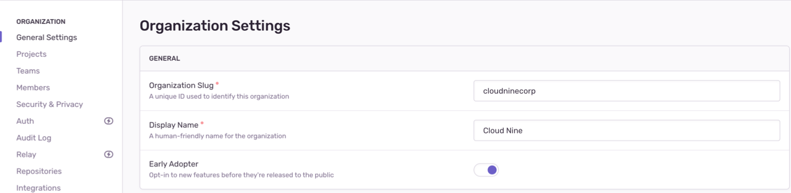

If you’re interested in being an Early Adopter, you can turn your organization’s Early Adopter status on/off in **Settings > General Settings**. This will affect all users in your organization and can be turned back off just as easily.

This page lists the features that you'll have access to when you opt-in as "Early Adopter". Note that features are sometimes released to early adopters in waves, so you may not see a feature immediately upon enabling the "Early Adopter" setting.

Limitations:

- This list does not include new features that aren't controlled by the "Early Adopter" setting, such as alphas, closed betas, or limited availability features that require manual opt-in.
- This list is not guaranteed to be 100% up-to-date, but it is monitored and updated frequently.

## Current Early Adopter Features

- [Issue Status](/product/issues/states-triage/) tags
- [Priority Sort](/product/issues#issue-sort) algorithm improvements
- [Issue Reprocessing](/product/issues/reprocessing/)
- [Span Summary](/product/performance/transaction-summary/#span-summary)
- [Issue Archiving](/product/accounts/early-adopter-features/issue-archiving/)
- [Sentry Comments on Suspect GitHub PRs](/product/integrations/source-code-mgmt/github/#get-sentry-comments-on-suspect-pull-requests/)
