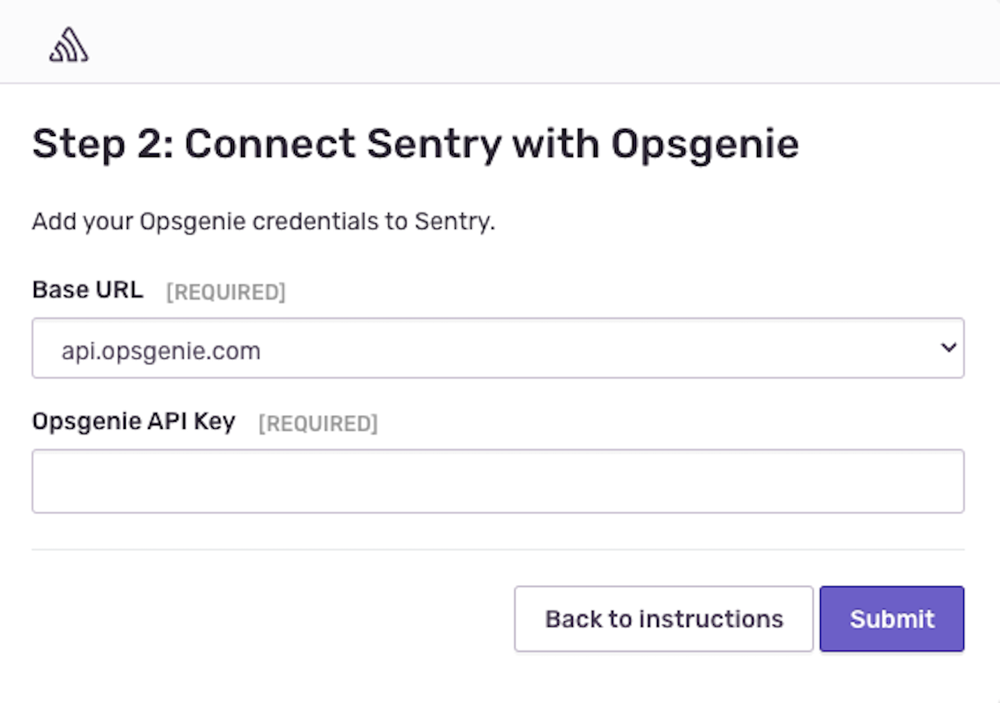
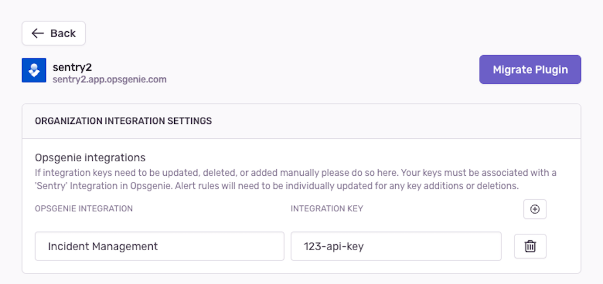

The Opsgenie integration allows you to add connect your Sentry organization with one or more Opsgenie accounts. You can configure issue and metric alerts in Sentry that send alerts to Opsgenie teams of your choice.

## Install

<Note>

Sentry owner, manager, or admin permissions are required to install this integration.

</Note>

1. Navigate to **Settings > Integrations > Opsgenie (Integration)**

    

2. The resulting modal will have instructions on how to create a management API key. Complete them in Opsgenie, and then return to Sentry with your API key copied.

    

3. Select your base Opsgenie URL, and paste in your management API key. Click 'Submit'. If your key is valid, you will be directed to the configuration page for your connected Opsgenie integration.

    

## Configure

The Opsgenie integration should now be installed. On the configuration page, you will be able to manually add and update integration keys. These keys must be associated with a 'Sentry' integration in Opsgenie.

### Alert Rules

Click "Add Alert Rule" in the integration configuration page or go to **Alerts** and click "Create Alert" to set up a new alert rule for the Opsgenie integration.

In [issue alerts](/product/alerts/alert-types/#issue-alerts), select "Send an Opsgenie notification" in the actions dropdown and then select your account and team:

In [metric alerts](/product/alerts/alert-types/#metric-alerts), select the Opsgenie option in the dropdown that corresponds to your account and the select your team:

If a Opsgenie incident is created from the critical trigger of a metric alert, it will be acknowledged when the Sentry metric alert is resolved.
