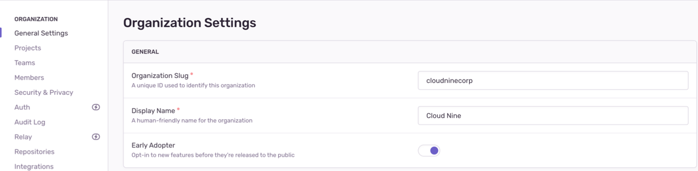

If you’re interested in being an Early Adopter, you can turn your organization’s Early Adopter status on/off in **Settings > General Settings**. This will affect all users in your organization and can be turned back off just as easily.

This page lists the features that you'll have access to when you opt-in as "Early Adopter". Note that features are sometimes released to early adopters in waves, so you may not see a feature immediately upon enabling the "Early Adopter" setting.

Limitations:

- This list does not include new features that aren't controlled by the "Early Adopter" setting, such as alphas, closed betas, or limited availability features that require manual opt-in.
- This list is not guaranteed to be 100% up-to-date, but it is monitored and updated frequently.

## Current Early Adopter Features

- [Grouping Breakdown](/product/data-management-settings/event-grouping/grouping-breakdown/)
- [Issue Reprocessing](/product/issues/reprocessing/)
- [Span Summary](/product/performance/transaction-summary/#span-summary)
- Organization Domains - Instead of being a path segment, organization slugs are used as a subdomain for [sentry.io](https://sentry.io). For example, `https://acme.sentry.io/issues/` replaces `https://sentry.io/organizations/acme/issues/`. API URLs are unchanged.
- [Team-level Roles](https://sentry-docs-git-update-org-and-user-managment-page.sentry.dev/product/accounts/membership/?original_referrer=https%3A%2F%2Fgithub.com%2Fgetsentry%2Fsentry-docs%2Fpull%2F6934#team-level-roles)
