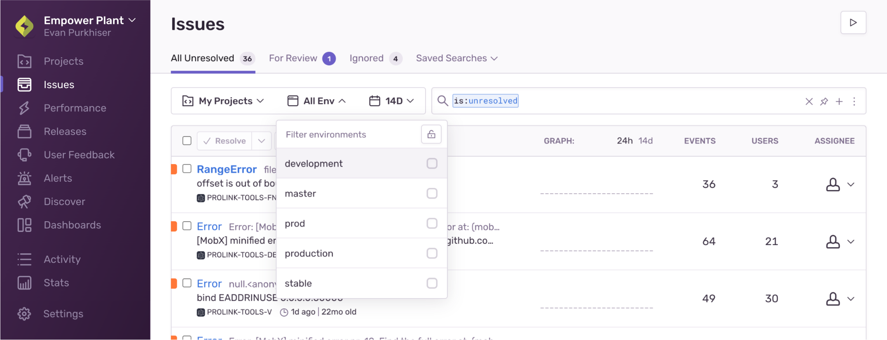

In this guide, we'll provide the recommended checklist for setting up your Sentry organization account so you can get started with Sentry error monitoring.

We understand that some of you are running enterprise organizations, while others of you are hobbyists just coding for fun. Below, we've linked where you should get started, depending on your situation.

- You're configuring Sentry for a large organization? [Start at step 1](#1-enable-single-sign-on-access)
- You're working on an application with a small team? [Start step 2](#2-set-up-teams)
- You're a hobbyist or working on an app alone? [Start at step 3](#3-configure-integrations)

Of course, you're welcome to go through all the steps, even if you're a team of one.

## 1. Enable Single Sign-On Access

[Single sign-on (SSO)](/product/accounts/sso/) allows your team to log in quickly, streamlines the on/off-boarding process for member accounts, and strengthens your login with secure credentials. Sentry provides out-of-the-box configuration for integrating SSO providers like [Okta](/product/accounts/sso/#okta) and [Azure Active Directory](/product/accounts/sso/#azure-active-directory) (SAML) or [Google](/product/accounts/sso/#google-business-app) and [GitHub](/product/accounts/sso/#github-organizations) (Oauth). In addition, we provide a generic configuration option for any other [SAML2 Identity Provider](/product/accounts/sso/saml2/).

Sentry also supports a subset of the specification for System for Cross-Domain Identity Management (SCIM) for [Okta](/product/accounts/sso/okta-sso/okta-scim/) and [Azure AD](/product/accounts/sso/azure-sso/#scim-integration).

## 2. Set Up Teams

Now that SSO is configured and members have created their accounts, add them to their Sentry Teams. Teams are associated with your [Sentry projects](#4-create-projects), and their members receive issue notifications in addition to becoming issue assignees. We recommend creating Sentry teams that align with your internal team structure (for example, _#Frontend_, _#Ops_, _#SDK_, and so on). To add a new team, go to **Settings > Teams** and click "Create Team".

Click on a team name to open the team settings and manage its associated members and projects.
Under the "Members" tab, add existing members to your team by clicking on "Add Member > [Member Name]".

You can also invite multiple new (external) members to join your organization and team by clicking on "Add Member > Invite Member".

Learn more about different user roles in [Organization Management](/product/accounts/membership/).

## 3. Configure Integrations

Sentry integrates into your existing workflows by providing out-of-the-box integrations with widely-used apps and services. To enable and configure integrations, go to **Settings > Integrations**. There are several types of integrations available, but we recommend that you immediately set up integrations for:

- [Alerting](#31-alert-notifications)
- [Source code management](#32-source-code-management)
- [Issue tracking](#33-issue-tracking)

### Alert Notifications {#31-alert-notifications}

By default, Sentry will notify you about errors in your apps by email and [Slack](/product/integrations/notification-incidents/slack/) (once you enable the integration). You can also enable team notifications in Slack so the right people in your organization always receive the alerts they need. In addition to Slack, Sentry offers several other [notification and incident integrations](/product/integrations/notification-incidents/), like [Microsoft Teams](/product/integrations/notification-incidents/msteams/) and [PagerDuty](/product/integrations/notification-incidents/pagerduty/) to help you triage issues.

Learn more about setting up alerts with integrations in [Alert Routing With Integrations](/product/alerts/create-alerts/routing-alerts/).

### Source Code Management {#32-source-code-management}

When you enable an integration with your source code management (SCM) provider, Sentry will analyze your commit data to:

1. Identify **suspect commits** that likely introduced an error.
1. **Suggest assignees** who can best resolve the error, based on the suspect commits and your [codeowners file](/product/issues/issue-owners/#code-owners).
1. Mark an issue as **Resolved via Commit or PR** to stop notifications about similar errors in past releases and notify you of a regression.
1. Link a Sentry issue to a new or existing issue in your integrated [issue tracking](#33-issue-tracking) solution.

   

   

Sentry has built-in SCM integrations with:

- [Azure DevOps](/product/integrations/source-code-mgmt/azure-devops/)
- [GitHub](/product/integrations/source-code-mgmt/github/)
- [GitLab](/product/integrations/source-code-mgmt/gitlab/)
- [Bitbucket](/product/integrations/source-code-mgmt/bitbucket/)

If you're using a different SCM provider or don't want Sentry to connect to your repository, check out our [Releases documentation](/product/releases/associate-commits/) to learn how you can still associate commits with your release.

### Issue Tracking {#33-issue-tracking}

Enabling an integration with your issue tracking solution allows you to create a new issue from within the **Issue Details** page in [sentry.io](https://sentry.io), or link to an existing one. GitHub, GitLab, and Bitbucket issues are associated with their respective SCM integrations. Sentry also integrates with [Azure DevOps](/product/integrations/source-code-mgmt/azure-devops/), [Shortcut](/product/integrations/issue-tracking/shortcut/), [Jira](/product/integrations/issue-tracking/jira/), and others.

For a list of all supported integrations, check out out our [full Integrations documentation](/product/integrations/).

You can set up automated issue management when you create alerts that route to [Azure DevOps](/product/integrations/source-code-mgmt/azure-devops/#automatically) and [Jira](/product/integrations/issue-tracking/jira/#automatically). External issues will be created for new Sentry issues on your behalf, and these issues will use the configured fields in your Azure DevOps or Jira workspace. For other issue tracking solutions, you can manually link Sentry issues.

<Note>

Automatic issue management is available only if your organization is on a Business or Trial plan.

</Note>

## 4. Create Projects

To start monitoring errors in your app with Sentry, you'll need to initialize the SDK with a DSN key. To obtain a key, add a new Sentry project by going to **Projects** and clicking "Create Project". Give the project a name and assign the responsible [team (or teams)](#2-set-up-teams). Then, retrieve the key in **[Project] > Settings > Client Keys (DSN)**.

Once the SDK is initialized, any error that occurs in your code, wherever it may be deployed and running, will be associated with that specific project.

If you haven't set up any teams to associate with your project because you skipped to step three, don't worry. Even on our free Developer plan, Sentry automatically sets up a team for you based on the name of your organization, and adds you to it.

### What's in a Project? {#-whats-in-a-project}

A _project_ is a logical entity that connects the errors in your application (or a part of it) to the team members assigned to that project. The project settings determine:

- Which errors should be ingested into your Sentry account and which should be dropped, through [Inbound Filters](/product/accounts/quotas/#inbound-data-filters)
- Who to notify, about what error, and how, using [Alert Rules](/product/alerts/alert-types/)
- Which errors should be automatically assigned to which member or team using [Ownership Rules](/product/issues/ownership-rules/)
- Custom rules to fine-tune [Event Grouping](/product/data-management-settings/event-grouping/) into issues

Also, when you go to the **Issues** and **Discover** pages in [sentry.io](https://sentry.io), the filter at the top of the screen prioritizes the projects you're a member of by default. This way, developers are looking at information that is relevant to their work, and they see the errors that they might need to work on.

### How Many Projects Should I Create? {#-how-many-projects-should-i-create}

You could theoretically put all your errors into a single project, as this isn't limited in [sentry.io](https://sentry.io). However, setting up multiple projects to reflect your application with finer granularity helps makes errors more visible and actionable, which can have a big impact on your team's productivity.

Here are some points to consider:

- If your application's source code is managed in **multiple repositories**, create a **separate project for each repo**.
- If your app is made up of **several micro-services**, **split them into projects** accordingly.
- If you have a **monolithic codebase**, set up **separate projects for the backend and frontend**.
- Give **each language its own project**. For example, if your backend code contains NodeJS and Java components, separate those into two different projects.

## 5. Define Environments

Depending on your development life cycle, your applications are probably deployed and running in multiple environments — _QA_, _Staging_, _Production_, and so on. Configuring the environment in your Sentry SDK will add the tag to every error event and will help you associate events with the environment in which they occurred. You can do that by creating a `SENTRY_ENVIRONMENT` environment variable or by explicitly defining it in the SDK configuration. Learn more in [Environments](/platform-redirect/?next=/configuration/environments/).

Having the environment defined in your SDK will allow you to:

- Create environment-specific alert rules.
- Filter the **Issues** page based on the environment.
- Gain comparative insights, based on the environment, through queries in **Discover**.
