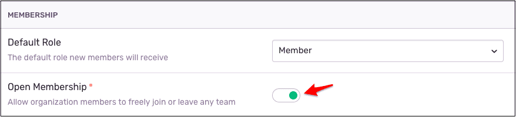

## Membership

Sentry handles user membership at the organizational level, but also supports team-level roles for users on a [Business plan](https://sentry.io/pricing/). Individual users can manage their personal preferences, including notifications and security settings, and can use their individual Sentry account to join multiple teams.

## Organization-level Roles

Check out the table below for all org-level roles and their permissions.

| **Action**                                                                          | **Billing** | **Member** | **Admin** | **Manager** | **Owner** |
| ----------------------------------------------------------------------------------- | ----------- | ---------- | --------- | ----------- | --------- |
| Can see and edit billing information and subscription details                       | X           |            |           |             | X         |
| Can see and edit legal and compliance details                                       | X           |            |           |             | X         |
| Can view and act on issues, (such as assigning and resolving)                       |             | X          | X         | X           | X         |
| Can join and leave teams                                                            |             | X          | X         | X           | X         |
| Can change Project settings                                                         |             |            | X         | X           | X         |
| Can add and remove Projects                                                         |             |            | X         | X           | X         |
| Can edit Global Integrations                                                        |             |            | X         | X           | X         |
| Can add, remove, and change members                                                 |             |            |           | X           | X         |
| Can add and remove teams                                                            |             |            | X         | X           | X         |
| Can add and remove repositories                                                     |             | X          | X         | X           | X         |
| Can change organization settings                                                    |             |            |           | X           | X         |
| Can remove an organization                                                          |             |            |           |             | X         |
| Can assign Team Admin Role                                                          |             |            |           | X           |           |
| Can add, remove, and edit Team Contributors                                         |             |            |           | X           |           |
| Can add Projects for teams (depending on the rules set by the org owner or manager) |             |            |           | X           |           |
| Can remove Projects from teams                                                      |             |            |           | X           |           |

### Owner

- Unrestricted access to the organization, its data, and settings.
- Can add, modify, and delete Projects and members, as well as manage subscriptions and billing.
- Can manage legal and compliance details.
- Can add or remove Projects.
- Can delete an organization.

### Manager

- Has admin access to all teams. Can add, modify, and delete Projects and members.
- Can add and remove members from the organization, but cannot remove organization itself.

### Admin

- Admin access to the teams of which they're members.
- Can create new teams and Projects, as well as remove Projects and teams of which they're members.

### Member

- Can view and act on events, as well as view most other data within the organization.

### Billing

- Can manage subscription and billing details.
- Can manage legal and compliance details.

<Note>

Team-level roles have replaced the Admin role for Business plan users. Existing Admin-level users will continue holding the role.

</Note>

## Team-level Roles

Check out the table below for all team-level roles and their permissions.

| **Action**                                                                        | **Team Admin**                                     | **Team Contributor** |
| --------------------------------------------------------------------------------- | -------------------------------------------------- | -------------------- |
| Can see and edit billing information and subscription details                     |                                                    |                      |
| Can see and edit legal and compliance details                                     |                                                    |                      |
| Can view and act on issues, (such as assigning and resolving)                     | X                                                  | X                    |
| Can join and leave teams (depending on the rules set by the org owner or manager) | X                                                  | X                    |
| Can change Project settings                                                       | X (_Only for projects they have access to_)        |                      |
| Can add and remove Projects                                                       | X (_Only for teams they’re an existing Admin for_) |                      |
| Can edit Global Integrations                                                      |                                                    |                      |
| Can add, remove, and change members                                               |                                                    |                      |
| Can invite new members to join (_Invite will land in pending state for managers and owners to approve_) | X | X |  
| Can add and remove teams | | |
| Can add and remove repositories | X (_Only for teams they’re an existing Admin for_) | |
| Can change organization settings | | |
| Can remove an organization | | |
| Can assign Team Admin Role | X (_Only for teams they’re an existing Admin for_) | |
| Can add, edit, or remove Team Contributors | X | |
| Can add Projects for teams (depending on the rules set by the org owner or manager) | X | X |
| Can remove Projects from teams | X | |

### Team Admin

- Admin access to the teams of which they're members.
- Can create new teams and Projects, as well as remove Projects and teams of which they're members.

### Team Contributor

- Can view and act on issues.
- Can join and leave teams (depending on the rules set by the org owner/manager).
- Can invite new members to join (pending approval from org owner/manager).
- Can add Projects for team (depending on the rules set by the org owner/manager).

## Open Membership

Open membership is enabled by default. This allows users to join, leave, and add other members to teams.

## Restricting Access

- Project access is limited to the team that owns the Project, but org members can get access to the Project by joining the team that owns it, (depending on the rules set by the org owner/manager).
- To limit access to a Project, you can limit access to the team that owns that Project by making it invite-only. Users will only be able to join from an invitation by a Manager, Owner, or Admin.

To restrict team access, go to the Settings page > General Settings and flip the “Open Membership” toggle.

## Transferring a Project

To transfer a Project to a new owner, go to the target Project's **Project Settings > General Settings > Transfer Project**. Enter the email address of the person you’d like to transfer it to. They'll receive an email to approve the transfer.

When transferring a Project to a new organization, we recommend also adding a new team to the Project for better visibility.

## Removing an Organization

If you’re an org owner, you can remove an entire organization and all its associated data completely. Doing so will *not* remove user accounts, but it will remove user membership in that organization.

To remove an organization, go to the **Settings** **page** **> General Settings,** then \*\*\*\*click the "Remove Organization" button, which will prompt you for confirmation. After this is done, your organization will be queued for deletion.
