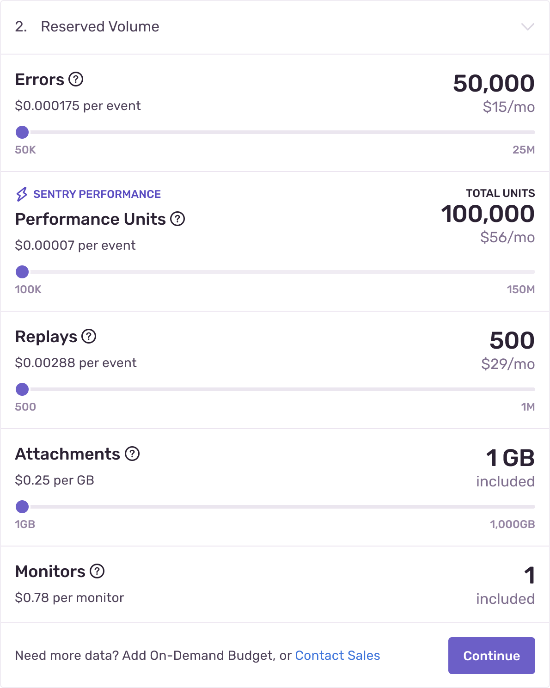
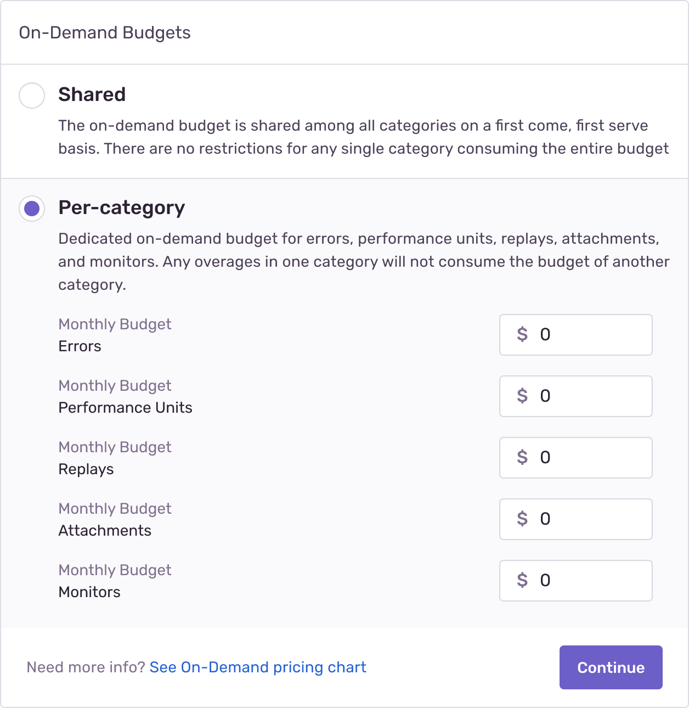

This page clarifies concepts around pricing and billing like:

- [Reserved (prepaid)](#prepaid-reserved-capacity) and [on-demand](#on-demand-capacity) volume
- [How our pricing works](#pricing-how-it-works), including [pricing tables](#pricing-tables)
- [Billing periods](#billing-cycles)
- [Taxes](#taxes) and [exemptions](#tax-exemptions)

## Volume {#capacity}

Your _volume_ is the total number of [events](/product/sentry-basics/key-terms/) and attachments — or the total amount of [data](/product/sentry-basics/key-terms/) — sent by and billed to your organization. You can purchase volume in two ways: [prepaid (or reserved)](#prepaid-reserved-capacity) and [on-demand](#on-demand-capacity).

### Prepaid (Reserved) Volume {#prepaid-reserved-capacity}

_Reserved_ volume (or quota) allows you to prepay for data at significant discounts. Your prepaid, reserved volume is always applied before on-demand volume. Unused reserved volume expires at the end of each billing month.

Every Sentry account includes a varying amount of reserved volume. For example, our Team plan includes a minimum of 50k errors, 100k transactions, and one GB of attachments per month:

To see prepaid pricing per volume tier, check out our [pricing tables](#pricing-tables).

### On-Demand Volume {#on-demand-capacity}

_On-demand_ volume is billed at the end of each billing month. You are charged per processed event or attachment, rounded up to the nearest cent. Your on-demand volume is determined by your [on-demand budget](#on-demand-cap) (or quota), which can be configured on either a shared or per-category basis. By setting on-demand budgets, you can control the maximum amount you'll pay for on-demand volume each month. Once your usage has consumed the maximum budget volume, you'll still be able to access prior event data, however, any additional data you send will be rejected.

To see on-demand pricing per volume tier, check out our [pricing tables](#pricing-tables).

#### On-Demand Budgets {#on-demand-cap}

Organizations on all plans have the option to set a shared on-demand strategy. Organizations on plans with [performance monitoring](/product/performance/) features have the ability to choose between a shared or per-category on-demand strategy:

- **Shared:** Your on-demand budget is shared among errors, transactions, and attachments.

- **Per-category:** Separate on-demand budgets for errors, transactions, and attachments. Any overages in one category will not consume the budget of another category.

If you raise your on-demand budget mid-month, your organization will start accepting additional data as soon as your new budget is applied. If you lower your on-demand budget mid-month to below the current month's usage, your on-demand budget will be reduced to match your usage. On your next bill date, your on-demand budget will be lowered to the requested amount.

After a new budget is in effect, all additional data will be rejected and no additional on-demand volume will be added. At the end of the billing month, you will be charged for any on-demand volume consumed.

We guarantee new budgets will be applied and effective within 24 hours. However, in most cases the new budget will be applied within minutes.

## Pricing: How it Works

Our pricing model is similar to the way that you purchase data for a cell phone:

- We bill you for [prepaid volume](#prepaid-reserved-capacity) monthly or annually.
- You can also set up an [on-demand budget](#on-demand-capacity) for possible overages, which is priced differently.

You're only billed for on-demand volume if you use it. If you run out of prepaid and on-demand volume, then we drop events and attachments, and you're not billed for that data.

To determine your on-demand pricing, start at the tier where your prepaid purchasing ends. For example, you've purchased 500k of reserved errors, with an on-demand budget of $25, on a Team plan. If you use 600k errors, you would pay for 500k prepaid errors at $0.000175/each and 100k on-demand errors at $0.000195/each, using $19.50 of your on-demand budget.

In another scenario, you've purchased 400k reserved errors with an on-demand budget of $25 on a Team plan. If you use 500k errors in total, you you would pay for 100k at $0.00029/each, the next 300k at $0.000175/each, and 100k on-demand errors at $0.000228/each, using $22.80 of your on-demand budget.

### Pricing Tables

We have three tables for [errors](#errors-pricing), [transactions](#transactions-pricing), and [attachments](#attachments-pricing) pricing:

<!-- prettier-ignore-start -->

#### Errors Pricing

| Total Errors Volume | Team Prepaid | Team On-Demand | Business Prepaid | Business On-Demand |
|---|---|---|---|---|
| >50k-100k | $0.000290 | $0.000377 | $0.000890 | $0.001157 |
| >100k-500k | $0.000175 | $0.000228 | $0.000500 | $0.000650 |
| >500k-2M | $0.000150 | $0.000195 | $0.000300 | $0.000390 |
| >2M-10M | $0.000150 | $0.000195 | $0.000300 | $0.000390 |
| >10M-20M | $0.000130 | $0.000169 | $0.000251 | $0.000326 |
| >20M-50M | $0.000110 | $0.000143 | $0.000132 | $0.000172 |

#### Transactions Pricing

| Total Transaction Volume | Team Prepaid | Team On-Demand | Business Prepaid | Business On-Demand |
|---|---|---|---|---|
| >100k-250k | $0.000100 | $0.000130 | $0.000300 | $0.000390 |
| >250k-500k | $0.000058 | $0.000075 | $0.000178 | $0.000231 |
| >500k-4.5M | $0.000052 | $0.000068 | $0.000130  | $0.000169 |
| >4.5M-5M | $0.000046 | $0.000060 | $0.000092 | $0.000120 |
| >5M-10M | $0.000039 | $0.000051 | $0.000074 | $0.000096 |
| >10M-100M | $0.000039 | $0.000050 | $0.000055 | $0.000072 |

#### Attachments Pricing

| Total Attachments Volume | Team/Business Prepaid | Team/Business On-Demand |
|---|---|---|
| >25 - 100 (GB) | $0.24 | $0.312 |
| >100 - 200 (GB) | $0.24 | $0.312 |
| >200 - 10k (GB) | $0.23 | $0.299 |

<!-- prettier-ignore-end -->

You can buy prepaid volume in increments as shown in the table below:

<!-- prettier-ignore-start -->

<!-- Don't remove spaces from first column header or number ranges in column will break onto two lines making them hard to read -->

| Errors Volume&nbsp;&nbsp;&nbsp;&nbsp;&nbsp;&nbsp; | Purchase Increment | Transaction Volume | Purchase Increment | Attachments Volume | Purchase Increment |
|---|---|---|---|---|---|
| >50k-100k | 50k | >100k-250k | 150k | >25 - 100 (GB) | 25 (GB) |
| >100k-500k | 100k | >250k-500k | 250k | >100 - 10k (GB) | 100 (GB) |
| >500k-2M | 500k | >500k-10M | 500k |  |  |
| >2M-20M | 1M | >10M-100M | 5M |  |  |
| >20M-50M | 2M |  |  |  |  |

<!-- prettier-ignore-end -->

On-demand purchasing isn't restricted by any increments since you set a dollar amount for your budget, rather than a certain amount of data. So if you want to purchase an amount of prepaid volume data that falls between increments, you should set that up as on-demand budget.

The slider on the [pricing](https://sentry.io/pricing/) page allows you to choose the prepaid volume you'd like for each type of event (errors, transactions) or attachments storage to see what you'd pay.

If your projects use a high volume of data, you can control how many events or attachments Sentry receives. For more information on how to manage your monthly spending, check out our [Quota Management documentation](/product/accounts/quotas/).

## Billing Periods {#billing-cycles}

Two different billing periods are available:

- **Billing period** - Your subscription billing period, which is either monthly or annual. This is when we’ll charge the credit card on file for your base subscription and reserved volumes.
- **On-demand period** - This reflects a one-month window in which we calculate on-demand charges. For monthly subscriptions, on-demand periods are aligned with your billing periods.

Users with the role of [Billing or Owner](/product/accounts/membership/) can find all previous invoices by going to the "Receipts" tab in **Settings > Subscription**.

<Note>

You must have either `Billing` or `Owner` permissions to access or make changes to information on the **Subscription** page. If you don't have those permissions, or you are not a member of the organization in Sentry, please reach out to a Billing member or an Owner to obtain invoices.

</Note>

## Plans & Free Trials

Sentry has one free Developer plan and three paid plans: Team, Business, and Enterprise. You can find more information about each of these plans and what they include on our [pricing page](https://sentry.io/pricing/).

Plan upgrades take effect immediately. Plan downgrades and cancellations are processed as the end of the current contract cycle and cannot be refunded. If you no longer want to be on a paid plan, you'll revert to the base Developer plan at the end of your current contract.

If you're currently on a paid plan, you can sign up for a 30-day trial; if you're on a free plan, you can run a trial for 14 days. Before the trial ends, Sentry will provide you options to upgrade and continue to use our latest features like Performance Monitoring. If you choose to opt in to a new plan during your trial or at the end of your trial, the new plan takes effect immediately. If you don't upgrade by the end of trial, you will be downgraded to the same plan you were on prior to starting the trial.

## Taxes

The following sections cover taxation for various jurisdictions, business-to-business and business-to-customer taxation differences, and exemptions.

Currently, prices displayed on our [pricing page](http://sentry.io/pricing) don't include sales tax since tax rates and applicability varies across country, state/province, and locality.

### US Taxes

As of December 1, 2020, customers with a US-based billing address may be subject to state and local sales tax. Sales tax will apply to billing addresses located in the following states/localities:

- Connecticut
- District of Columbia
- Maryland
- Massachusetts
- New Mexico
- New York
- Ohio
- Pennsylvania
- Rhode Island
- South Carolina
- Texas
- Utah
- Washington

### Canadian Taxes

As of October 1, 2022, customers with a Canadian-based billing address may be subject to provincial and local sales tax, varying according to province. Canadian customers may be subject to one or more of the following taxes depending on their location:

<!-- prettier-ignore-start -->

| Province(s) | Tax Type(s) | Total Tax Rate |
|---|---|---|
| Alberta, Northwest Territories,   Nunavut, Yukon | Goods & Service Tax (5%) | 5% |
| British Columbia, Manitoba | Goods & Service Tax (5%)    Provincial Sales Tax (7%) | 12% |
| New Brunswick,   Newfoundland and Labrador,   Nova Scotia, Prince Edward Island | Harmonized Sales Tax | 15% for all provinces   except Ontario (13%) |
| Quebec | Goods & Service Tax (5%)    Quebec Sales Tax (9.975%) | 14.975% |
| Saskatchewan | Goods & Service Tax (5%)    Provincial Sales Tax (6%) | 11% |

<!-- prettier-ignore-end -->

All Canadian federal and provincial taxes will be calculated based on billing address.

### VAT

In the European Union (EU) and in accordance with EU VAT legislation, VAT will be applied only to orders where exemption documentation or a valid VAT ID has not been supplied prior to or at the time of payment.

The VAT in other countries such as Switzerland, South Africa, and Russia is applicable on all taxable sales where valid exemption documentation has not been provided to Sentry prior to payment.

### B2B and B2C Taxation - Differences

Internationally, sales tax rules differ based on whether the customer is business-to-business (B2B) or business-to-consumer (B2C). In most countries, B2C sales are taxable, while B2B customers are not charged sales tax at the point of sale, but self-assess when they file their returns.

However, in some countries, both B2C and B2B customers need to be charged sales tax at the point of sale. Sentry will levy tax on your purchase based on your local tax legislation and rate according to your billing address.

### Tax Exemptions

If your company or non-profit organization qualifies for a sales tax exemption, you can reach out to tax@sentry.io with the following information to have sales tax removed from any future invoices:

- Organization name
- Copy of a signed tax exempt certificate

If you've submitted an exemption form, and you're still being charged sales taxes, that's because either:

- The exemption certificate was still in review after the billing period was closed.
- The exemption certificate covers a state that is different from your billing address.

Updating your address or submitting a tax exemption certificate doesn't impact the taxes charged on older invoices. We do not adjust the billing or invoicing of a closed billing period.
