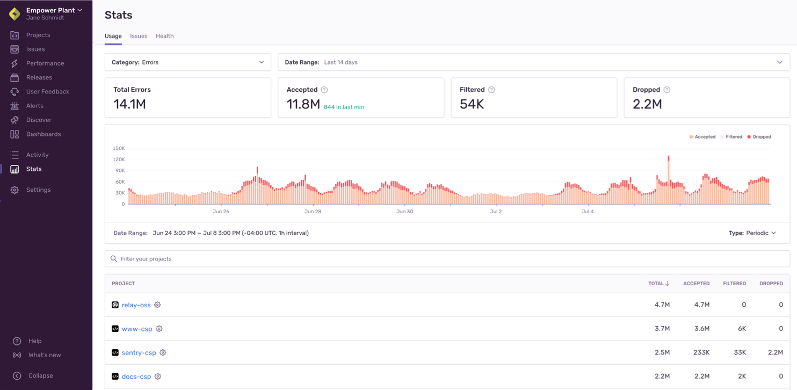
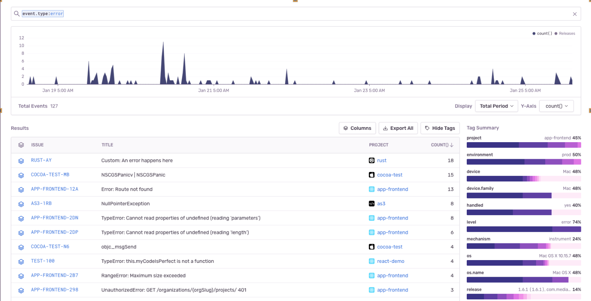

Before you can decide how to best manage your errors quota, you need to be able to get an overview of how your quota is currently being used.

## Check Your Quota Usage {#common-workflows-for-managing-your-event-stream}

You can look at your events in aggregate in the "Usage Stats" tab of the **Stats** page. This information will help you answer key questions about the breakdown of your incoming events or which projects are consuming your quota. The answers to these questions can help you figure out where you need to do further fine-tuning of your SDK filters and configuration.

This page is accessible to all members of your organization, so Owners in your Sentry org can share this page with the developers directly responsible for a given project. Also, you can come back to this page to check if the changes you've made are having the desired effect.

### How can I see a breakdown of incoming events? {#-how-can-i-see-a-breakdown-of-incoming-events}

The [Usage Stats](/product/stats/#usage-stats) tab displays details about the total amount of data Sentry has received across your entire organization for up to 90 days. The page breaks down the events (by project) into three categories: _accepted_, _dropped_, or _filtered_. Only accepted events affect your quota:

### What are my busiest projects? {#-what-are-my-busiest-projects}

The "Project" table in the "Usage Stats" tab of **Stats** breaks down your data by project, so you can see which ones are consuming your quota. Clicking on the settings icon next to a project name in the table will open the project's settings page where you can manage its [inbound filters](#3-inbound-data-filters) and [rate limits](#6-rate-limiting).

### Which issues are consuming my quota? {#-what-issues-are-consuming-my-quota}

<Note>

You can only update the columns of the Results table in **Discover** if your organization is on a Business plan.

</Note>

You can set up [a query](https://sentry.io/orgredirect/organizations/:orgslug/discover/results/?field=title&field=project&field=count%28%29&name=All+Events&query=event.type%3Aerror&sort=-count&statsPeriod=14d&yAxis=count%28%29) in **Discover** to take a more proactive approach to resolving your busiest issues. When you're building the query, search for `event.type:error` and then set the columns `issue`, `title`, `project`, and `count()`, as shown below:

Once the changes are applied, sort the "Results" table by the "COUNT()" column to display your busiest issues:

Once you know where your quota is being used, you can start taking the steps below to control it.
