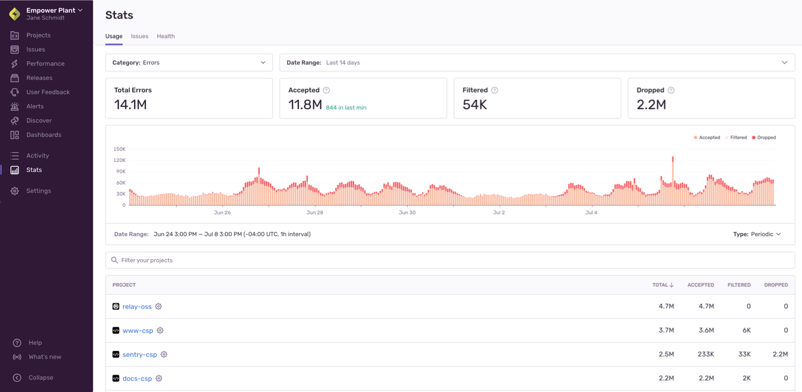

Data and quotas are interconnected in Sentry. When you [subscribe to Sentry](https://sentry.io/pricing/), you pay for the amount of data &#151 events (errors, replays, transactions, and transactions with profiling), and attachments &#151 to be tracked. Each data category has its own quota that you can adjust. When Sentry tracks an event or attachment, it counts toward your quota for that type of data.

To see which projects are using up your quota, you can review the "Usage" tab of **Stats**. This page can be viewed by any member of your organization and can be shared by a team member with Owner or Billing-level permissions with the developers directly responsible for a given project. In addition, you can come back to this page to check if the changes you've made are having the desired effect:

You can also download a project breakdown report in the "Usage History" tab of **Settings > Subscriptions** (only accessible to Owner and Billing members of your Sentry organization).

Sentry's flexibility means you can exercise fine-grained control over which events and attachments count toward your quota. This page provides you with high-level information about strategies for managing your quota, but you can get more detailed information in:

- [Spike Protection](/product/accounts/quotas/spike-protection/)
- [Spend Allocation](/product/accounts/quotas/spend-allocation/)
- [Manage Your Error Quota](/product/accounts/quotas/manage-event-stream-guide/)
- [Manage Your Performance Units Quota](/product/accounts/quotas/manage-transaction-quota/)
- [Manage Your Replay Quota](/product/accounts/quotas/manage-replay-quota/)
- [Manage Your Attachments Quota](/product/accounts/quotas/manage-attachments-quota/)

## How to Manage Your Quota

There are a number of things you can do to manage your quota, as shown in the table below. Actions are listed in order from easiest and fastest, to most challenging and potentially time-consuming. The checkmarks tell you whether the action helps you manage errors, Performance Units, Replays, attachments, or some combination of the four.

The first 6 actions in the list can all be done in [sentry.io](https://sentry.io), while the rest have to be done in an SDK.

<!-- prettier-ignore-start -->

| Action | Errors | Performance Units | Replays |Attachments |
| ------ | ------ | ------------ | ----------- |----------- |
| [Ensure spike protection is enabled](#spike-protection) | &check; | &check; | &check; | &check; |
| [Set a spend allocation budget](#spend-allocation) | &check; | &check; | &check; | &check; |
| [Adjust your quota](#increasing-quotas) | &check; | &check; | &check; | &check; |
| [Rate limit your events or attachments](#limiting-events) | &check; |  |  | &check; |
| [Review repeated events](#4-event-repetition) | &check; |  |  |  |
| [Filter your events](#inbound-data-filters) | &check; | &check; |  | &check; |
| [Update your SDK sample rate](#6-sdk-sample-rate) | &check; | &check; |  |  |
| [Apply SDK filtering](#7-sdk-filtering-beforesend) | &check; | &check; |  |  |
| [Update your SDK configuration](#8-sdk-configuration) | &check; | &check; |  |  |
| [Manage data size](#size-limits) | &check; | &check; |  | &check; |

<!-- prettier-ignore-end -->

## What Counts Towards Your Quota {#what-counts-toward-my-quota-an-overview}

Sentry completes a thorough evaluation of each event to determine if it counts toward your quota, as outlined in this overview. Detailed documentation for each evaluation is linked throughout.

Before completing any of these evaluations, Sentry confirms that each event includes a valid DSN and project as well as whether the event can be parsed. In addition, for error events, Sentry validates that the event contains valid fingerprint information. If any of these items are missing or incorrect, the event is rejected.

<Note>

This list is ordered from easiest or least time-consuming, to most challenging or potentially time-consuming.

</Note>

### Spike Protection {#spike-protection}

Sentry's Spike Protection checks for significant overages in error events, (as compared to an established spike threshold), on a per-project basis. If a spike is detected, Spike Protection kicks in, dropping events once they've reached a certain threshold.

Spike Protection can be enabled on a per-project basis for your organization by any team member with either **Billing or Owner-level permissions**. To select which project to set it up for, go to **Settings > Spike Protection**. You'll be able to toggle it on for individual projects or click “Enable All” to set it up for all your projects at once. Learn more about how spike protection works and how to manage spikes in [Spike Protection](/product/accounts/quotas/spike-protection/).

### Spend Allocation {#spend-allocation}

Spend Allocation gives you the ability to prioritize your most important projects (or make sure that smaller projects don't get ignored). You can do this by setting aside a set amount of reserved volume (errors, performance units, replays, and attachments) to be used by those projects each month. This ensures that all the projects that are important to you are always monitored, regardless of the amount of volume other projects consume. Spend Allocation can be enabled on a per-project basis for your organization by any team member with either Billing or Owner-level permissions. To select which project to set it up for, go to **Settings > Spend Allocation**. Learn more about how [Spend Allocation](/product/accounts/quotas/spend-allocation/) works.

### Adjusting Your Quota {#increasing-quotas}

Events and attachments that exceed your quota will not be accepted, so you may want to increase your quota. Conversely, you might want to decrease your quota or adjust your reserved and on-demand quotas to better control your spending. Learn about adjusting your quota in [Manage Your Error Quota](/product/accounts/quotas/manage-event-stream-guide/#2-adjusting-quotas), [Manage Your Performance Units Quota](/product/accounts/quotas/manage-transaction-quota/), [Manage your Replay Quota](/product/accounts/quotas/manage-replay-quota/), and [Manage Your Attachments Quota](/product/accounts/quotas/manage-attachments-quota/#1-adjusting-quotas).

### Rate Limits {#limiting-events}

You can add limits for error events on a per-project basis in **[Project] > Settings > Client Keys (DSN)**. If the event rate limit for a project has been exceeded, and your subscription allows, the event won't be counted. You can also rate limit attachments on an organization level in **Settings > Security & Privacy**. Learn more in [Manage Your Error Quota](/product/accounts/quotas/manage-event-stream-guide/#6-rate-limiting) and [Manage Your Attachments Quota](/product/accounts/quotas/manage-attachments-quota/#2-rate-limiting).

### Event Repetition

In some cases, repeated events can count against your quota, so it's important to know how event repetition is treated in Sentry. Learn more in [Manage Your Error Quota](/product/accounts/quotas/manage-event-stream-guide/#5-applying-workflows).

### Inbound Filters {#inbound-data-filters}

If an inbound filter is applied for a type of error, transaction, or attachment, and your subscription allows, it won't be counted. You can manage these in **[Project] > Settings > Inbound Filters**. Learn more in [Manage Your Error Quota](/product/accounts/quotas/manage-event-stream-guide/#3-inbound-data-filters), [Manage Your Performance Units Quota](/product/accounts/quotas/manage-transaction-quota/#2-inbound-data-filters), [Manage your Replay Quota](/product/accounts/quotas/manage-replay-quota/), and [Manage Your Attachments Quota](/product/accounts/quotas/manage-attachments-quota/#3-inbound-data-filters).

### SDK Sample Rate

If a sample rate is defined for the SDK, the SDK evaluates whether this event should be sent as a representative fraction of events, effectively limiting the number of errors and transactions you send to Sentry. Setting a sample rate is documented [for each SDK](/platform-redirect/?next=/configuration/sampling/), but you can also learn more in [Manage Your Error Quota](/product/accounts/quotas/manage-event-stream-guide/#6-sdk-sample-rate) and [Manage Your Performance Units Quota](/product/accounts/quotas/manage-transaction-quota/#2-sdk-configuration-tracing-options/).

### SDK Filtering: `beforeSend` and `beforeSendTransaction`

All Sentry SDKs support the `beforeSend` callback method, which you can use to modify the data of an error event or to drop it completely. Many also support `beforeSendTransaction`. Learn more in [Manage Your Error Quota](/product/accounts/quotas/manage-event-stream-guide/#1-sdk-filtering-beforesend) and [Manage Your Performance Units Quota](/product/accounts/quotas/manage-transaction-quota/#1-sdk-filtering-beforesendtransaction).

### SDK Configuration

The SDK configuration either allows an event to be sent to Sentry or filters it out. Configuration is documented [for each SDK](/platform-redirect/?next=/configuration/filtering/), but you can also learn more in [Manage Your Error Quota](/product/accounts/quotas/manage-event-stream-guide/#2-sdk-configuration) and [Manage Your Performance Units Quota](/product/accounts/quotas/manage-transaction-quota/#2-sdk-configuration-tracing-options).

### Size Limits {#size-limits}

Sentry imposes limits on various fields within an event, as well as the size of full events and the requests they are sent in, which can affect your attachments quota. Learn more in [Manage Your Attachments Quota](/product/accounts/quotas/manage-attachments-quota/#4-size-limits).

## What Counts Toward Your Quota - Quick Guide {#what-counts-toward-my-quota-table-view}

Use this table as a quick reference for what does and doesn't count towards your quota:

<!-- prettier-ignore-start -->

| Scenario | Yes, this data counts |
|----------|------------------------|
| [Spike protection](#spike-protection) activation threshold has been reached (errors) |  |
| [Spike protection](#/product/accounts/quotas/manage-event-stream-guide/#when-does-spike-protection-become-inactive) no longer active (errors) | &check; |
| Your [quota](#increasing-quotas) hasn't been reached | &check; |
| Your [quota](#increasing-quotas) has been exceeded |  |
| A [rate limit](#limiting-events) for a project has been applied (errors, attachments) |  |
| This is a [repeated event](#4-event-repetition) for which issues were previously set to Delete & Discard (errors) |  |
| This is a [repeated event](#4-event-repetition) for a previously resolved issue (errors) | &check; |
| This is a [repeated event](#4-event-repetition) for an issue that you've set to Ignore | &check; |
| The event defies [inbound filters](#inbound-data-filters) configured in sentry.io  |  |
| The event is sent after the [SDK sample rate](#6-sdk-sample-rate) has been exceeded |  |
| The event isn't sent based on [SDK filters](#7-sdk-filtering-beforesend) |  |
| The event isn't sent based on [SDK configuration](#8-sdk-configuration) |  |
| [Size limits](#size-limits) have been exceeded |  |
| [Issues](/product/issues/#quota) are created from accepted errors, transactions, and transactions with profiling |  |

<!-- prettier-ignore-end -->

## Key Terms

Let's clarify a few terms:

- **Event** - An event is one instance of you sending data to Sentry, excluding attachments. Generally, this data is an error or a transaction.
- **Error** - What counts as an error varies by platform, but in general, if there's something that looks like an exception, it can be captured as an error in Sentry. Sentry automatically captures errors, uncaught exceptions, and unhandled rejections, as well as other types of errors, depending on platform. A grouping of similar errors makes [an issue](/product/issues/).
- **Performance Unit** - A performance unit represents the total number of units that can be used across different Performance event types - (Transactions or Transactions with Profiling). A Transaction consumes 1 Performance Unit and a Transaction with Profiling consumes 1.3 Performance Units.
- **Transaction** - A [transaction](/product/performance/transaction-summary/#what-is-a-transaction) represents a single instance of a service being called to support an operation you want to measure or track, like a page load. Transaction events are grouped by the transaction name.
- **Transaction with Profiling** - A Transaction with Profiling is sent by projects with Profiling enabled. This Transaction type provides the deepest level of visibility into the performance of your apps and consumes 1.3 Performance Units.
- **Replay** - Session Replays are video-like reproductions of users’ sessions as they navigate your app or website.
- **Attachment** - Attachments are stored additional files, such as config files, log files, or stored mini-dumps, that are related to an error event. Unless the option to store crash reports is enabled, Sentry will use these files only to create an event, and then drop them.
- **Data** - Anything you send to Sentry. This includes events (errors, transactions, transactions with profiling, or replays), attachments, and event metadata.
- **Quota** - Your quota is the amount of data (errors, performance units, replays, attachments) that you pay Sentry to track.

## Next Steps

<PageGrid />
