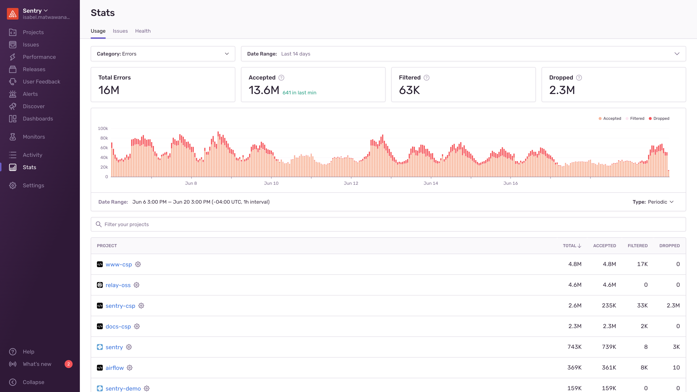

Events and quotas are interconnected in Sentry. At the most basic, when you [subscribe to Sentry](https://sentry.io/pricing/), you pay for the number of events - errors, attachments, and transactions - to be tracked. Each of these type of events has a quota. When Sentry accepts an event, it counts toward your quota for that type of event.

To see which of your projects are using up your quota, you can review the "Usage" tab of **Stats**. This page is accessible to all members of your organization, so a Billing or Owner member can share this page with the developers directly responsible for a given project:

You can also com back to this page to assess if the changes you've are having the desired effect.

You can also download a project breakdown report in the "Usage History" tab of **Settings > Subscriptions**.

Sentry’s flexibility means you can exercise fine-grained control over which events count toward your quota. This page provides you with high-level strategies for managing your quota, but you can get more detailed information in:

- [Manage Your Error Quota](/product/accounts/quotas/manage-event-stream-guide/#common-workflows-for-managing-your-event-stream)
- [Manage Your Transaction Quota](/product/accounts/quotas/manage-transaction-quota/#1-event-usage-stats).

## Manage Your Quota - Quick Guide

This list of things to do to manage your quota is arranged from the fastest and least involved thing you can do to the most. Each of these items is linked to a longer explanation if you need it and the table indicates whether the action can affect, errors, transactions, or attachments or a combination of those.

<!-- prettier-ignore-start -->

| Action | Errors | Transactions | Attachments |
| ------ | ------ | ------------ | ----------- |
| 1. [Check your spike protection is enabled](#spike-protection) | &check; |  |  |
| 2. [Adjust your quota](#increasing-quotas) | &check; | &check; | &check; |
| 3. [Limit your events](#limiting-events) | &check; |  | &check; |
| 4. [Review repeated events](#6-event-repetition) | &check; |  | * |
| 5. [Filter your events](#inbound-data-filters) | &check; | &check; | &check; |
| 6. [Update your SDK sample rate](#6-sdk-sample-rate) | &check; | &check; |  |
| 7. [SDK filtering](#7-sdk-filtering) | &check; |  |  |
| 8. [SDK configuration](#8-sdk-configuration) | &check; | &check; | &check; |
| 9. [Manage data size](#size-limits) | &check; | &check; | &check; |

<!-- prettier-ignore-end -->

## Key Terms

Let’s clarify a few terms to start:

- **Event** - An event is one instance of you sending data to Sentry. Generally, this data is an error or a transaction.
- **Error** - What counts as an error varies by platform, but in general, if there's something that looks like an exception, it can be captured as an error in Sentry. Sentry automatically captures errors, uncaught exceptions, and unhandled rejections, as well as other types of errors, depending on platform. A grouping of similar errors makes [an issue](/product/issues/).
- **Transaction** - A [transaction](/product/performance/transaction-summary/#what-is-a-transaction) represents a single instance of a service being called to support an operation you want to measure or track, like a page load. Transaction events are grouped by the transaction name.
- **Attachment** - Stored additional files, such as config or log files that are attached to an error event. Unless the option to store crash reports is enabled, Sentry will use these files only to create an event, and then drop them.
- **Data** - Anything you send to Sentry. This includes, events (errors or transactions), attachments, and event metadata.
- **Quota** - Your quota is the amount of data (events, transactions, attachments) that you pay Sentry to track.

<!-- ## Managing My Quota, an Overview -->

## Some Other Heading {#what-counts-toward-my-quota-an-overview}

Sentry completes a thorough evaluation of each event to determine if it counts toward your quota, as outlined in this overview. Detailed documentation for each evaluation is linked throughout. Before completing any of these evaluations, Sentry confirms that each event includes a valid DSN and project as well as whether the event can be parsed. In addition, for error events, Sentry validates that the event contains valid fingerprint information. If any of these items are missing or incorrect, the event is rejected.

### 1. Spike Protection {#spike-protection}

Sentry’s spike protection prevents huge overages in error events from consuming your event capacity. Spike protection is not currently available for transactions. Learn more in the Spike Protection section of [Manage Your Error Quota](/product/accounts/quotas/manage-event-stream-guide/#1-spike-protection).

### 2. Quota Availability {#increasing-quotas}

Events that exceed your quota are not accepted. Once your event volume is approaching or has exceeded the quota, teammates with the "owner" organization permission level will receive [notification](/product/alerts/notifications/#quota-notifications) emails. Learn about adding to your quota and what happens when you exceed it in the Increasing Quotas section of [Manage Your Error Quota](/product/accounts/quotas/manage-event-stream-guide/#3-increasing-quotas) and [Manage Your Transaction Quota](/product/accounts/quotas/manage-transaction-quota/#2-increasing-quotas).

### 3. Rate Limits {#limiting-events}

If the error event rate limit for a project has been exceeded, and your subscription allows, the event will not be counted. You can add limits for error events and attachments in [sentry.io](https://sentry.io). This does not apply to transaction events. Learn more in the Rate Limiting section of [Manage Your Error Quota](/product/accounts/quotas/manage-event-stream-guide/#4-rate-limiting) or

#### Attachment Limits {#attachment-limits}

If you have enabled the storage of crash reports, you may set limits for the maximum number of crash reports that will be stored per issue. To set up these limits, use the slider in the "Store Native Crash Reports" option in your organization's "Security & Privacy" settings.

### 4. Event Repetition

It's important to know if you have any repeated events, because sometimes they count against your quota and sometimes they don't. Learn more in the Event Repetition section of [Manage Your Error Quota](/product/accounts/quotas/manage-event-stream-guide/#5-applying-workflows).

### 5. Inbound Filters {#inbound-data-filters}

If any inbound filter is set for a type of event or attachment, and your subscription allows, the event or attachment won't be counted. Learn more in the Inbound Data Filters section of [Manage Your Error Quota](/product/accounts/quotas/manage-event-stream-guide/#6-inbound-data-filters) and [Manage Your Transaction Quota](/product/accounts/quotas/manage-transaction-quota/#3-inbound-data-filters).

After these checks are processed, the event counts toward your quota. It is accepted into Sentry, where it persists and is stored.

### 6. SDK Sample Rate

If a sample rate is defined for the SDK, the SDK evaluates whether this event should be sent as a representative fraction of events. Setting a sample rate is documented for each SDK. The SDK sample rate is not dynamic; changing it requires re-deployment. In addition, setting an SDK sample rate limits visibility into the source of events. Setting a rate limit for your project may better suit your needs. Learn more in the SDK Sample Rate section of [Manage Your Error Quota](/product/accounts/quotas/manage-event-stream-guide/#8-sdk-sample-rate) and [Manage Your Transaction Quota](/product/accounts/quotas/manage-transaction-quota/#4-sdk-sample-rate).

### 7. SDK Filtering

Blah blah

Learn More in the SDK Filtering section of [Manage Your Error Quota](/product/accounts/quotas/manage-event-stream-guide/#9-sdk-filtering-beforesend).

### 8. SDK Configuration

The SDK configuration either allows the event or filters the event out. Learn more in the SDK Configuration section of [Manage Your Error Quota](/product/accounts/quotas/manage-event-stream-guide/#10-sdk-configuration) and [Manage Your Transaction Quota](/product/accounts/quotas/manage-transaction-quota/#2-sdk-configuration-tracing-options) or in the [filtering docs for your specific SDK](/platform-redirect/?next=/configuration/filtering/).

### 9. Manage Data Size {#size-limits}

Sentry imposes limits on various fields within an event, as well as the size of full events and the requests they are sent in:

- Events, attachments, and requests exceeding payload size limits are immediately dropped with a `413 Payload Too Large` error. Sentry allows compressed content encoding, and applies separate limits before and after decompression.
- Fields exceeding the individual size limits are afterwards trimmed and truncated at a best effort.

To avoid using up your attachments quota, whch is based on size and not number of instaces of data sent, or unintentional data loss, consider limiting the size of values passed into Sentry's APIs. For example, if your application attaches application state or request bodies to Sentry events, truncate them first.

The precise limits may change over time. For more information, please refer to the following resources:

- [Envelope Size Limits](https://develop.sentry.dev/sdk/store/#size-limits)
- [Store Endpoint Size Limits](https://develop.sentry.dev/sdk/store/#size-limits)
- [Minidump Size Limits](/platforms/native/guides/minidumps/#size-limits)
- [Variable Size Limits](https://develop.sentry.dev/sdk/data-handling/#variable-size)

<Alert>

If the event exceeds 200KB compressed or 1MB decompressed for events and 20MB
compressed or 100MB decompressed for minidump uploads (all files combined),
the event will be rejected.

</Alert>

## What Counts Toward My Quota - Quick Guide {#what-counts-toward-my-quota-table-view}

This table outlines whether an an event (or any type of data) that you send to Sentry counts against your quota or doesn't.

<!-- prettier-ignore-start -->

| Scenario | Yes, this event counts |
|----------|------------------------|
| [Spike protection](#spike-protection) has been triggered (errors) |  |
| Your [quota](#increasing-quotas) hasn't been reached | &check; |
| Your [quota](#increasing-quotas) has been exceeded |  |
| A [rate limit](#limiting-events) for a project has been applied (errors, attachments) |  |
| This is a [repeated event](#6-event-repetition) for which future events are set to Delete & Discard (errors) |  |
| This is a [repeated event](#6-event-repetition) for a previously resolved issue (errors) | &check; |
| This is a [repeated event](#6-event-repetition) for an issue that you've set to Ignore | &check; |
| The event defies [inbound filters](#inbound-data-filters) configured in sentry.io  |  |
| The event is sent after the [SDK sample rate](#6-sdk-sample-rate) has been exceeded |  |
| The event defies [SDK filters](#7-sdk-filtering) |  |
| The event defies [SDK configuration](#8-sdk-configuration) |  |
| [Size limits](#size-limits) have been exceeeded |  |

<!-- prettier-ignore-end -->
