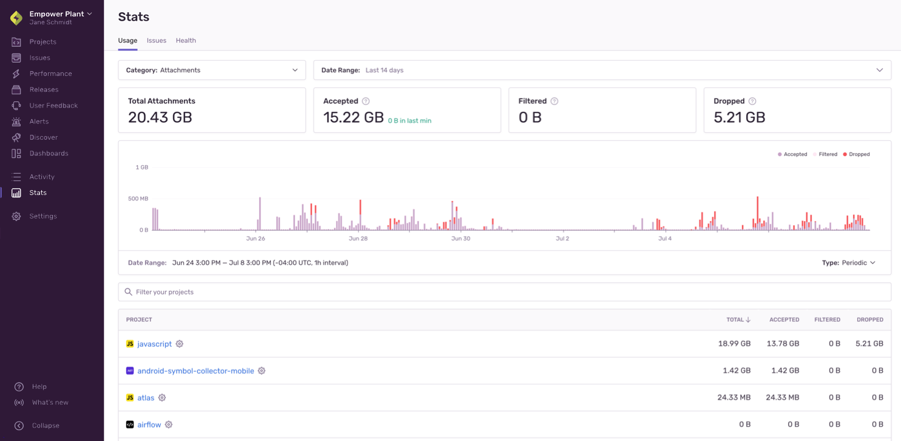

Sending all your error attachments to Sentry may consume your quota too rapidly, so we provide tools to control the _type_ and _amount_ of attachments that are stored.

Applying the proper filters, SDK configuration, and rate limits is an iterative and on-going process, but these tips will show you how to get the most out of your error events. These tips are ordered from easiest or least time-consuming to most challenging or potentially time-consuming. The first three options are all things you can do in [sentry.io](https://sentry.io), whereas the remaining one is something you'll do in the SDK.

## Before You Begin: Check Your Quota Usage

You can look at your attachments in aggregate in the "Usage Stats" tab of **Stats**. This information will help you answer key questions about the breakdown of your incoming attachments or which projects are consuming your quota. The answers to these questions can help you figure out where you need to do further fine-tuning of your SDK filters and configuration.

This page is accessible to all members of your organization, so Owners in your Sentry org can share this page with the developers directly responsible for a given project. Also, you can come back to this page to assess if the changes you've made are having the desired effect.

### How can I see a breakdown of incoming attachments?

The [Usage Stats](/product/stats/#usage-stats) tab displays details about the total amount of data Sentry has received across your entire organization for up to 90 days. The page breaks down the events (by project) into three categories: _accepted_, _dropped_, or _filtered_. Only accepted attachments affect your quota:

### What are my busiest projects? {#-what-are-my-busiest-projects}

The "Project" table in the "Usage Stats" tab of **Stats** breaks down your data by project, so you can see which ones are consuming your quota. Clicking on the settings icon next to a project name in the table will open the project's settings page where you can manage its inbound filters and rate limits

## Adjusting Quotas

<Note>

Quotas can only be updated by a Billing or Owner member of your Sentry organization.

</Note>

Once your attachments volume is approaching or has exceeded the quota, teammates with the "Owner" organization permission level will receive [notification](/product/alerts/notifications/#quota-notifications) emails. You can then choose to [increase](#increasing-quotas) or [decrease](#decreasing-quotas) your quota.

If this is your first time exceeding quota and you're on a paid plan, however, you'll be entered into a one-time grace period. Learn more about the grace period in this [Help article](https://help.sentry.io/account/billing/what-happens-when-i-run-out-of-event-capacity-and-a-grace-period-is-triggered/).

### Increasing Quotas

If you're dropping attachments that you want to keep because you've exceeded your quota, add to your quota at any time during your billing period by either increasing your [reserved](#reserved-volume) or [on-demand](#on-demand-budget) quota.

When you exceed your quota threshold, the server will respond with a 429 HTTP status code, which communicates to SDKs and clients to stop sending events and thus their associated attachments. This status code comes with a `Retry-After` header that indicates the time for which this rate limit is active. However, clients are not supposed to retry events, but instead drop events until the rate limit has expired, to prevent queue backlogs. Note, that since event ingestion and rate limiting happen asynchronously, the 429 HTTP status code is always slightly delayed.

To increase your quota, go to **Settings > Subscription** and click the "Manage Subscription" button to access your subscription options. When you increase your quota, the change goes into effect immediately.

If you're on a Developer plan and want to increase your quota, you'll need to upgrade to a Team or Business plan. On these plans you can prepay for more attachments volume and purchase on-demand volume, as needed. Learn about Sentry's plans on our [pricing page](https://sentry.io/pricing/).

<Note>

If you upgrade from Team to Business mid-billing period, your on-demand pricing changes retroactively.

</Note>

### Reserved Volume

If the amount of data you need for attachments is steadily increasing, you may want to increase your reserved capacity or volume. Reserved volume is less expensive than on-demand volume since you prepay for it. It also allows you to choose the amount of data you want to have available for attachments beforehand rather than just setting an arbitrary on-demand budget. Learn more about [reserved volume](/product/accounts/pricing/#prepaid-reserved-capacity) in our pricing documentation.

You shouldn't increase your reserved volume if you think your need for more events is temporary, since [reducing your reserved volume is tied to your billing period](#decreasing-quotas).

### On-Demand Budget

If you need to increase your attachments quota temporarily, we recommend that you add or increase on-demand budget. This is ideal for situations like rolling out a new version of your application where you anticipate receiving more data for the month. To add on-demand capacity or volume, you enter a monthly maximum budget on either a shared or per-category (errors, transactions, and attachments) basis. Learn more about [on-demand volume](/product/accounts/pricing/#on-demand-capacity) in our pricing documentation.

### Decreasing Quotas

Plan downgrades and decreases in reserved volume are processed at the end of your billing period, and remaining volume cannot be refunded. For example, if you have a monthly billing period that starts on the 5th of the month, and you decrease your reserved volume on June 20th, then this change will be processed on July 4th. Your billing period beginning on July 5th will reflect your new reserved volume.

<Alert level="warning">

If you have an annual billing period, plan downgrades and decreases in reserved volume go into effect at the beginning of your **next billing year.**

</Alert>

Changes to on-demand volume typically go into effect immediately and are guaranteed to go into effect within 24 hours. However, you can't decrease your on-demand budget to less than what you've consumed in the current period.

To decrease your quota, go to **Settings > Subscription** and click "Manage Subscriptions". When you reach the "Review & Confirm" step, the date that these changes go into effect will be displayed:

<Note>

We strongly recommend that you make subscription changes **before** the last day of your billing period. Depending on your time zone, in some cases, changes made on the last day of the billing period will not go into effect until the next billing period.

</Note>

## Rate Limiting

If you have enabled the storage of crash reports, you can set limits for the maximum number of crash reports that will be stored per issue. To set up these limits, go to **Settings > Security & Privacy** and make a selection in the "Store Native Crash Reports" dropdown. This setting applies to your entire organization.

## Inbound Data Filters

SDK configuration requires changes to your source code and depends on your next deployment, but server-side filters can be easily configured per project in the "Data Filters" section of **[Project] > Settings > Inbound Filters**.

While you can't set filters for attachments directly, when you set inbound filters for error events, their associated attachments are indirectly filtered. Learn more about setting data filters for error events in [Manage Your Error Quota](/product/accounts/quotas/manage-event-stream-guide/).

## Size Limits

Sentry imposes limits on various fields within an event, as well as the size of full events and the requests they are sent in:

- Events, attachments, and requests exceeding payload size limits are immediately dropped with a `413 Payload Too Large` error. Sentry allows compressed content encoding, and applies separate limits before and after decompression.
- Fields exceeding the individual size limits are afterwards trimmed and truncated at a best effort.

To avoid using up your attachments quota — whch is based on size and not number of instaces of attachments data sent — or having the event dropped entirely, consider limiting the size of values passed into Sentry's APIs. For example, if your application attaches application state or request bodies to Sentry events, truncate them first.

The precise limits may change over time. For more information, please refer to the following resources:

- [Envelope Size Limits](https://develop.sentry.dev/sdk/envelopes/#size-limits)
- [Store Endpoint Size Limits](https://develop.sentry.dev/sdk/store/#size-limits)
- [Minidump Size Limits](/platforms/native/guides/minidumps/#size-limits)
- [Variable Size Limits](https://develop.sentry.dev/sdk/data-handling/#variable-size)

<Alert>

If the event exceeds 200KB compressed or 1MB decompressed for events and 20MB compressed or 100MB decompressed for minidump uploads (all files combined), the event will be rejected.

</Alert>
