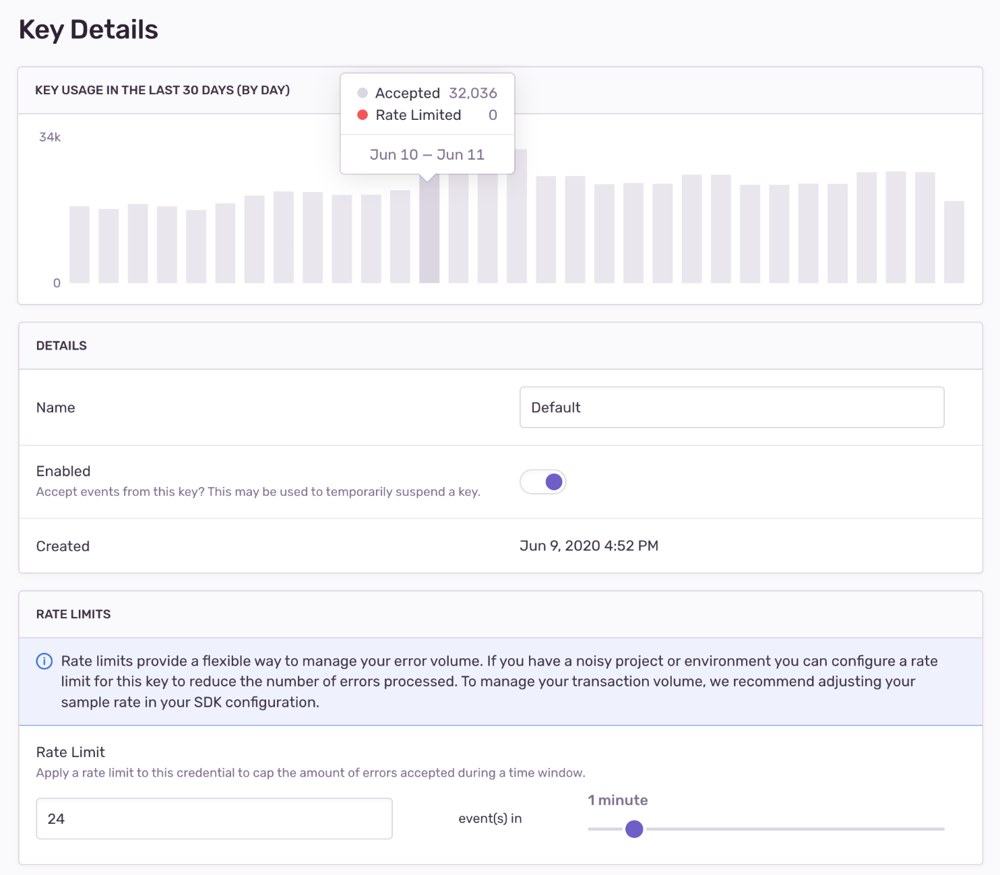

<!-- indicate which of these actions can only be taken by a billing or owner member and add in guides as well  -->

Sending all your application errors to Sentry ensures you'll be notified in real-time when errors occur in your code. However, with a basic setup, you may consume your error quota too rapidly and trigger more notifications than you can use. Sentry provides tools to control the _type_ and _amount_ of errors that are monitored. These tools allow you to:

1. Receive more actionable and meaningful error events.
2. Reserve real-time notifications for errors that actually break your code.
3. Manage your error quota.

Applying the proper filters, SDK configuration, and rate limits is an iterative and on-going process, but these tips will show you how to get the most out of your error events. These tips are ordered from easiest or least time-consuming to most challenging or potentially time-consuming./This list of things to do to manage your quota is arranged from the fastest and least involved thing you can do to the most. Options 1-5 are all things you can do in sentry.io whereas the remaining ones are things you'll do in the SDK.

## Before You Begin: Check Quota Usage

You can look at your events in aggregate in the "Usage Stats" tab of **Stats**. This information will help you answer key questions about the breakdown of your incoming events or which projects are consuming your quota. The answers to these questions can help you figure out where you need to do further fine-tuning of your SDK filters and configuration.

This page is accessible to all members of your organization, so a Billing or Owner member can share this page with the developers directly responsible for a given project. Also, you can come back to this page to assess if the changes you've made are having the desired effect.

### How can I see a breakdown of incoming events?

The [Usage Stats](/product/stats/#usage-stats) tab displays details about the total amount of data Sentry has received across your entire organization for up to 90 days. The page breaks down the events (by project) into three categories: accepted, dropped, or filtered. Only accepted events affect your quota:

### What are my busiest projects? {#-what-are-my-busiest-projects}

The "Project" table in the "Usage Stats" tab of **Stats** breaks down your data by project, so you can see which ones are consuming your quota. Clicking on the settings icon next to a project name in the table will open the project's settings page where you can manage its inbound filters and rate limits

### Which issues are consuming my quota?

You can set up a query in **Discover** to take a more proactive approach to resolving your busiest issues. When you're building the query, search for `event.type:error` and then set the columns `issue`, `title`, `project`, and `count()`, as shown below:

Once the changes are applied, sort the "Results" table by the "COUNT" column to display your busiest issues:

## 1. Increasing Quotas

Add to your quota at any time during your billing period by either upgrading to a higher plan or tier, increasing your reserved capacity, or increasing your on-demand capacity. To increase your quota, go to **Settings > Subscription** and click the "Manage Subscription" button to access your subscription options. When you increase your quota, the change goes into effect immediately. Quotas can only be updated by a Billing or Owner member of your Sentry organization.

If you exceed your quota threshold, the server will respond with a 429 HTTP status code, which communicates to SDKs and clients to stop sending events. This status code comes with a `Retry-After` header that indicates the time for which this rate limit is active. However, clients are not supposed to retry events, but instead drop events until the rate limit has expired, to prevent queue backlogs. Note, that since event ingestion and rate limiting happen asynchronously, the 429 HTTP status code is always slightly delayed.

If this is your first time exceeding quota, however, you'll be entered into a one-time grace period. Learn more about the grace period in this [Help article](https://help.sentry.io/account/billing/what-happens-when-i-run-out-of-event-capacity-and-a-grace-period-is-triggered/).

### Reserved Capacity

If the number of events you need is steadily increasing, you may want to increase your reserved capacity. Reserved capacity is less expensive than on-demand capacity since you prepay for it. It also allows you to choose the number of events that you want to have available beforehand rather than just setting an arbitrary on-demand budget. Learn more about [reserved capacity](/product/accounts/pricing/#prepaid-reserved-capacity) in our pricing documentation.

You shouldn't increase your reserved capacity if you think your need for more events is temporary, since [reducing your reserved capacity is tied to your billing cycle](#decreasing-quotas).

### On-Demand Capacity

If you need to increase your event quota temporarily, we recommend that you add or increase on-demand capacity. This is ideal for situations like rolling out a new version of your application where you anticipate more events for the month. To add on-demand capacity, you enter a monthly maximum budget on either a shared or per-category (errors, transactions, and attachments) basis. Learn more about [on-demand capacity](/product/accounts/pricing/#on-demand-capacity) in our pricing documentation.

### Plan Upgrade

If you're on a Developer plan and want to increase your quota, you'll need to upgrade to a Team or Business plan. On these plans you can prepay for more event capacity and purchase on-demand capacity, as needed. Learn about Sentry's plans on our [pricing page](https://sentry.io/pricing/).

Upgrade from Team to Biz mid-cycle, your on demand pricing changes retroactively - more expensive - check pricing content

### Decreasing Quotas

Plan downgrades and decreases in reserved capacity are processed at the end of your billing cycle, and remaining capacity cannot be refunded. For example, if you have a monthly billing cycle that starts on the 5th of the month, and you decrease your reserved capacity on June 20th, then this change will be processed on July 4th. Your billing cycle beginning on July 5th will reflect your new reserved capacity.

Changes to on-demand - you can’t decrease to below what you’ve consumed

<Alert level="warning">

If you have an annual billing cycle, plan downgrades and decreases in reserved capacity go into effect at the beginning of your **next billing year.**

</Alert>

Changes to on-demand capacity typically go into effect immediately and are guaranteed to go into effect within 24 hours.

To decrease your quota, go to **Settings > Subscription** and click "Manage Subscriptions". When you reach the "Review & Confirm" step, the date that these changes go into effect will be displayed:

<Note>

We strongly recommend that you make subscription changes before the last day of your billing cycle. Depending on your time zone, in some cases, changes made on the last day of the billing cycle will not go into effect until the next billing cycle.

</Note>

## 2. Rate Limiting

<!-- add something about 429 error code -->

<Note>

This feature is available only if your organization is on a Business plan.

</Note>

Rate limiting allows you to [set the maximum volume of error events a project key will accept during a period of time](/product/accounts/quotas/#what-counts-toward-my-quota-table-view). While this is quite useful for managing your monthly event quota, keep in mind that once a defined threshold is crossed, **subsequent events will be dropped**. Therefore, you shouldn't constantly be hitting your rate limit; rather, it should act as a ceiling intended to protect you from unexpected spikes.

In **[Project] > Settings > Client Keys (DSN)**, click "Configure", and you can create multiple DSN keys per project and assign different (or no) rate limits to each key. This will allow you to dynamically allocate keys (with varying thresholds) depending on release, environment, and so on.

If you have a project in production that generates a lot of noise, a rate limit allows you to set the maximum amount of data, such as “500 events per minute”. Additionally, you can create a second key for the same project for your staging environment, which is unlimited, ensuring your QA process is still untouched.

### Setting Useful Rate Limits

A good way to set a project rate limit is by figuring out the expected event volume based on your average traffic. Let's look at an example:

<!-- image notes: Sentry, airflow, Santry, app-frontend -->

1. Open the project DSN key configuration under **[Project] > Settings > Client Keys (DSN)** by clicking "Configure".
1. In the `KEY USAGE IN THE LAST 30 DAYS` graph and look for the highest point, or the maximum daily rate. In the example below, the maximum daily rate in the last month is less than 34K.
1. Based on that, define a ceiling **daily** maximum value. In this example, we set a maximum of approximantely 35K, which is around 1458 events an **hour**, or about 24 events a **minute**.
1. Set a daily, hourly, or minute-based rate limit. We recommend using a minute-based rate to avoid situations where a random event spike might exhaust your daily or hourly quota and leave you without event data for a long period.

You should periodically go back and check the graph to see the number of events dropped due to rate limiting and, if needed, revisit your settings.

<!-- new stuff -->

#### Attachment Limits

If you have enabled the storage of crash reports, you may set limits for the maximum number of crash reports that will be stored per issue. To set up these limits, use the slider in the "Store Native Crash Reports" option in your organization's "Security & Privacy" settings.

## 3. Inbound Data Filters

While SDK configuration requires changes to your source code and depends on your next deployment, server-side filters can be easily configured per project in the "Data Filters" section of **[Project] > Settings > Inbound Filters**.

Once applied, you can track the filtered events (numbers and cause) using the graph provided at the top of the "Inbound Filters" page.

Sentry provides several methods to filter all events and attachments server-side, which are applied before checking for potential rate limits.

Inbound filters include:

- Common browser extension errors
- Events coming from localhost
- Known legacy browsers errors
- Known web crawlers
- By their error message
- From specific release versions of your code
- From certain IP addresses.

These are explained below.

After these checks are processed, the event counts toward your quota. It is accepted into Sentry, where it persists and is stored.

### IP Filters

If you have a rogue client, Sentry supports blocking an IP from sending data. Navigate to **[Project] > Settings > Inbound Filters** to add the IP addresses (or subnets) in the "IP Addresses" field.

### Filter by Release

<Note>

This feature is available only if your organization is on a Business plan.

</Note>

If you discover a problematic release causing excessive noise, Sentry supports ignoring all events from that release. Navigate to **[Project] > Settings > Inbound Filters**, then add the releases to the "Releases" field

### Filter by Error Message

<Note>

This feature is available only if your organization is on a Business plan.

</Note>

Sentry supports filtering out a specific or certain kind of error as well. Navigate to **[Project] > Settings > Inbound Filters**, then add the error message to the "Error Message" field.

To ensure you’re adding the correct message to the inbound filter setting, check the JSON for an event in the issue. The filter by error message setting matches the data found in the "title" field near the end of the file.

### Filter by Issue

<Note>

This feature is available only if your organization is on a Business plan.

</Note>

When you are unable to take immediate action on an issue, but it continues to occur, Sentry supports deleting and discarding that issue, which you can do from the **Issue Details** page. Navigate to the issue you would like to filter, click on the drop-down menu next to the bin icon, and select “Delete and discard future events”. This setting deletes most data associated with the issue and filters out new matching events before they count against your quota.

You can view and restore previously discarded issues by navigating to the "Discarded Issues" tab of **[Project] > Settings > Inbound Filters**.

## 4. SDK Configuration

The Sentry SDKs have several configuration options that can be used to filter unwanted errors from leaving your application's runtime. A lot of these options are platform-specific, so make sure you look for yours in our docs under [Platforms](/platforms/) and [Configuration](/platform-redirect/?next=/configuration/). Following are some examples.

### JavaScript

The JavaScript SDK includes multiple integrations: functional plugins that you can configure, enable, or disable. Learn more in [JavaScript SDK Integrations](/platforms/javascript/configuration/integrations/). Several integrations allow you to configure the types of events you want Sentry to monitor:

#### InboundFilters

The integration is enabled by default and adds the following configuration options to the SDK:

- `allowUrls`: Domains that might raise acceptable exceptions represented in a regex pattern format.
- `denyUrls`: A list of strings or regex patterns which match error URLs that should be blocked from sending events. Configuring both `allowUrls` and `denyUrls` on the SDK can be used to block subdomains of the domains listed in `allowUrls`.
- `ignoreErrors`: Instruct the SDK to never send an error to Sentry if it matches any of the listed error messages or regular expressions. The SDK will try to match against the message or, if there is no message, a string containing the exception type and value formatted like so: `ExceptionType: value`.

To learn more and see code samples, check out:

- [Filtering](/platforms/javascript/configuration/filtering/)
- [Enriching Events: Add Context](/platforms/javascript/enriching-events/context/)

#### GlobalHandlers

The integration attaches global handlers to capture uncaught exceptions (`onerror`) and unhandled rejections (`onunhandledrejection`). Both handlers are enabled by default, but can be disabled through configuration. Learn more in [GlobalHandlers Integration](/platforms/javascript/configuration/integrations/default/#globalhandlers).

Check out additional configuration options with the [tryCatch](/platforms/javascript/configuration/integrations/default/#trycatch) and [ReportingObserver](/platforms/javascript/configuration/integrations/plugin/#reportingobserver) integrations.

### Other SDKs

**Java** - Sentry's [Java SDK](/platforms/java/) provides integrations with common Java logging libraries. The configuration allows you to set a logging threshold determining the minimum level to capture a log message as breadcrumb. It also provides a setting to configure the minimum log level to capture an event.

**PHP** - The `error_types` configuration option allows you to set the error types you want Sentry to monitor. Learn more in PHP [Basic Options](/platforms/php/configuration/options/#common-options).

**Ruby** - The `excluded_exceptions` configuration option allows you to set the exception types you wish to suppress. Learn more in the [Ruby configuration docs](/platforms/ruby/configuration/options/#optional-settings)

### 5. Data Size

Sentry imposes limits on various fields within an event, as well as the size of full events and the requests they are sent in:

- Events, attachments, and requests exceeding payload size limits are immediately dropped with a `413 Payload Too Large` error. Sentry allows compressed content encoding, and applies separate limits before and after decompression.
- Fields exceeding the individual size limits are afterwards trimmed and truncated at a best effort.

To avoid using up your attachments quota, whch is based on size and not number of instaces of data sent, or unintentional data loss, consider limiting the size of values passed into Sentry's APIs. For example, if your application attaches application state or request bodies to Sentry events, truncate them first.

The precise limits may change over time. For more information, please refer to the following resources:

- [Envelope Size Limits](https://develop.sentry.dev/sdk/store/#size-limits)
- [Store Endpoint Size Limits](https://develop.sentry.dev/sdk/store/#size-limits)
- [Minidump Size Limits](/platforms/native/guides/minidumps/#size-limits)
- [Variable Size Limits](https://develop.sentry.dev/sdk/data-handling/#variable-size)
- [Debug size limits]()?

<Alert>

If the event exceeds 200KB compressed or 1MB decompressed for events and 20MB compressed or 100MB decompressed for minidump uploads (all files combined), the event will be rejected.

</Alert>
