Sending all application errors to Sentry ensures you'll be notified in real-time when errors occur in your code. However, with just the basic setup, you might quickly realize that your applications generate many errors, and those might trigger many notifications. Sentry provides tools to control the _type_ and _amount_ of errors that are monitored. These will allow you to:

1. Shape your event stream to make it actionable and meaningful.
2. Reserve those real-time notifications for errors that actually break your code.
3. Manage your quotas if you're on an event-quota based plan.

## 1. SDK Filtering: beforeSend

All Sentry SDKs support the `beforeSend` callback method. Once implemented, the method is invoked when the SDK captures an event, right before sending it to your Sentry account. It receives the event object as a parameter, so developers can use that to modify the event's data or drop it completely (by returning `null`) based on their custom logic and the data available on the event like _tags_, _environment_, _release version_, _error attributes_, and so forth. For more information see [Filtering Events](/platform-redirect/?next=/configuration/filtering/)

## 2. SDK Configuration

The Sentry SDKs have several configuration options that can be used to filter unwanted errors from leaving your application's runtime. A lot of these options are platform-specific, so make sure you look for yours in our docs under [Platforms](/platforms/) and [Configuration](/platform-redirect/?next=/configuration/). Here are some examples:

### JavaScript

The SDK includes multiple `Integrations` - functional plugins that you can configure, enable, or disable. For more information see [JavaScript SDK Integrations](/platforms/javascript/). Several integrations allow you to configure the types of events you want Sentry to monitor:

#### InboundFilters

The integration is enabled by default and adds the following configuration options to the SDK:

- `allowUrls`: Domains that might raise acceptable exceptions represented in a regex pattern format.
- `denyUrls`: A list of strings or regex patterns that match error URLs which should be blocked from sending events (Configuring both options on the SDK can be used to block **subdomains** of the domains listed in `allowUrls`).
- `ignoreErrors`: Instruct the SDK to never send an error to Sentry if it matches any of the listed error **messages**. If no message is available, the SDK will try to compare against an underlying **exception type and value**.

For more information and code samples check out:

- [Integrating the SDK: Filtering Events Reported to Sentry](/platforms/javascript/configuration/filtering/)
- [Enriching Error Data](/platforms/javascript/enriching-events/context/)

#### GlobalHandlers

The integration attaches global handlers to capture uncaught exceptions (`onerror`) and unhandled rejections (`onunhandledrejection`). Both handlers are enabled by default but can be disabled through configuration. For more information see [GlobalHandlers Integration](/platforms/javascript/configuration/integrations/default/#globalhandlers)

Check out additional configuration options with the [TryCatch](/platforms/javascript/configuration/integrations/default/#trycatch) and [ReportingObserver](/platforms/javascript/configuration/integrations/plugin/#reportingobserver) integrations.

### Other SDKs

**Java** - Sentry's [Java SDK provides integrations](/platforms/java/) with common Java logging libraries. The configuration allows you to set a logging threshold determining the minimum level to capture a log message as breadcrumb. And another setting to configure minimum log level to capture an event.

**PHP** - The `error_types` configuration option allows you to set the error types you want Sentry to monitor. For more information see [PHP: Common Options](/platforms/php/configuration/options/#common-options).

**Ruby** - The `excluded_exceptions` configuration option allows you to set the exception types you wish to suppress. For more information see [Ruby Configuration](/platforms/ruby/configuration/options/#optional-settings)

## 3. Inbound Data Filters

While SDK configuration requires changes to your source code and depends on your next deployment, server-side filters can be easily configured per project under `[Project Settings] > Inbound Filters > Data Filters`. For more information, see [Inbound Filters](/product/accounts/quotas/#inbound-data-filters) and [Manage Your Flow of Errors Using Inbound Filters](https://blog.sentry.io/2017/11/27/setting-up-inbound-filters)

Once applied, you can track the filtered events (numbers and cause) using the graph provided at the top of the Inbound Data Filters view.

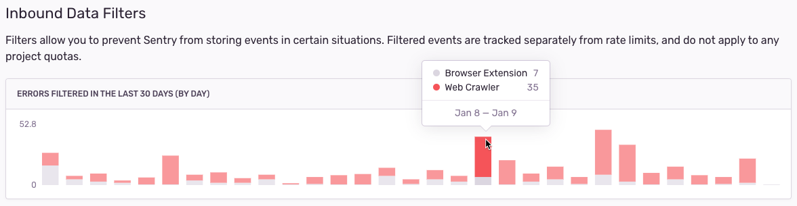

## 4. Event Grouping

Proper event grouping is essential to maintain a meaningful Issue Stream and reduce redundant notifications. Sentry groups similar _Events_ into unique _Issues_ based on their _Fingerprint_. An event's fingerprint relies firstly on its **stack trace**.

With **JavaScript** errors, a minified source code might result in a nondeterministic stack trace that could mess up associated event grouping. Make sure Sentry has access to your `Source Maps` and minified artifacts. For more information see [Uploading Source Maps](/platforms/javascript/sourcemaps/).

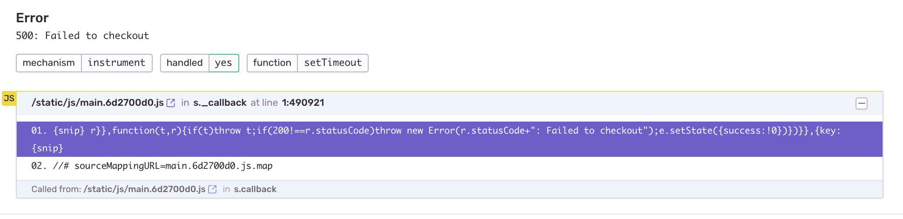
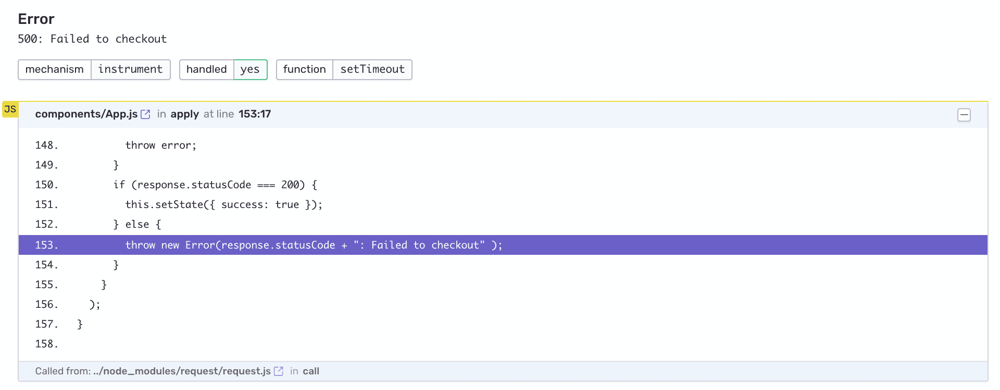

For more information on the Fingerprint algorithm and customizing event grouping see [Grouping & Fingerprints](/platform-redirect/?next=/data-management/event-grouping/).

## 5. Applying Workflows

Now that your event stream is fine-tuned to reflect real problems in your code, it's an excellent practice to react to errors as they happen. If an issue reflects a real problem in your code, resolve it; otherwise--- discard.

### Resolve

You've been alerted on a new error in your code? Jump into the issue page to get all the data you need to know about the error. If it's a real issue in your code, assign a team member to resolve it. Don't forget to let Sentry know once it's resolved. For more information see [The Sentry Workflow — Resolve](https://blog.sentry.io/2019/07/03/the-sentry-workflow-resolve)

### Delete & Discard

<Alert level="info">
  Delete and Discard is available on the Business plan.
</Alert>

If there is an irrelevant reoccurring issue that you are unable or unwilling to resolve, you can delete and discard it from the issue details page by clicking `Delete and discard future events`. This will remove the issue and event data from Sentry and filter out future matching events.

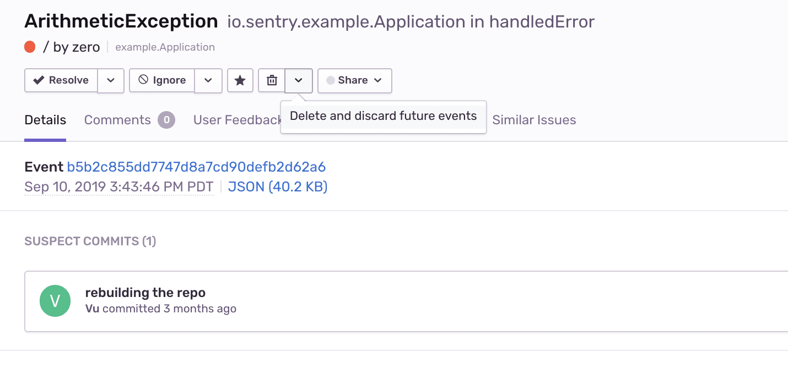

Discarded issues are listed under `[Project Settings] > Inbound Filters > Discarded Issues` and can always be un-discarded to allow future events back in your stream.

> Note: Once you've identified a set of discarded issues, it might make sense to go back to your SDK configuration and add the related errors into your before-send client-side filtering.

## 6. Rate Limiting

Rate limiting allows you to limit the amount of events Sentry accepts per-project for a defined time span. While this is quite useful for managing your monthly event quota, keep in mind that once a defined threshold is crossed, **subsequent events will be dropped**. Therefore, your rate limit shouldn't be constantly hit, but rather defined as a ceiling intended to protect you from unexpected spikes.

Under `[Project Settings] » Client Keys » Configure`, you can create multiple DSN keys per-project and assign different (or no) limits to each key. This will allow you to dynamically allocate keys (with varying thresholds) depending on Release, Environment, and so forth.

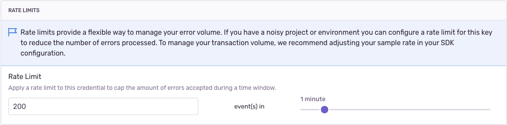

For more information see [What Counts Toward My Quota](/product/accounts/quotas/#what-counts-toward-my-quota-table-view)

## 7. Spike Protection

Sentry also applies a dynamic rate limit to your account designed to protect you from short-term spikes. However, we would recommend applying all of the previously mentioned methods. For more information see:

- [Spike Protection](/product/accounts/quotas/#spike-protection)
- [Protect Yourself Against Spikes in Events with Spike Protection](https://blog.sentry.io/2018/05/08/event-spike-protection#what-counts-as-a-spike)

## Common Workflows for Managing Your Event Stream

Applying the proper filters, SDK configuration, and rate limits is an iterative and on-going process. Sentry provides several tools to increase your visibility into the events and issues aggregating in your streams. Let's see how they can be leveraged to manage your streams.

### > **How to set proper rate limits?**

A good way to set a project rate limit is by figuring out the expected event volume based on your average traffic. Let's look at an example:

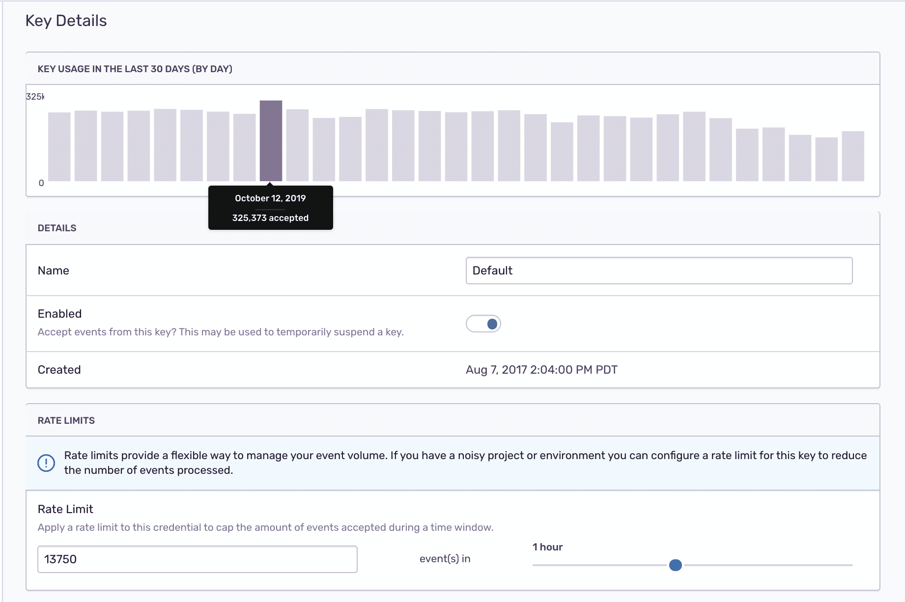

- Open the project DSN key configuration under `[Project Settings] > Client Keys > [Configure]`
- Take a look at the `KEY USAGE IN THE LAST 30 DAYS` graph. Max daily rate in the last month is < 326K
- Based on that, we can define a ceiling **daily** max value of ~330K, which is ~13,750 events an **hour**, or ~230 events a **minute**.
- Notice that you can set a daily, hourly, or minute-based rate limit. We'd recommend using a minute based rate to avoid situations where a random event spike might exhaust your daily or hourly set quota and leave you blind for a long while.
- You can always go back, check the graph to see the number of events dropped due to rate limiting and revisit your settings.

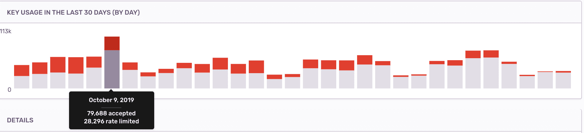

### > **How can I see a breakdown of incoming events?**

The `Stats` view displays details about the total number of events Sentry has received across your entire organization over the last week. The report breaks down the events by project into three categories:

- **Accepted**: events processed and persisted displayed in your event stream.
- **Rate Limited**: events that were dropped due to the limit being hit.
- **Filtered**: events that were blocked based on your inbound filter rules.

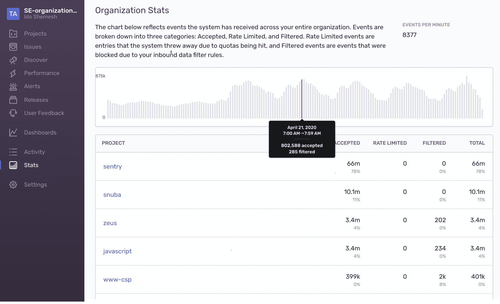

Clicking on a project name will open the project settings view where you can manage the project's Inbound Filters and Rate Limits.

You can also download monthly reports with a similar break down of all your previous billing periods under `Settings > Usage & Payments > Usage History`

### > **What are my busiest projects?**

[Discover](/workflow/discover/) provides a powerful query builder to query through all your event data cross-project.

1. Open Discover and click on `Build a new query`.
2. From the top-level filter select `View All Projects` in the project drop-down and apply the desired environments and date range
3. In the query builder input enter `event.type:error`
4. From the `Results` table click on `Edit Columns` and edit the columns and aggregates as below

   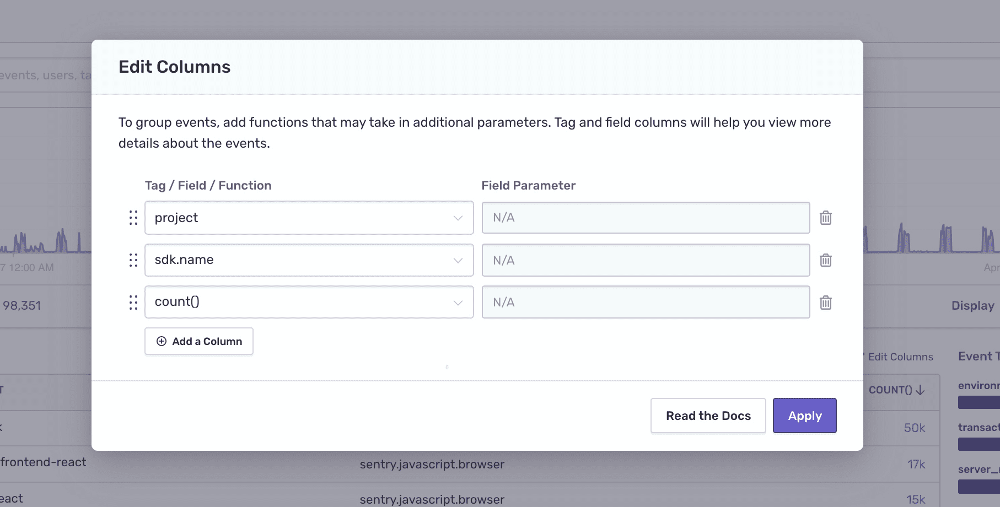

5. Apply the changes and click on the event `COUNT()` column to orders the table rows by the number of events

   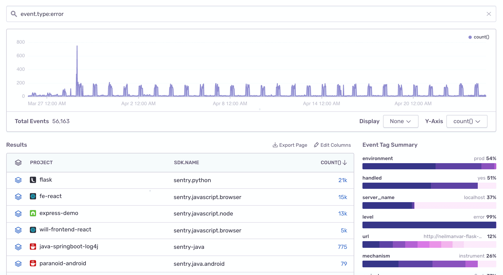

6. Click on `Save as...` to save this query to your main Discover Dashboard

### > **What issues are consuming my quota?**

The Sentry workflow starts with a real-time alert notifying you about an error in your code. If you want to take a more proactive approach to resolve your busiest errors, follow steps 1 - 6 from above. For step 4 select the columns as seen below:

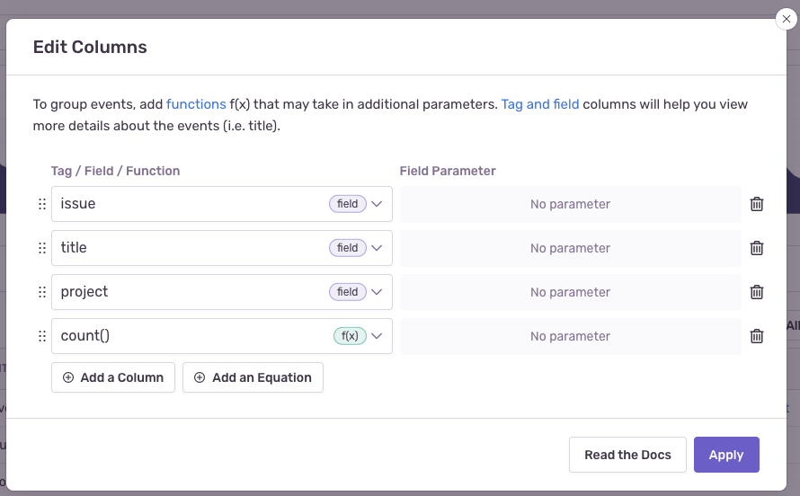

Once applying the changes the Results table will display your busiest issues:

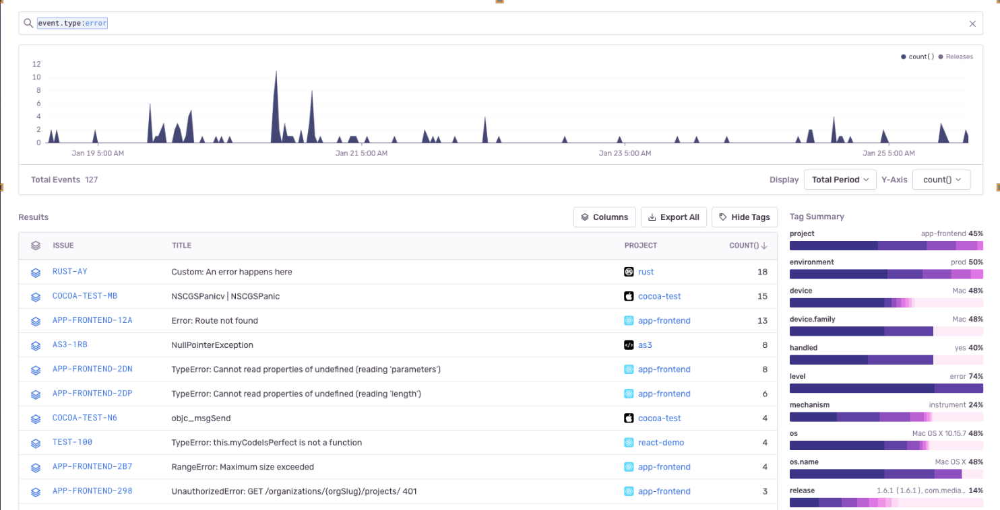

### > **Spike Protection was activated --- what should I do?**

You received an email notifying you that Spike Protection was triggered and applied to your account.

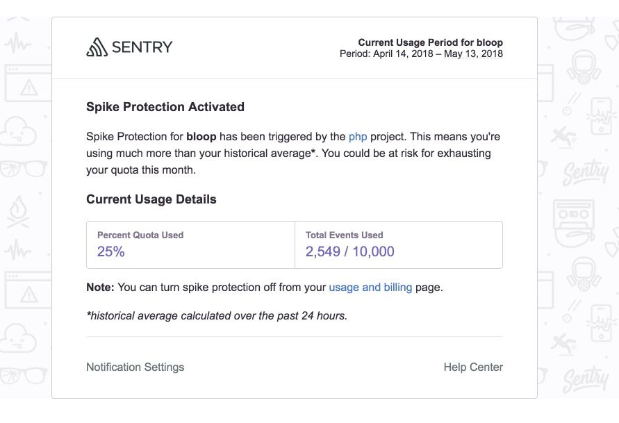

Many times an unexpected spike is caused by a new error (or errors) introduced into your code with a new release version. Here are ways you can search for these errors:

1. Open Discover and click on `Build a new query`.
2. From the top-level filter select `View All Projects` in the project drop-down and apply the desired environments and date range around the time the spike occurred.
3. Find the spike in the events timeline graph and mark the range with your cursor. Notice the events timeline and date filter (on the top filter bar) are updated to zoom into the selected date range.
   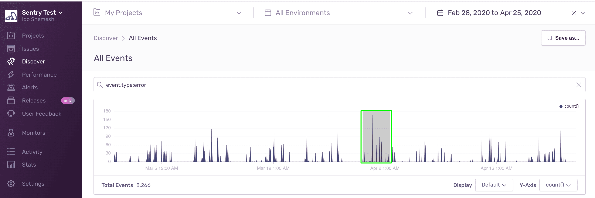

4. Now, you can use Discover to query only the set of events sent to Sentry during the spike. Edit the Results table columns as shown below to see the busiest issues that contributed to the spike.
   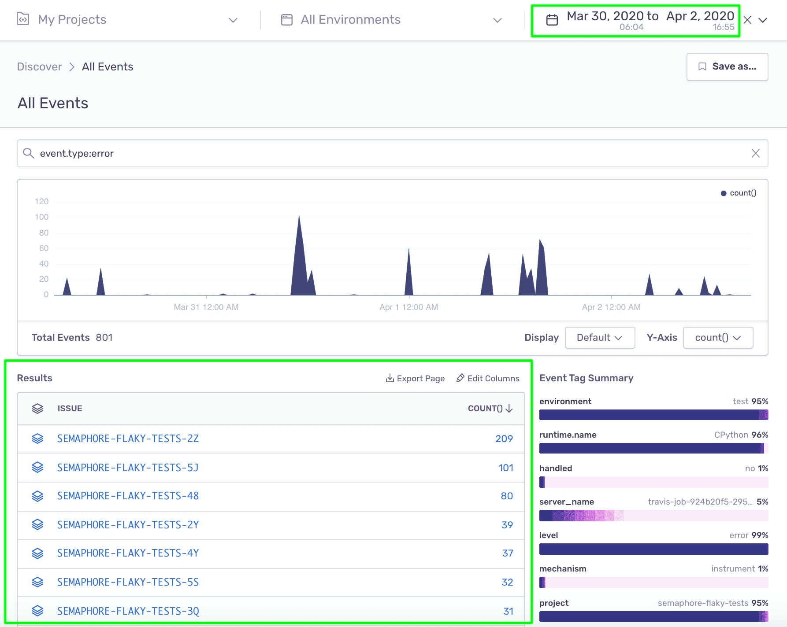
5. Click on the `Issue Id` to open the issue details page. If it's a real issue - assign it to a project team member to resolve it; otherwise - discard it.

Also, consider doing the following:

- Set better rate limits on the DSN keys associated with the spike related projects.
- If it's a specific release version that has gone bad, add the version identifier to the project's Inbound filters to avoid accepting events from that release.
