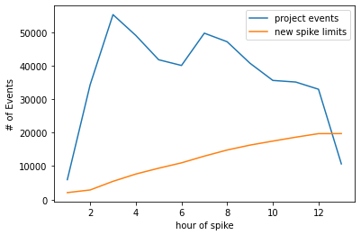

Sending all your application errors to Sentry ensures you'll be notified in real-time when errors occur in your code. However, with a basic setup, you may consume your error quota too rapidly and trigger more notifications than you can use. Sentry provides tools to control the _type_ and _amount_ of errors that are monitored. These tools allow you to:

1. Receive more actionable and meaningful error events.
2. Reserve real-time notifications for errors that actually break your code.
3. Manage your error quota.

Applying the proper filters, SDK configuration, and rate limits is an iterative and on-going process, but these tips will show you how to get the most out of your error events. These tips are ordered from easiest or least time-consuming to most challenging or potentially time-consuming. Options 1-5 are all things you can do in [sentry.io](https://sentry.io), whereas the remaining ones are things you'll do in the SDK.

## Before You Begin: Check Your Quota Usage {#common-workflows-for-managing-your-event-stream}

You can look at your events in aggregate in the "Usage Stats" tab of **Stats**. This information will help you answer key questions about the breakdown of your incoming events or which projects are consuming your quota. The answers to these questions can help you figure out where you need to do further fine-tuning of your SDK filters and configuration.

This page is accessible to all members of your organization, so Owners in your Sentry org can share this page with the developers directly responsible for a given project. Also, you can come back to this page to check if the changes you've made are having the desired effect.

### How can I see a breakdown of incoming events? {#-how-can-i-see-a-breakdown-of-incoming-events}

The [Usage Stats](/product/stats/#usage-stats) tab displays details about the total amount of data Sentry has received across your entire organization for up to 90 days. The page breaks down the events (by project) into three categories: _accepted_, _dropped_, or _filtered_. Only accepted events affect your quota:


### What are my busiest projects? {#-what-are-my-busiest-projects}

The "Project" table in the "Usage Stats" tab of **Stats** breaks down your data by project, so you can see which ones are consuming your quota. Clicking on the settings icon next to a project name in the table will open the project's settings page where you can manage its [inbound filters](#3-inbound-data-filters) and [rate limits](#6-rate-limiting).

### Which issues are consuming my quota? {#-what-issues-are-consuming-my-quota}

<Note>

You can only update the columns of the Results table in **Discover** if your organization is on a Business plan.

</Note>

You can set up [a query](https://sentry.io/orgredirect/organizations/:orgslug/discover/results/?field=title&field=project&field=count%28%29&name=All+Events&query=event.type%3Aerror&sort=-count&statsPeriod=14d&yAxis=count%28%29) in **Discover** to take a more proactive approach to resolving your busiest issues. When you're building the query, search for `event.type:error` and then set the columns `issue`, `title`, `project`, and `count()`, as shown below:


Once the changes are applied, sort the "Results" table by the "COUNT()" column to display your busiest issues:


Once you know where your quota is being used, you can start taking the steps below to control it.

## Grace Period

We include a one-time grace period for error events on all paid accounts. This means that if an account depletes its error event volume and has never previously triggered a grace period, we continue to accept events for the next three days at a maximum rate of 10,000 events per hour. If you choose not to increase your error volume, Sentry will stop accepting events for the remainder of the current billing month. However, if you increase your volume, error events accepted during the grace period will be counted as consumed volume.

While this grace period isn't dependent on the [Spike Protection feature](#7-spike-protection), you'll probably get a notification that you've entered a grace period along with a notification of a spike.

## 1. Spike Protection {#7-spike-protection}

A spike is both a **large** and **temporary** increase in error event volume. Sentry applies a dynamic rate limit to your account designed to protect you from short-term spikes.

Spike protection is enabled for your organization by default, and when it's enabled, Sentry continually monitors for spikes. You can confirm that it's enabled in **Settings > Subscription**. This page can only be accessed by a Billing or Owner member of your Sentry organization.

### How Does Spike Protection Work?

Because Sentry bills based on monthly event volume, spikes can easily consume your quota for the rest of the month. Sentry's spike protection prevents these types of overages from consuming your error event quota by dropping error events during the spike.

We use your historical error event volume to implement a dynamic rate limit, and then discard error events when you hit its threshold. When spike protection is activated, we limit the number of error events accepted in any minute to:

```
maximum(20, 6 x average error events per minute over the last 24 hours)
```

<Note>

The 24-hour window ends at the beginning of the current hour, not at the current minute.

</Note>

This means if you experience a spike, we'll temporarily protect you, but if the increase in volume is sustained, the spike protection limit will gradually **increase until Sentry accepts all events**.

For example, in the last 24 hours, your organization has been receiving, on average, 10 events per minute (after any inbound filters have been applied). That means your current per-minute limit is 6 \* 10 or 60 events. There have been no spikes in that time, so spike control is "inactive". Something breaks, and in the next minute, your organization sends Sentry 100 events. When we see the 61st event, three things happen:

1. Spike protection becomes "active".

1. If your organization has used more than 25% of your monthly quota, Sentry sends the organization owner a [notification](/product/alerts/notifications/#quota-notifications) including which project the 61st event came from. This is likely, but not guaranteed to be, the project in which something broke.

1. Events 61-100 are dropped with a 429 error code.

When the next minute begins, we again record up to 60 events, dropping the rest until the minute is up. It continues like this for the remainder of the hour. After an hour, we re-calculate your per-minute limit, and for the next hour use that limit to decide whether events get dropped each minute. We repeat this process every hour until Sentry eventually accepts all events.

If, instead of a single big spike (or an overall, permanent, increase in traffic), you experience many small spikes, there may be many days in a row when at least a few events are dropped. In that scenario, spike protection remains active the entire time.

Spike protection is an organization-level setting, so once it's triggered, it affects all the projects in the organization, regardless of which project triggered the spike.

### Managing a Spike {#-spike-protection-was-activated----what-should-i-do}

If spike protection has been triggered for your account, you'll receive an email notifying you:


To manage the current spike and avoid future spikes, we recommend taking the following steps:

- Set up an [on-demand budget](#on-demand-budget) to ensure you have time to adjust your volume in the event of a future spike in errors.
- Set better [rate limits](#6-rate-limiting) on the DSN keys for the projects related to the spike.
- If it's a specific release version that has caused the spike, add the version identifier to the project's [inbound filters](#3-inbound-data-filters) to avoid accepting events from that release.

To review the error events dropped because of spike protection, go to the "Usage Stats" tab of **Stats** for your Sentry org and select "Errors" in the "Category" dropdown.

### When Does Spike Protection Become "Inactive?"

Events will not be dropped during any minute in which you don't send more than the hourly limit that Sentry has calculated for you. After 24 hours without any dropped events, spike protection becomes "inactive" again. This means that it is no longer dropping events, but _it does not mean the system has stopped paying attention._ The next time events are dropped, spike protection will be "reactivated".

### New Heuristic Changes

<Include name="limited-avail-note.mdx" />

Spike protection is enabled for every project by default, and when it's enabled, Sentry continually monitors for spikes. You can confirm that it's enabled in **Settings > Projects > _Select Project_ > General Settings**.

The way our spike protection algorithm essentially works is by using a weighted average of your events over the past 168 hours (past 7 days), applying a multiplier to that number, comparing this final number against a floor bound that is determined using your quota, and setting that as your spike limit.

#### Spike Protection Inputs

- Number of projects
- Quota (per event type)
- Events in the past 7 days

#### Floor Bound Calculation

To break it down even further, the first step of this algorithm identifies a floor bound that is calculated using your quota. This bound takes the max of either 500 events or (3 \* your quota)/(720 \* number of projects) - the latter number represents your project using up 3 times your overall quota in 30 days if events are continually ingested at this hourly rate, thus flagging for a potential spike.

#### Spike Limit Calculation

The next step uses hourly data from the past 7 days to calculate spike limit projections for the next 7 days. This data is used to calculate weighted averages, which takes into account weekly and hourly seasonality. For example, the weighted average calculated for Monday at 3 pm is more heavily influenced by data points on Monday or hours around 3 pm. This weighted average is then multiplied by a multiplier that is 5 times the overall standard deviation of the past week - this multiplier is bounded between 3 and 6.

#### Setting the Final Limit

The final spike limit for each hour is set to the max of the floor bound or the calculated limit. This is done for a multitude of reasons - firstly, using the floor bound protects smaller or new projects. New projects that do not have a week’s worth of data to use to calibrate spike limits can use the floor, an adaptation of the organization’s quota, to approximate appropriate limits. Additionally, the floor can be used to minimize false positives in smaller/new projects such that spikes aren’t flagged incorrectly.

Additionally, at the onset of a spike, spike limits are recalculated in real time throughout the duration of the spike. While this is done to adjust for the increasing volume of incoming events, the limit grows at a steady rate such that quota is protected and not blown through. An example of how our heuristic works during a spike is shown below.

#### Example Calculations




**_During Spike_**

- 1st hour: 6k events ingested, limit is recalculated to 2083, 3917 events dropped
- 2nd hour: 34k events ingested, limit is recalculated to 2873, 31217 events dropped
- 3rd hour: 55k events ingested, limit is recalculated to 5452, ~49k events dropped
- 4th hour: 49k events ingested, limit is recalculated to 7628, ~41k events dropped
- 5th hour: 41k events ingested, limit is recalculated to 9371, ~31k events dropped

Limits are recalculated throughout the duration of the spike.

For this particular example:

- Org Quota: 500k
- Events Ingested: ~478k
- Events ~157k

Here's an example of spike limit projections for a week, taking into account seasonality:


## 2. Adjusting Quotas

<Note>

Quotas can only be updated by a Billing or Owner member of your Sentry organization.

</Note>

Once your event volume is approaching or has exceeded the quota, teammates with the "Owner" organization permission level will receive [notification](/product/alerts/notifications/#quota-notifications) emails. You can then choose to [increase](#increasing-quotas) or [decrease](#decreasing-quotas) your quota.

If this is your first time exceeding quota and you're on a paid plan, however, you'll be entered into a one-time grace period. Learn more about the grace period in this [Help article](https://help.sentry.io/account/billing/what-happens-when-i-run-out-of-event-capacity-and-a-grace-period-is-triggered/).

### Increasing Quotas

If you're dropping events that you want to keep because you've exceeded your quota, add to your quota at any time during your billing period by either increasing your [reserved](#reserved-volume) or [on-demand](#on-demand-budget) quota.

When you exceed your quota threshold, the server will respond with a 429 HTTP status code, which communicates to SDKs and clients to stop sending events. This status code comes with a `Retry-After` header that indicates the time for which this rate limit is active. However, clients are not supposed to retry events, but instead drop events until the rate limit has expired, to prevent queue backlogs. Note, that since event ingestion and rate limiting happen asynchronously, the 429 HTTP status code is always slightly delayed.

To increase your quota, go to **Settings > Subscription** and click the "Manage Subscription" button to access your subscription options. When you increase your quota, the change goes into effect immediately.

If you're on a Developer plan and want to increase your quota, you'll need to upgrade to a Team or Business plan. On these plans you can prepay for more event volume and purchase on-demand volume, as needed. Learn about Sentry's plans on our [pricing page](https://sentry.io/pricing/).

<Note>

If you upgrade from Team to Business mid-billing period, your on-demand pricing changes retroactively.

</Note>

### Reserved Volume

If the number of events you need is steadily increasing, you may want to increase your reserved capacity or volume. Reserved volume is less expensive than on-demand volume since you prepay for it. It also allows you to choose the number of events that you want to have available beforehand rather than just setting an arbitrary on-demand budget. Learn more about [reserved volume](/product/accounts/pricing/#prepaid-reserved-capacity) in our pricing documentation.

You shouldn't increase your reserved volume if you think your need for more events is temporary, since [reducing your reserved volume is tied to your billing period](#decreasing-quotas).

### On-Demand Budget

If you need to increase your event quota temporarily, we recommend that you add or increase on-demand budget. This is ideal for situations like rolling out a new version of your application where you anticipate more events for the month. To add on-demand capacity or volume, you enter a monthly maximum budget on either a shared or per-category (errors, transactions, and attachments) basis. Learn more about [on-demand volume](/product/accounts/pricing/#on-demand-capacity) in our pricing documentation.

### Decreasing Quotas

Plan downgrades and decreases in reserved volume are processed at the end of your billing period, and remaining volume cannot be refunded. For example, if you have a monthly billing period that starts on the 5th of the month, and you decrease your reserved volume on June 20th, then this change will be processed on July 4th. Your billing period beginning on July 5th will reflect your new reserved volume.

<Alert level="warning">

If you have an annual billing period, plan downgrades and decreases in reserved volume go into effect at the beginning of your **next billing year.**

</Alert>

Changes to on-demand volume typically go into effect immediately and are guaranteed to go into effect within 24 hours. However, you can't decrease your on-demand budget to less than what you've consumed in the current period.

To decrease your quota, go to **Settings > Subscription** and click "Manage Subscriptions". When you reach the "Review & Confirm" step, the date that these changes go into effect will be displayed:


<Note>

We strongly recommend that you make subscription changes **before** the last day of your billing period. Depending on your time zone, in some cases, changes made on the last day of the billing period will not go into effect until the next billing period.

</Note>

## 3. Rate Limiting {#6-rate-limiting}

<Include name="business.mdx" />

Rate limiting allows you to set the maximum volume of error events a project key will accept during a period of time. For example, if you have a project in production that generates a lot of noise, a rate limit allows you to set the maximum amount of data, such as “500 events per minute”. Additionally, you can create a second key for the same project for your staging environment, which is unlimited, ensuring your QA process is still untouched.

In **[Project] > Settings > Client Keys (DSN)**, click "Configure", and you can create multiple DSN keys per project and assign different (or no) rate limits to each key. This will allow you to dynamically allocate keys (with varying thresholds) depending on release, environment, and so on.


Once you've set the limit, events dropped because of rate limiting generate a 429 error code.

While rate limiting is quite useful for managing your monthly event quota, keep in mind that once a defined threshold is crossed, subsequent events will be dropped. Therefore, you shouldn't constantly be hitting your rate limit; rather, it should act as a ceiling intended to protect you from unexpected spikes.

### Setting Useful Rate Limits {#-how-to-set-proper-rate-limits}

A good way to set a project rate limit is by figuring out the expected event volume based on your average traffic. Here's how to do that:

1. Go **[Project] > Settings > Client Keys (DSN)** and open the project DSN key configuration under by clicking "Configure".
1. In the "KEY USAGE IN THE LAST 30 DAYS" graph, look for the highest point, or the maximum daily rate. In the example below, the maximum daily rate in the last month is less than 34K:
   
   <!-- image notes: Sentry, airflow, Santry, app-frontend -->
1. Based on the rate, choose a **daily** maximum value or ceiling. In this example, we calculated a daily maximum of approximantely 35K, which is around 1458 events an **hour**, or about 24 events a **minute**.
1. Set a daily, hourly, or minute-based rate limit. We recommend using a minute-based rate to avoid situations where a random event spike might exhaust your daily or hourly quota and leave you without event data for a long period.

You should periodically go back and check the graph to see the number of events dropped due to rate limiting and, if needed, revisit your settings.


## 4. Review Event Repetition {#5-applying-workflows}

The following rules apply for error event repetition and your quota:

- If you previously resolved an issue, a new error event counts toward your quota because it may represent a regression in your code.
- If you have chosen to ignore alerts about error events with the same fingerprint, a new event counts toward your quota because the event is still occurring.
- If you ["Delete & Discard"](#delete--discard) an issue, then **future** error events with the same fingerprint will not count toward your quota.

### Delete & Discard

<Include name="business.mdx" />

If there is an irrelevant, reoccurring issue that you are unable or unwilling to resolve, you can delete and discard it from the **Issue Details** page by clicking "Delete and discard future events". This will remove the issue and event data from Sentry and filter out future matching events.


You can find a list of deleted and discarded issues in the "Discarded Issues" tab in **[Project] > Settings > Inbound Filters**. From here, you can un-discarded any of these issues to receive future events.


Once you've identified a set of discarded issues, it might make sense to go back to your SDK configuration and add the related errors into your `beforeSend` client-side filtering.

## 5. Inbound Data Filters {#3-inbound-data-filters}

While SDK configuration requires changes to your source code and depends on your next deployment, server-side filters can be easily configured per project in the "Data Filters" section of **[Project] > Settings > Inbound Filters**.

Once applied, you can track the filtered events (numbers and cause) using the graph provided at the top of the "Inbound Data Filters" page.


Sentry provides several methods to filter all events and attachments server-side, which are applied before checking for potential rate limits. Inbound filters include:

- Common browser extension errors
- Events coming from `localhost`
- Known legacy browsers errors
- Known web crawlers
- Error messages
- Specific release versions of your code
- Certain IP addresses

The first four options above are settings that you simply toggle on or off. Setting the others is explained further below.

After these checks are processed, events and attachments that aren't dropped based on these filters count toward your quota. They're accepted into Sentry, where they're persisted and stored.

### IP Filters

If you have a rogue client, Sentry supports blocking an IP from sending data. Navigate to **[Project] > Settings > Inbound Filters** to add the IP addresses (or subnets) in the "IP Addresses" field.

### Filter by Release

<Include name="business.mdx" />

If you discover a problematic release causing excessive noise, Sentry supports ignoring all events and attachments from that release. Navigate to **[Project] > Settings > Inbound Filters**, then add the release to the "Releases" field.

### Filter by Error Message

<Include name="business.mdx" />

Sentry supports filtering out a specific or certain kind of error as well. Navigate to **[Project] > Settings > Inbound Filters**, then add the error message to the "Error Message" field.

To ensure you’re adding the correct message to the inbound filter setting, check the JSON for an event in the issue. The filter by error message setting matches the data found in the `title` field near the end of the file.

## 6. SDK Sample Rate

If a sample rate is defined for the SDK, the SDK evaluates whether this event should be sent as a representative fraction of events. Setting a sample rate is [documented for each SDK](/platform-redirect/?next=/configuration/sampling/).

The SDK sample rate is not dynamic; changing it requires re-deployment. Also, keep in mind that setting an SDK sample rate limits visibility into the source of events. Setting a rate limit for your project may better suit your needs.

## 7. SDK Filtering: beforeSend {#1-sdk-filtering-beforesend}

All Sentry SDKs support the `beforeSend` callback method. Once implemented, the method is invoked when the SDK captures an event, right before sending it to your Sentry account. It receives the event object as a parameter, so you can use that to modify the event's data or drop it completely (by returning `null`) based on your custom logic and the data available on the event, like _tags_, _environment_, _release version_, _error attributes_, and so on. Learn more in [Filtering Events](/platform-redirect/?next=/configuration/filtering/).

## 8. SDK Configuration {#2-sdk-configuration}

The Sentry SDKs have several configuration options that can be used to filter unwanted errors from leaving your application's runtime. A lot of these options are platform-specific, so make sure you look for yours in our platform docs under [Configuration](/platform-redirect/?next=/configuration/). Following are some configuration examples for JavaScript and other SDKs.

### JavaScript

The JavaScript SDK includes multiple integrations: functional plugins that you can configure, enable, or disable. Learn more in [JavaScript SDK Integrations](/platforms/javascript/configuration/integrations/). Several integrations allow you to configure the types of events you want Sentry to monitor; two of them, InboundFilters and GlobalHandlers are explained below:

#### InboundFilters

The integration is enabled by default and adds the following configuration options to the SDK:

- `allowUrls`: Domains that might raise acceptable exceptions represented in a regex pattern format.
- `denyUrls`: A list of strings or regex patterns which match error URLs that should be blocked from sending events. Configuring both `allowUrls` and `denyUrls` on the SDK can be used to block subdomains of the domains listed in `allowUrls`.
- `ignoreErrors`: Instructs the SDK to never send an error to Sentry if it matches any of the listed error messages or regular expressions. The SDK will try to match against the message or, if there is no message, a string containing the exception type and value formatted like so: `ExceptionType: value`.

To learn more and see code samples, check out:

- [Filtering](/platforms/javascript/configuration/filtering/)
- [Enriching Events: Add Context](/platforms/javascript/enriching-events/context/)

#### GlobalHandlers

This integration attaches global handlers to capture uncaught exceptions (`onerror`) and unhandled rejections (`onunhandledrejection`). Both handlers are enabled by default, but can be disabled through configuration. Learn more in [GlobalHandlers Integration](/platforms/javascript/configuration/integrations/default/#globalhandlers).

Check out additional configuration options with the [tryCatch](/platforms/javascript/configuration/integrations/default/#trycatch) and [ReportingObserver](/platforms/javascript/configuration/integrations/plugin/#reportingobserver) integrations.

### Other SDKs

**Java** - Sentry's [Java SDK](/platforms/java/) provides integrations with common Java logging libraries. The configuration allows you to set a logging threshold determining the minimum level to capture a log message as breadcrumb. It also provides a setting to configure the minimum log level to capture an event.

**PHP** - The `error_types` configuration option allows you to set the error types you want Sentry to monitor. Learn more in PHP [Basic Options](/platforms/php/configuration/options/#common-options).

**Ruby** - The `excluded_exceptions` configuration option allows you to set the exception types you wish to suppress. Learn more in the [Ruby configuration docs](/platforms/ruby/configuration/options/#optional-settings)
