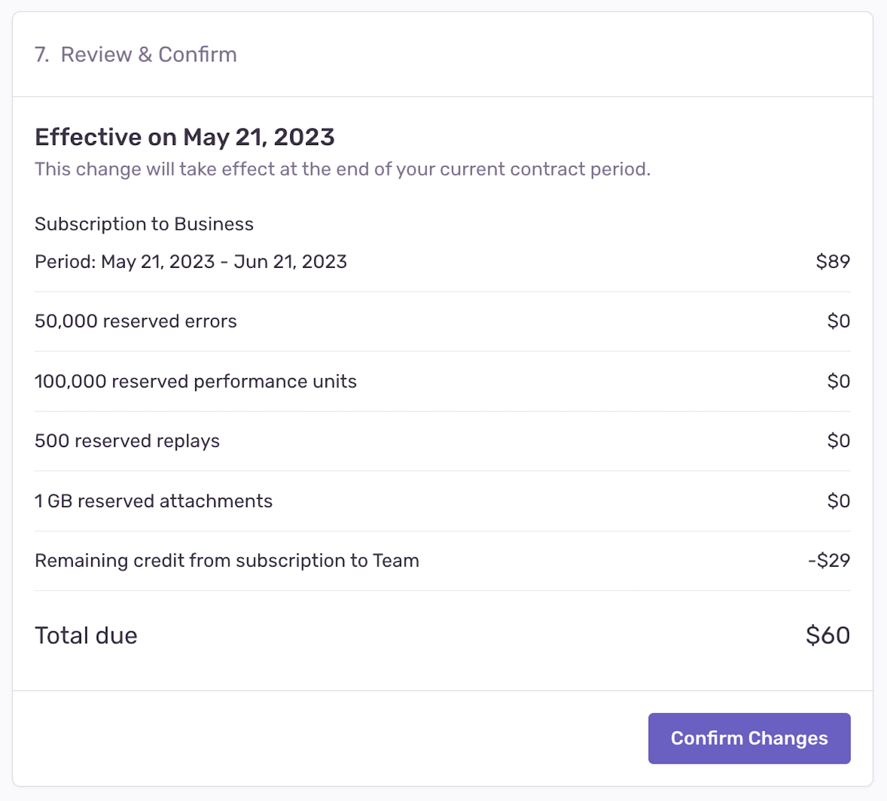

The below will help you understand where and how to manage your Replay quota, how to check which projects are consuming more than others, and what to expect if you need to increase or decrease your spend.

## Before You Begin: Check Your Quota Usage {#3-replay-usage-stats}

You can look at your replays in aggregate in the "Usage Stats" tab of the **Stats** page to understand the breakdown of your incoming replays and see which projects are consuming your quota. This may help you figure out where you need to further fine-tune your SDK filters and configuration.

This page is accessible to all members of your organization, so Owners in your Sentry org will be able to share it with the developers directly responsible for a given project. You’ll also be able to use this page to assess whether the changes you've made are having the desired effect.

### How can I See a Breakdown of Incoming Replays?

The Usage Stats tab displays details about the total amount of data Sentry has received across your entire organization for up to 90 days. The page breaks down the events (by project) into three categories: accepted, dropped, or filtered. Only accepted replays affect your quota:

### Which Projects Are Consuming My Quota?

The "Project" table in the "Usage Stats" tab of the Stats page breaks down your data by project, so you can identify the ones that are consuming the most quota. Clicking on the settings icon next to a project name in the table, will open the project's settings page, where you can manage its [inbound filters](#2-inbound-data-filters) and rate limits.

## Adjusting Quotas

<Note>

Quotas can only be updated by a Billing or Owner-level member of your Sentry organization.

</Note>

Once your replay volume is approaching or has exceeded its quota, teammates with the "Owner" organization permission level will start receiving [notification](/product/alerts/notifications/#quota-notifications) emails. They'll then be able to choose to [increase](#increasing-quotas) or [decrease](#decreasing-quotas) your quota.

If this is your first time exceeding quota and you're on a paid plan, however, you'll be entered into a one-time grace period. Learn more about the grace period in this [Help article](https://help.sentry.io/account/billing/what-happens-when-i-run-out-of-event-capacity-and-a-grace-period-is-triggered/).

### Increasing Quotas

If you're dropping replays that you want to keep because you've exceeded your quota, you can add to your quota at any time during your billing period by either increasing your [reserved](#reserved-volume) or [on-demand](#on-demand-budget) quota.

When you exceed your quota threshold, the server will respond with a 429 HTTP status code, which communicates to SDKs and clients to stop sending replays. This status code comes with a `Retry-After` header that indicates the time for which this rate limit is active. But to prevent queue backlogs, instead of retrying events, clients are supposed to drop them until the rate limit has expired. Note, that since event ingestion and rate limiting happen asynchronously, the 429 HTTP status code is always slightly delayed.

To increase your quota, go to **Settings > Subscription** and click the "Manage Subscription" button to access your subscription options. When you increase your quota, the change goes into effect immediately.

If you're on a Developer plan and want to increase your quota, you'll need to upgrade to a Team or Business plan, which allow you to prepay for more replay volume and purchase on-demand volume, as needed. Learn about Sentry's plans on our [pricing page](https://sentry.io/pricing/).

<Alert>

If you upgrade from Team to Business mid-billing period, your on-demand pricing changes retroactively.

</Alert>

### Increasing Reserved Volume

If the amount of replays you need is steadily increasing, you may want to increase your reserved capacity or volume. Reserved volume is less expensive than on-demand volume since you prepay for it. It also allows you to choose the amount of replays you want to have available beforehand, rather than setting an arbitrary on-demand budget. Learn more about [reserved volume](/product/accounts/pricing/#prepaid-reserved-capacity) in our pricing documentation.

You shouldn't increase your reserved volume if you think your need for more events is temporary, since [reducing your reserved volume is tied to your billing period](#decreasing-quotas).

### Increasing On-Demand Budget

If you need to increase your replays quota temporarily, we recommend that you add or increase your on-demand budget. This is ideal in situations where you’re rolling out a new version of your application and anticipate receiving more data for the month, for example. To add on-demand volume, set a monthly maximum budget on either a shared (budget is shared between events such as replays and errors), or per-category (budget is set aside per category such as replays), basis. Learn more about [on-demand volume](/product/accounts/pricing/#on-demand-capacity) in our pricing documentation.

### Decreasing Quotas

Billing plan downgrades and decreases in reserved volume are processed at the end of your billing cycle and any remaining volume cannot be refunded. For example, if you have a monthly billing cycle that starts on the 5th of the month, and you decide to decrease your reserved volume on June 20th, your request will be processed on July 4th. Your downgrade request will then be reflected starting with the July 5th billing cycle.

<Alert level="warning">

If you have an annual billing period, plan downgrades and decreases in reserved volume go into effect at the beginning of your **next billing year.**

</Alert>

Changes to on-demand volume typically go into effect within minutes and are guaranteed to take place within a maximum of 24 hours. However, you can't decrease your on-demand budget to less than what you've already consumed in a given billing period.

To decrease your quota, go to **Settings > Subscription** and click "Manage Subscriptions". When you reach the "Review & Confirm" step, the date that these changes go into effect will be displayed:

<Note>

We strongly recommend that you make subscription changes **before** the last day of your billing period. In some cases, changes made on the last day of the billing period will not go into effect until the next billing period (depending on your time zone).

</Note>
