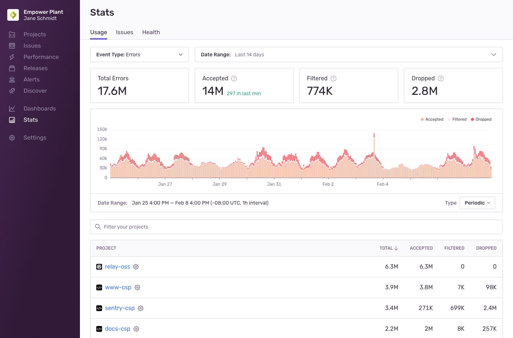
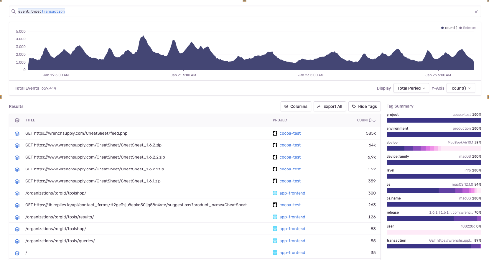

In most cases, sending all [transaction](/product/performance/transaction-summary/#what-is-a-transaction) events to Sentry would generate more performance data than you might find useful and might use up your transactions quota too quickly. Sentry provides tools to control the _type_ and _amount_ of transactions that are monitored. This allows you to have transaction data that's actionable and meaningful, and to manage your quota. Applying the proper SDK configuration is an iterative and on-going process, but these tips will show you how to best use Sentry's tools to get the most out of your transaction events.

## 1. SDK Filtering: beforeSend

All Sentry SDKs support the `beforeSend` callback method. Once implemented, the method is invoked when the SDK captures an event, right before sending it to your Sentry account. It receives the event object as a parameter, so you can use that to modify the event's data or drop it completely (by returning `null`) based on your custom logic and the data available on the event, like _tags_, _environment_, _release version_, and so on. Learn more in [Filtering Events](/platform-redirect/?next=/configuration/filtering/).

## 2. SDK Configuration: Tracing Options

When you configure your the SDK, you can control the number of transactions that are sent to Sentry by setting the [tracing options](/platform-redirect/?next=/configuration/options/%23tracing-options). You can also set up [custom instrumentation](/platform-redirect/?next=/performance/instrumentation/custom-instrumentation/) for performance monitoring to capture certain types of transactions.

## 3. Event Usage Stats

Once you've completed the steps above, you can look at your events in aggregate in the "Usage Stats" tab of **Stats**. This information will help you answer key questions about the breakdown of your incoming events or which projects are consuming your quota. The answers to these questions can help you figure out where you need to do further fine-tuning of your SDK filters and configuration.

### How can I see a breakdown of incoming events?

The [Usage Stats](/product/stats/#usage-stats) tab displays details about the total number of events Sentry has received across your entire organization for up to 90 days. The page breaks down the events, by project, into three categories:

- **Accepted**: Events processed and displayed in the issues or transactions views in [sentry.io](https://sentry.io).
- **Dropped**: Events that were discarded due to a limit being hit.
- **Filtered**: Events that were blocked based on your inbound filter rules.

You can also download monthly reports with a similar breakdown of all your previous billing periods under **Settings > Subscription** in the "Usage History" tab.

### What are my busiest projects?

The "Project" table in the "Usage Stats" tab of **Stats** breaks down your events by project so you can see which ones are consuming your quota. Clicking on the settings icon next to a project name in the table will open the project's settings, where you can manage its inbound filters and rate limits

You can also download monthly reports that provide a breakdown of events by project under **Settings > Subscription** in the "Usage History" tab.

### Which transactions are consuming my quota?

You can set up a query in **Discover** to see which transactions you're receiving the most and if you want to adjust that. When you're building the query, search for `event.type:transaction` and then set the columns to `title`, `project`, and `count`, as shown below:

Once the changes are applied, sort the "Results" table by the "COUNT" column to display your busiest transactions:

