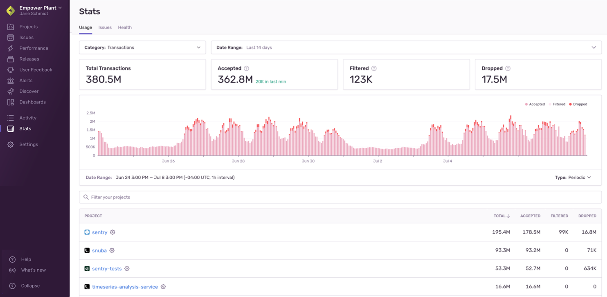
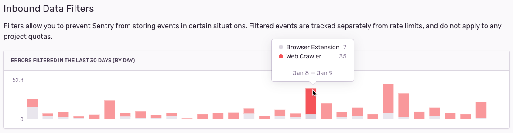

In most cases, sending all Transaction and Transaction with Profiling events to Sentry could generate more performance data than you'd find useful and might use up your performance units too quickly. Sentry provides tools to control the _type_ and _amount_ of transactions and transactions with profiling that are monitored. This allows you to have performance data that's actionable and meaningful, and to manage your quota.

Applying the proper SDK configuration is an iterative and on-going process, but these tips will show you how to best use Sentry's tools to get the most out of your transaction and transactions with profiling events. These tips are ordered from easiest or least time-consuming to most challenging or potentially time-consuming. The first two options are things you can do in [sentry.io](https://sentry.io), whereas the remaining ones are things you'll do in the SDK.

## Before You Begin: Check Your Quota Usage {#3-event-usage-stats}

<Alert title="Note" level="info">

The "Usage Stats" tab is only visible if you're on a Team, Business, or Enterprise plan.

</Alert>

You can look at your events in aggregate in the "Usage Stats" tab of **Stats**. This information will help you answer key questions about the breakdown of your incoming events or which projects are consuming your quota. The answers to these questions can help you figure out where you need to do further fine-tuning of your SDK filters and configuration.

This page is accessible to all members of your organization, so Owners in your Sentry org can share this page with the developers directly responsible for a given project. Also, you can come back to this page to check if the changes you've made are having the desired effect.

### How can I see a breakdown of incoming events?

The [Usage Stats](/product/stats/#usage-stats) tab displays details about the total amount of data Sentry has received across your entire organization for up to 90 days. The page breaks down the events (by project) into three categories: _accepted_, _dropped_, or _filtered_. Only accepted events affect your quota:

### What are my busiest projects?

The "Project" table in the "Usage Stats" tab of **Stats** breaks down your events by project so you can see which ones are consuming your quota. Clicking on the settings icon next to a project name in the table will open the project's settings, where you can manage its [inbound filters](#2-inbound-data-filters).

### Which transactions are consuming my quota?

<Note>

You can only update the columns of the Results table in **Discover** if your organization is on a Business plan.

</Note>

You can set up [a query](<https://sentry.io/orgredirect/organizations/:orgslug/discover/results/?field=title&field=project&field=count()&name=All+Events&query=event.type%3Atransaction&sort=-count&statsPeriod=14d&yAxis=count()>) in **Discover** to see which transactions or transactions with profiling you're receiving the most and if you want to adjust that. When you're building the query, search for `event.type:transaction` and then set the columns to `title`, `project`, and `count`, as shown below:

Once the changes are applied, sort the "Results" table by the "COUNT()" column to display your busiest transactions:

You can look for transactions with profiling using  `has:profile.id`. Adding a `profile.id` column to the query will give you a link to the profile.

## Adjusting Quotas

<Note>

Quotas can only be updated by a Billing or Owner member of your Sentry organization.

</Note>

Once your performance units volume is approaching or has exceeded the quota, teammates with the "Owner" organization permission level will receive [notification](/product/alerts/notifications/#quota-notifications) emails. You can then choose to [increase](#increasing-quotas) or [decrease](#decreasing-quotas) your quota.

If this is your first time exceeding quota and you're on a paid plan, however, you'll be entered into a one-time grace period. Learn more about the grace period in this [Help article](https://help.sentry.io/account/billing/what-happens-when-i-run-out-of-event-capacity-and-a-grace-period-is-triggered/).

### Increasing Quotas

If you're dropping events that you want to keep because you've exceeded your quota, add to your quota at any time during your billing period by either increasing your [reserved](#reserved-volume) or [on-demand](#on-demand-budget) quota.

When you exceed your quota threshold, the server will respond with a 429 HTTP status code, which communicates to SDKs and clients to stop sending events. This status code comes with a `Retry-After` header that indicates the time for which this rate limit is active. However, clients are not supposed to retry events, but instead drop events until the rate limit has expired, to prevent queue backlogs. Note, that since event ingestion and rate limiting happen asynchronously, the 429 HTTP status code is always slightly delayed.

To increase your quota, go to **Settings > Subscription** and click the "Manage Subscription" button to access your subscription options. When you increase your quota, the change goes into effect immediately.

If you're on a Developer plan and want to increase your quota, you'll need to upgrade to a Team or Business plan. On these plans you can prepay for more performance units volume and purchase on-demand volume, as needed. Learn about Sentry's plans on our [pricing page](https://sentry.io/pricing/).

<Alert>

If you upgrade from Team to Business mid-billing period, your on-demand pricing changes retroactively.

</Alert>

### Reserved Volume

If the number of events you need is steadily increasing, you may want to increase your reserved capacity or volume. Reserved volume is less expensive than on-demand volume since you prepay for it. It also allows you to choose the number of performance units that you want to have available beforehand, rather than just setting an arbitrary on-demand budget. Learn more about [reserved volume](/product/accounts/pricing/#prepaid-reserved-capacity) in our pricing documentation.

You shouldn't increase your reserved volume if you think your need for more events is temporary, since [reducing your reserved volume is tied to your billing period](#decreasing-quotas).

### On-Demand Budget

If you need to increase your performance units quota temporarily, we recommend that you add or increase on-demand budget. This is ideal for situations like rolling out a new version of your application where you anticipate more events for the month. To add on-demand capacity or volume, you enter a monthly maximum budget on either a shared or per-category (errors, performance units, replays, and attachments) basis. Learn more about [on-demand volume](/product/accounts/pricing/#on-demand-capacity) in our pricing documentation.

### Decreasing Quotas

Plan downgrades and decreases in reserved volume are processed at the end of your billing period, and remaining volume cannot be refunded. For example, if you have a monthly billing period that starts on the 5th of the month, and you decrease your reserved volume on June 20th, then this change will be processed on July 4th. Your billing period beginning on July 5th will reflect your new reserved volume.

<Alert level="warning">

If you have an annual billing period, plan downgrades and decreases in reserved volume go into effect at the beginning of your **next billing year.**

</Alert>

Changes to on-demand volume typically go into effect immediately and are guaranteed to go into effect within 24 hours. However, you can't decrease your on-demand budget to less than what you've consumed in the current period.

To decrease your quota, go to **Settings > Subscription** and click "Manage Subscriptions". When you reach the "Review & Confirm" step, the date that these changes go into effect will be displayed:

<Note>

We strongly recommend that you make subscription changes **before** the last day of your billing period. Depending on your time zone, in some cases, changes made on the last day of the billing period will not go into effect until the next billing period.

</Note>

## Inbound Filters {#2-inbound-data-filters}

While SDK configuration requires changes to your source code and depends on your next deployment, server-side filters can be easily configured per project in the "Data Filters" section of **[Project] > Settings > Inbound Filters**.

Once applied, you can track the filtered events (numbers and cause) using the graph provided at the top of the "Inbound Filters" page.

<Note>

The **Inbound Data Filters** page in [sentry.io](https://sentry.io) only refers to errors, but it applies to transactions, transactions with profiling, and attachments as well.

</Note>

Sentry provides several methods to filter all events and attachments server-side, which are applied before checking for potential rate limits. Inbound filters include:

- Common browser extension errors
- Events coming from `localhost`
- Known legacy browsers errors
- Known web crawlers
- Specific release versions of your code
- Certain IP addresses

The first four options above are settings that you simply toggle on or off. Setting the others is explained further below.

After these checks are processed, events and attachments that aren't dropped based on these filters count toward your quota. They're accepted into Sentry, where they're persisted and stored.

### IP Filters

If you have a rogue client, Sentry supports blocking an IP from sending data. Navigate to **[Project] > Settings > Inbound Filters** to add the IP addresses (or subnets) in the "IP Addresses" field.

### Filter by Release

<Include name="business.mdx" />

If you discover a problematic release causing excessive noise, Sentry supports ignoring all events and attachments from that release. Navigate to **[Project] > Settings > Inbound Filters**, then add the release to the "Releases" field.

## SDK Filtering: beforeSendTransaction {#1-sdk-filtering-beforesendtransaction}

Some Sentry SDKs support the `beforeSendTransaction` callback method. Once implemented, this method is invoked when the SDK captures a transaction event, right before sending it to your Sentry account. Because it receives the transaction event object as a parameter, you can use it to modify the event's data or drop the event completely (by returning `null`) based on your custom logic and the data available on the event, such as _tags_, _environment_, _release version_, _transaction name_, and so on. Note that only transaction events pass through `beforeSendTransaction`. Error and message events have a separate method, `beforeSend`, which is supported in all SDKs. Learn more about both methods in [Filtering Events](/platform-redirect/?next=/configuration/filtering/).

## SDK Configuration: Tracing Options {#2-sdk-configuration-tracing-options}

When you configure your the SDK, you can control the number of transactions that are sent to Sentry by setting the [tracing options](/platform-redirect/?next=/configuration/options/%23tracing-options), including either setting a sample rate or providing a function for sampling. You can also set up [custom instrumentation](/platform-redirect/?next=/performance/instrumentation/custom-instrumentation/) for performance monitoring to capture certain types of transactions.
